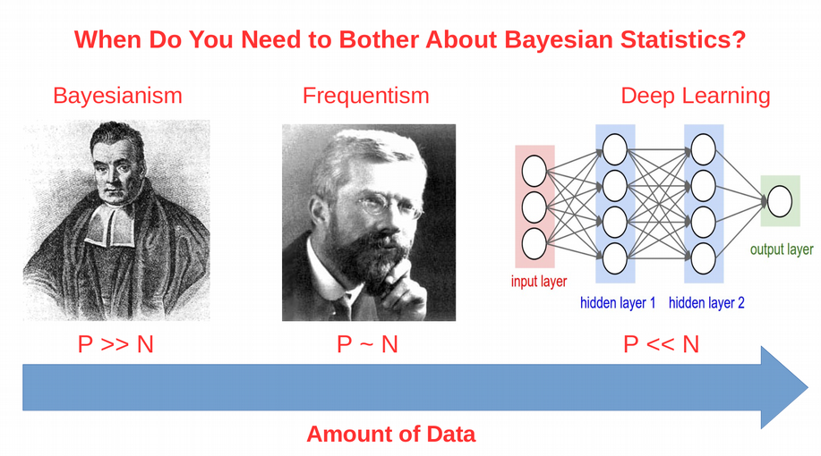
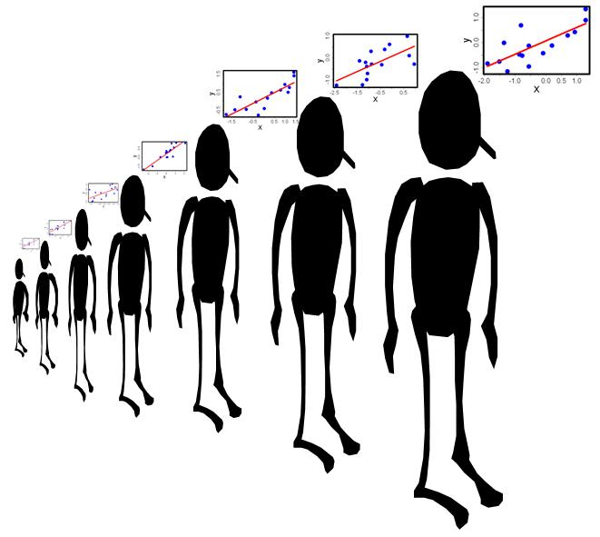
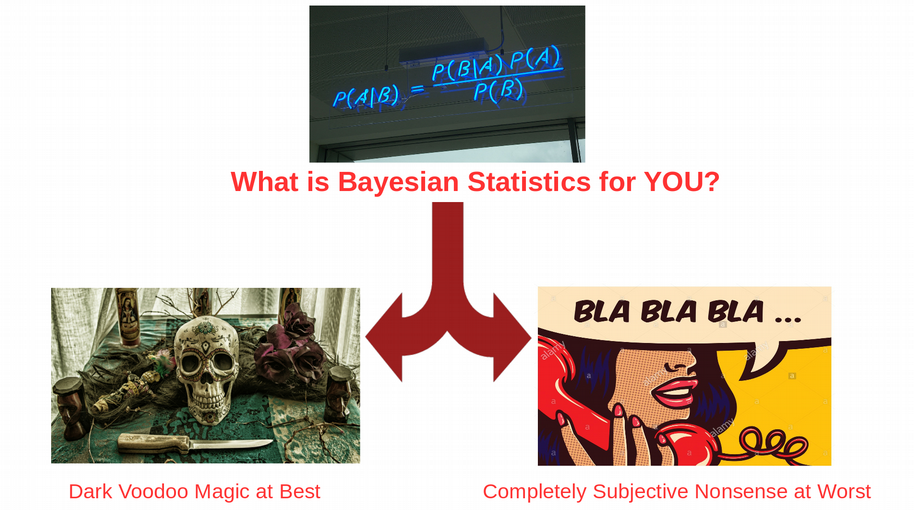
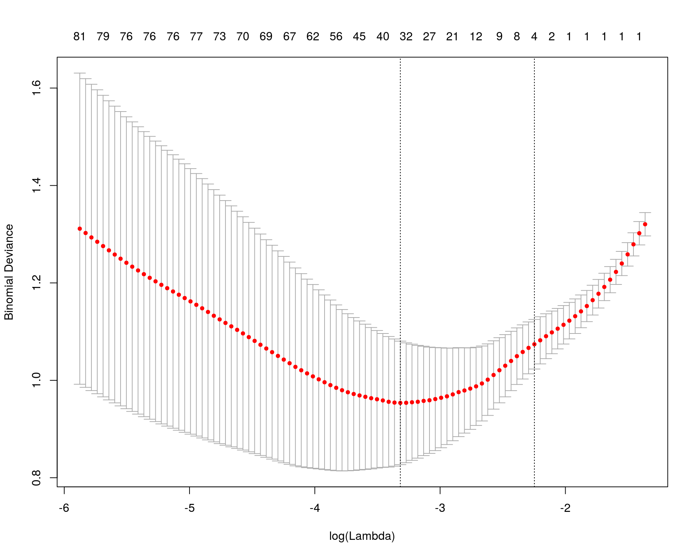
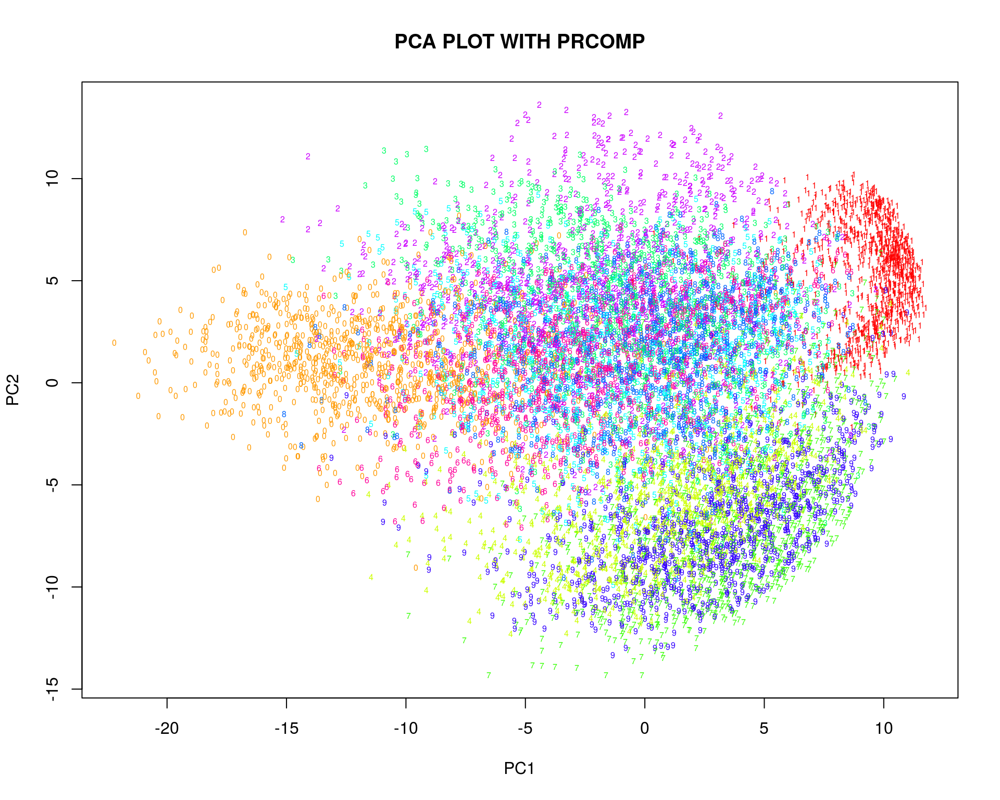
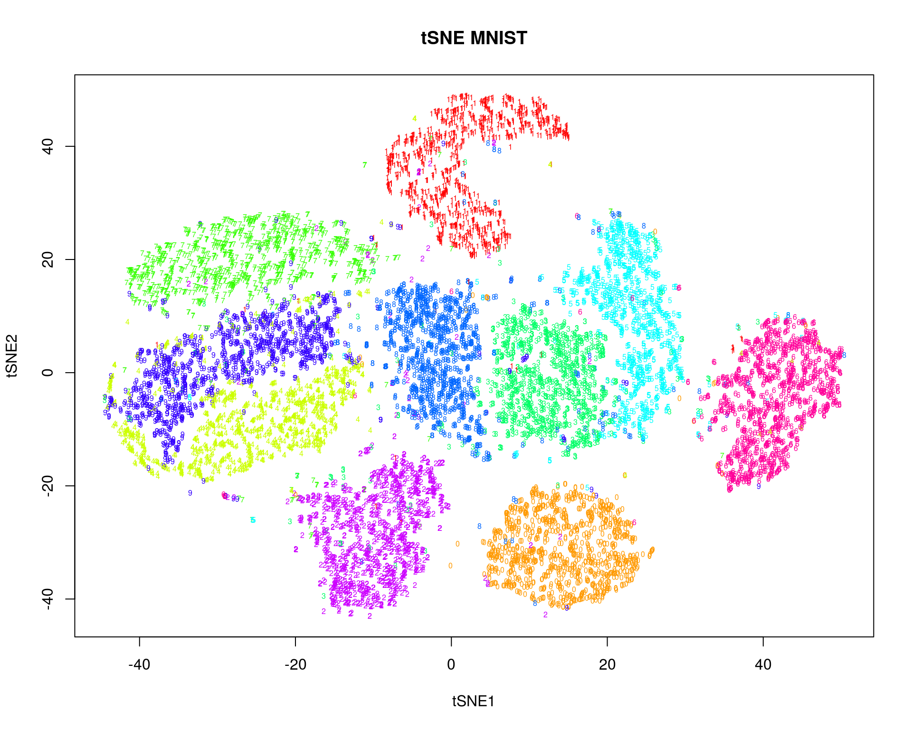
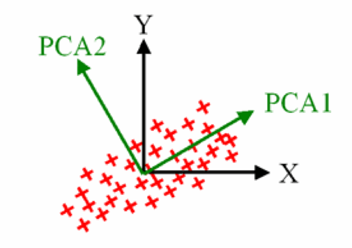
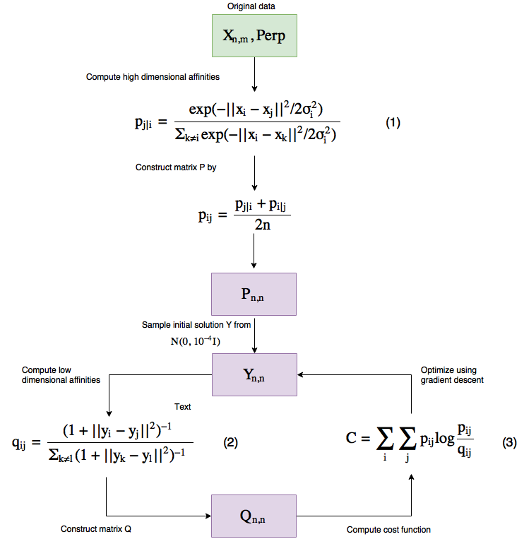

exclude: true
count: false

```{r,echo=FALSE,child="assets/header-presentation.Rmd"}
```

<!-- ----------------- Only edit title & author above this ----------------- -->

```{r,echo=FALSE,message=FALSE,warning=FALSE}
# load the packages you need

#library(tidyverse)
#library(ggplot2)
```


---
name: Statistics

## What is Mathematical Statistics?

* Can Mathematical Statistics mean
  * a statistical test? 
  * a probability distribution? 
  * or maybe a p-value?

* Classic statistics **is not the only way** to analyze your data

.center[
]


---
name: Types of Analysis

## Different Types of Data Analysis

* Depends on the amount of data we have
* Balance between the numbers of features and observations




---
name: Frequentist Statistics Failure

## Frequentist Statistics Failure

.center[
]


---
name: Frequentist Statistics Brain Damaging (Cont.)

## Frequentist Statistics Brain Damaging

.center[
]

.center[
]


---
name: Maximum Likelihood Principle

## Maximum Likelihood Principle

* We maximize probability to observe the data $X_i$
$$\rm{L}\,(\,\rm{X_i} \,|\, \mu,\sigma\,) =
\prod_{i=0}^{N}\frac{1}{\sqrt{2\pi\sigma²}} \exp^{\displaystyle -\frac{(X_i-\mu)^2}{2\sigma²}}\\
\mu = \frac{1}{N}\sum_{i=0}^N \rm{X_i}\\
\sigma^2 = \frac{1}{N}\sum_{i=0}^N (\rm{X_i}-\mu)^2$$

--
* Maximum Likelihood has many assumptions:
  * Large sample size
  * Gaussian distribution
  * Homoscedasticity
  * Uncorrelated errors
  * Convergence of covariance
* Those assumptions are not fulfilled in the real world


---
name: Statistical Test

## Two-Groups Statistical Test

```{r,echo=TRUE,fig.width=7,fig.height=5,fig.align='center'}
set.seed(12)
X<-c(rnorm(20,mean=5,sd=2),12,15,14,16)
Y<-c(rnorm(24,mean=7,sd=2))
boxplot(X,Y,ylab="DIFFERENCE",names=c("X","Y"))
```


---
name: Parametric Statistical Test

## Parametric Statistical Test Fails

```{r}
t.test(X,Y)
```
```{r,echo=FALSE,fig.width=5,fig.height=3.5,fig.align='center'}
qqnorm(c(X,Y))
qqline(c(X,Y))
```


---
name: Resampling

## Resampling

```{r,fig.width=6,fig.height=4,fig.align='center'}
observed <- median(Y)-median(X)
print(paste0("Observed difference = ",observed))
res <- vector(length=1000)
for(i in 1:1000){Z<-c(X,Y); Y_res<-sample(Z,length(Y),FALSE);
X_res<-sample(Z,length(X),FALSE); res[i]<-median(Y_res)-median(X_res)}
hist(abs(res), breaks=100, main="Resampled", xlab="Difference")
print(paste0("p-value = ", sum(abs(res) >= abs(observed))/1000))
```


---
name: ML Does Not Stand Non-Independence

## ML Does Not Stand Non-Independence

```{r,echo=FALSE}
m<-matrix(rnorm(25),ncol=5,nrow=5)
colnames(m)<-paste0("n",seq(1:5))
rownames(m)<-paste0("p",seq(1:5))
m
```

* Two types of non-independence in data
  * between samples
  * between features

.center[
.pull-left-50[
### Random Effects
]
.pull-right-50[
### Lasso
]]


---
name: Linear Model with Non-Independence

## Linear Model with Non-Independence

```{r,fig.width=7,fig.height=5,fig.align='center'}
library("lme4")
library("ggplot2")
ggplot(sleepstudy,aes(x=Days,y=Reaction)) + geom_point() + 
  geom_smooth(method="lm")
```


---
name: Fit Linear Model for Each Individual

## Fit Linear Model for Each Individual

```{r,fig.width=7,fig.height=5,fig.align='center'}
ggplot(sleepstudy, aes(x = Days, y = Reaction)) + 
  geom_smooth(method = "lm", level = 0.95) + geom_point() + 
  facet_wrap( ~ Subject, nrow = 3, ncol = 6)
```


---
name: The Case of the Missing Heritability

## Random Effects and Missing Heritability

.center[
]


---
name: Random Effects Modelling

## Random Effects Modelling

* Allow individual level Slopes and Intercepts
* This is nothing else than Bayesian Priors on coefficients


$$\rm{Reaction} = \alpha_i + \beta_i \rm{Days}$$


```{r}
lmerfit <- lmer(Reaction ~ Days + (Days | Subject), sleepstudy)
```

.pull-left-50[
```{r,echo=FALSE,fig.width=8,fig.height=6}
plot(density(coef(lmerfit)$Subject[,1]),xlab="INTERCEPT",main="INTERCEPT")
#plot(density(ranef(lmerfit)$Subject[,1]),xlab="INTERCEPT",main="INTERCEPT")
```
]
.pull-right-50[
```{r,echo=FALSE,fig.width=8,fig.height=6}
plot(density(coef(lmerfit)$Subject[,2]),xlab="SLOPE",main="SLOPE")
#plot(density(ranef(lmerfit)$Subject[,2]),xlab="SLOPE",main="SLOPE")
```
]


---
name: Linear Mixed Models (LMM)

## Linear Mixed Models (LMM)

```{r}
summary(lmer(Reaction ~ Days + (Days | Subject), sleepstudy))
```


---
name: LMM Average Fit

## LMM Average Fit

```{r,echo=FALSE,cache=TRUE,fig.width=8,fig.height=6,fig.align='center'}
library("arm")
lmerfit <- lmer(Reaction ~ Days + (Days | Subject), sleepstudy)
sims <- sim(lmerfit, n.sims = 10000)
fs <- fixef(sims)
newavg <- data.frame(Days = 0:9)
Xmat <- model.matrix( ~ 1 + Days, data = newavg)
fitmat <- matrix(ncol = nrow(fs), nrow = nrow(newavg))
for (i in 1:nrow(fs)) { fitmat[,i] <- Xmat %*% as.matrix(fs)[i,] }
newavg$lower <- apply(fitmat, 1, quantile, prob=0.05)
newavg$median <- apply(fitmat, 1, quantile, prob=0.5)
newavg$upper <- apply(fitmat, 1, quantile, prob=0.95)
ggplot(sleepstudy, aes(x = Days, y = Reaction)) + geom_point() +
  geom_smooth(method="lm") + 
  geom_line(data = newavg, aes(y = median), size = 1) + 
  geom_line(data = newavg, aes(y = lower), lty = 2) + 
  geom_line(data = newavg, aes(y = upper), lty = 2)
```


---
name: LMM Individual Fit

## LMM Individual Fit

```{r,echo=FALSE,fig.width=8,fig.height=6,fig.align='center'}
yhat <- fitted(sims, lmerfit)
sleepstudy$lower <- apply(yhat, 1, quantile, prob=0.025)
sleepstudy$median <- apply(yhat, 1, quantile, prob=0.5)
sleepstudy$upper <- apply(yhat, 1, quantile, prob=0.975)
ggplot(sleepstudy, aes(x = Days, y = Reaction)) + 
  geom_smooth(method = "lm", level = 0.95) + geom_point() + 
  facet_wrap(~Subject, nrow = 3, ncol = 6) + 
  geom_line(data = sleepstudy, aes(y = median), size = 1) + 
  geom_line(data = sleepstudy, aes(y = lower), lty = 2) + 
  geom_line(data = sleepstudy, aes(y = upper), lty = 2)
```


---
name: What is Bayesian Statistics for You?

## What is Bayesian Statistics for You?

.center[
]

.small[
* **Handling Missing Data**
* **Handling Non-Gaussian Data**
* **Cause or Consequence**
* **Lack of Statistical Power**
* **Overfitting and Correction for Multiple Testing (FDR)**
* **Testing for Significance and P-Value**
]


---
name: Frequentist vs. Bayesian Fitting

## Frequentist vs. Bayesian Linear Model

.center[
.pull-left-50[
### Maximum Likelihood
$$y = \alpha+\beta x$$
<br/>
$$L(y) \sim e^{-\frac{(y-\alpha-\beta x)^2}{2\sigma^2}}$$
<br/>
$$\max_{\alpha,\beta,\sigma}L(y) \Longrightarrow \hat\alpha, \hat\beta, \hat\sigma$$
]]
--
.center[
.pull-right-50[
### Bayesian Linear Fitting
$$y \sim \it N(\mu,\sigma) \quad\textrm{- Likelihood L(y)}$$
<br/>
$$\mu = \alpha + \beta x$$
<br/>
$$\alpha \sim \it N(\mu_\alpha,\sigma_\alpha) \quad\textrm{- Prior on} \quad\alpha \\
\beta \sim \it N(\mu_\beta,\sigma_\beta) \quad\textrm{- Prior on} \quad\beta$$

<br/>
$$P(\mu_\alpha,\sigma_\alpha,\mu_\beta,\sigma_\beta,\sigma) \sim  L(y)N(\mu_\alpha,\sigma_\alpha)N(\mu_\beta,\sigma_\beta)$$

<br/>
$$\max_{\mu_\alpha,\sigma_\alpha,\mu_\beta,\sigma_\beta,\sigma}P(\mu_\alpha,\sigma_\alpha,\mu_\beta,\sigma_\beta,\sigma) \Longrightarrow \hat\mu_\alpha,\hat\sigma_\alpha,\hat\mu_\beta,\hat\sigma_\beta,\hat\sigma$$
]]


---
name: Bayesian Linear Model

## Bayesian Linear Model

```{r,warning=FALSE,message=FALSE,cache=TRUE}
library("brms")
options(mc.cores = parallel::detectCores())
brmfit <- brm(Reaction ~ Days + (Days | Subject), data = sleepstudy)
summary(brmfit)
```


---
name: Bayesian Population-Level Fit

## Bayesian Population-Level Fit

```{r,echo=FALSE,fig.width=8,fig.height=6}
newavg <- data.frame(Days = 0:9)
fitavg <- cbind(newavg, fitted(brmfit, newdata = newavg, re_formula = NA)[,-2])
names(fitavg) <- c("Days", "Reaction", "Lower", "Upper")
ggplot(sleepstudy, aes(x = Days, y = Reaction)) + geom_point() + 
  geom_smooth(method="lm") + 
  geom_line(data = fitavg, col = "black", size = 1) + 
  geom_line(data = fitavg, aes(y = Lower), col = "black", lty = 2) + 
  geom_line(data = fitavg, aes(y = Upper), col = "black", lty = 2)
```


---
name: Bayesian Group-Level Fit

## Bayesian Group-Level Fit

```{r,echo=FALSE,fig.width=8,fig.height=6}
newvary <- subset(sleepstudy,select=c("Subject","Days"))
fitvary <- cbind(newvary, fitted(brmfit, newdata = newvary)[,-2])
names(fitvary) <- c("Subject", "Days", "Reaction", "Lower", "Upper")
ggplot(sleepstudy, aes(x = Days, y = Reaction)) + 
  geom_smooth(method = "lm", level = 0.95) + geom_point() + 
  facet_wrap(~Subject, nrow = 3, ncol = 6) + 
  geom_line(data = fitvary, aes(y = Reaction), size = 1) + 
  geom_line(data = fitvary, aes(y = Lower), lty = 2) + 
  geom_line(data = fitvary, aes(y = Upper), lty = 2)
```


---
name: Feature Non-Independence: LASSO

## Feature Non-Independence: LASSO

$$Y = \beta_1X_1+\beta_2X_2+\epsilon \\
\textrm{OLS} = (y-\beta_1X_1-\beta_2X_2)^2 \\
\textrm{Penalized OLS} = (y-\beta_1X_1-\beta_2X_2)^2 + \lambda(|\beta_1|+|\beta_2|)$$

.center[
]


---
name: Dimensionality Reduction

## Dimensionality Reduction

* Can Dimensionality Reduction mean
  * PCA? 
  * tSNE? 

.pull-left-50[
.pull-right-50[
]]
.pull-right-50[
]

--
.pull-left-50[
.pull-right-50[
]]
.pull-right-50[
No, this is about overcoming

**The Curse of Dimenionality**

also known as Rao's Paradox
]


---
name: Low Dimensional Space

## Low Dimensional Space

```{r}
set.seed(123); n <- 20; p <- 2
Y <- rnorm(n); X <- matrix(rnorm(n*p),n,p); summary(lm(Y~X))
```


---
name: Going to Higher Dimensions

## Going to Higher Dimensions

```{r}
set.seed(123456); n <- 20; p <- 10
Y <- rnorm(n); X <- matrix(rnorm(n*p),n,p); summary(lm(Y~X))
```


---
name: Even Higher Dimensions

## Even Higher Dimensions

```{r}
set.seed(123456); n <- 20; p <- 20
Y <- rnorm(n); X <- matrix(rnorm(n*p),n,p); summary(lm(Y~X))
```


---
name: Maximum Likelihood Blows Up

## The Math Blows Up in High Dimensions

Let us now take a closer look at why exactly the ML math blows up when n<=p. Consider a linear model:

$$Y = \beta X$$

Let us make a few mathematical tricks in order to get a solution for the coefficients of the linear model:

$$X^TY = \beta X^TX \\
(X^TX)^{-1}X^TY = \beta(X^TX)^{-1} X^TX \\
(X^TX)^{-1}X^TY = \beta$$

The inverse matrix $(X^TX)^{-1}$ **diverges** when p=>n as variables in X become correlated


---
name: No True Effects in High Dimensions

## No True Effects in High Dimensions

.pull-left-50[
```{r}
set.seed(12345)
N <- 100
x <- rnorm(N)
y <- 2*x+rnorm(N)
df <- data.frame(x,y)
```
]
.pull-right-50[
```{r,eval=FALSE}
for(i in 1:10)
{
df[,paste0("PC",i)]<-
  Covar*(1-i/10)*y+rnorm(N)
}
```
]
.center[
```{r,echo=FALSE,fig.width=6,fig.height=4.8,fig.align='center'}
effect_master<-list()
for(k in 1:3)
{
  for(i in 1:10)
  {
    df[,paste0("PC",i)]<-k*(1-i/10)*y+rnorm(N)
  }

  effect<-vector()
  effect<-append(effect,2)
  for(i in 1:10)
  {
    formula<-as.formula(paste0("y~x+",paste0("PC",seq(1:i),collapse="+")))
    effect<-append(effect,summary(lm(formula,data=df))$coefficients[2,1])
  }
  effect_master[[k]]<-effect
}
plot(effect_master[[1]]~seq(from=0,to=10,by=1),type='o',xlab="PRINCIPAL COMPONENTS",ylab="EFFECT",xlim=c(0,10),ylim=c(0,2),col="blue",main="Effect of x vs. y at different covariation between y and PCs")
points(effect_master[[2]]~seq(from=0,to=10,by=1),col="green")
lines(effect_master[[2]]~seq(from=0,to=10,by=1),col="green")
points(effect_master[[3]]~seq(from=0,to=10,by=1),col="red")
lines(effect_master[[3]]~seq(from=0,to=10,by=1),col="red")
legend("topright",c("1","2","3"),title="Covar",fill=c("blue","green","red"),inset=0.02)
```
]


---
name: PCA

## Principal Component Analysis (PCA)

* Collapse p features (p>>n) to few latent features and keep variation

* Rotation and shift of coordinate system toward maximal variance

* PCA is an **eigen matrix decomposition** problem


.pull-left-50[
]
.pull-right-50[
$$PC = u^T X = X^Tu$$
X is mean centered $\Longrightarrow <PC> = 0$
$$<(PC-<PC>)^2> = <PC^2> = u^T X X^Tu \\
X X^T=A \\ 
< PC^2 > = u^T Au$$
A is **variance-covariance** of X

$$\rm{max}(u^T Au + \lambda(1-u^Tu))=0 \\
 Au = \lambda u$$
]


---
name: PCA on MNIST

## PCA on MNIST

```{r,echo=FALSE,cache=TRUE}
mnist<-read.csv("/home/nikolay/Documents/Teaching/RaukR/2017-10-13-mnist_train.csv")
labels<-mnist$label
mnist$label<-NULL
```
```{r PCA,echo=FALSE,cache=TRUE,fig.width=8,fig.height=6,fig.align='center'}
PC<-prcomp(log10(mnist + 1), center=TRUE, scale=FALSE)
colors <- rainbow(length(unique(labels)))
names(colors) <- unique(labels)
plot(PC$x[,1:2], t='n',main="PCA PLOT WITH PRCOMP", xlab="PC1",ylab="PC2")
text(PC$x[,1:2], labels = labels, col = colors[as.character(labels)], cex = 0.5)
```


---
name: tSNE

## t-distributed Stochastic Neighbor Embedding (tSNE)

.center[
]


---
name: tSNE on MNIST

## tSNE on MNIST

```{r tSNE,echo=FALSE,cache=TRUE,fig.width=8,fig.height=6,warning=FALSE,message=FALSE,fig.align='center'}
library("Rtsne")
set.seed(12)
tsne.out<-Rtsne(log10(mnist + 1), initial_dims = 20, verbose = FALSE, perplexity = 30, max_iter = 1000)
plot(tsne.out$Y,  t = 'n', main = "tSNE MNIST", xlab="tSNE1",ylab="tSNE2")
text(tsne.out$Y, labels = labels, col = colors[as.character(labels)], cex = 0.5)
```


<!-- --------------------- Do not edit this and below --------------------- -->

---
name: end-slide
class: end-slide, middle
count: false

# Thank you. Questions?

```{r,echo=FALSE,child="assets/footer-presentation.Rmd"}
```

```{r,include=FALSE,eval=FALSE}
# manually run this to render this document to HTML
rmarkdown::render("presentation.Rmd")
# manually run this to convert HTML to PDF
#pagedown::chrome_print("presentation.html",output="presentation.pdf")
```

