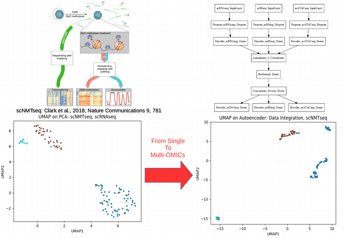

exclude: true
count: false

```{r,echo=FALSE,child="assets/header-presentation.Rmd"}
```

<!-- ----------------- Only edit title & author above this ----------------- -->

```{r,echo=FALSE,message=FALSE,warning=FALSE}
# load the packages you need

#library(tidyverse)
#library(ggplot2)
```


---
name: Statistics

## What is Mathematical Statistics?

* Can Mathematical Statistics mean
  * a statistical test? 
  * a probability distribution? 
  * or maybe a p-value?

* We are not going to draw marbles or roll dice

.center[
]

.center[
<span style="color:red">**Classic statistics is not the only way to analyze your data**</span>]


---
name: Types of Analysis

## Different Types of Data Analysis

* Depends on the amount of data we have
* Balance between the numbers of features and observations
 + P is the number of features (genes, proteins, genetic variants etc.)
 + N is the number of observations (samples, cells, nucleotides etc.)

.center[
]


---
name: Do we have Big Data in Life Sciences?
## Do we have Big Data in Life Sciences?

.center[
]


---
name: Precision Medicine: Why isn't it in the Clinics? 
## Precision Medicine: Why isn't it in the Clinics?

.center[
]


---
name: The Curse of Dimensionality

## The Curse of Dimensionality

.pull-left-50[
]

.pull-right-50[

$$Y = \alpha + \beta X$$
$$\beta = \left(X^TX\right)^{-1}X^TY$$

$$\left(X^TX\right)^{-1} \sim \frac{1}{\rm{det}\left(X^TX\right)}\dots\,\rightarrow\,\infty\hbox{,}\,\,\,\,\,\,\,\,n\ll p$$

<br/>
.center[
<span style="color:red">**The math blows up in high dimensions**</span>]

<br/>
.center[
]

<br/>
$$l_d = r\sqrt{d}\hbox{, where d is dimensionality of space}$$

<br/>
.center[
<span style="color:red">**Euclidean distance fails, hard to define metric**</span>]
]


---
name: Low Dimensional Space

## Low Dimensional Space

```{r}
set.seed(123) 
n <- 20 # number of samples
p <- 2  # number of features / dimensions
Y <- rnorm(n)
X <- matrix(rnorm(n*p),n,p) 
summary(lm(Y~X))
```


---
name: Going to Higher Dimensions

## Going to Higher Dimensions

```{r}
set.seed(123456); n <- 20; p <- 10
Y <- rnorm(n); X <- matrix(rnorm(n*p),n,p); summary(lm(Y~X))
```


---
name: Even Higher Dimensions

## Even Higher Dimensions

```{r}
set.seed(123456); n <- 20; p <- 20
Y <- rnorm(n); X <- matrix(rnorm(n*p),n,p); summary(lm(Y~X))
```


---
name: Dimensionality Reduction

## Dimensionality Reduction

```{r,echo=FALSE,cache=TRUE}
mnist<-read.csv("/home/nikolay/Documents/Teaching/RaukR/2017-10-13-mnist_train.csv")
labels<-mnist$label
mnist$label<-NULL
```
```{r PCA,echo=FALSE,cache=TRUE,fig.width=10,fig.height=5,fig.align='center'}
par(mfrow=c(1,2))

PC<-prcomp(log10(mnist + 1), center=TRUE, scale=FALSE)
colors <- rainbow(length(unique(labels)))
names(colors) <- unique(labels)
plot(PC$x[,1:2], t='n',main="PCA PLOT WITH PRCOMP", xlab="PC1",ylab="PC2")
text(PC$x[,1:2], labels = labels, col = colors[as.character(labels)], cex = 0.5)

library("Rtsne")
set.seed(12)
tsne.out<-Rtsne(log10(mnist + 1), initial_dims = 20, verbose = FALSE, perplexity = 30, max_iter = 1000)
plot(tsne.out$Y,  t = 'n', main = "tSNE MNIST", xlab="tSNE1",ylab="tSNE2")
text(tsne.out$Y, labels = labels, col = colors[as.character(labels)], cex = 0.5)
```

<br/>
.center[
<span style="color:red">**Dimensionality Reduction is not for visualization but overcoming the Curse of Dimensionality**</span>]


---
name: Linear Dimensionality Reduction

## Linear Dimensionality Reduction

.center[
]


---
name: Non-Linear Dimensionality Reduction

## Non-Linear Dimensionality Reduction

.center[
]


---
name: Frequentist Statistics Failure

## Frequentist Statistics Failure

.center[
]


---
name: Frequentist Statistics Brain Damaging (Cont.)

## Frequentist Statistics Brain Damaging

.center[
]

.center[
]


---
name: Pvalue is not good for ranking features
## Pvalue is not good for ranking features

.pull-left-50[
]


.pull-right-50[
```{r,echo=TRUE}
FC <- 1.02
x_mean <- 5; x_sd <- 1
N_vector<-seq(from=100,to=10000,by=100)
x1 <- rnorm(N_vector, x_mean, x_sd)
x2 <- rnorm(N_vector, x_mean*FC, x_sd)
```
```{r,echo=FALSE,fig.width=8,fig.height=7,fig.align='center'}
set.seed(123)
pvalue_vector<-vector()
signal_vector<-vector()
noise_vector<-vector()
for(N in N_vector)
{
  x1 <- rnorm(N, x_mean, x_sd)
  x2 <- rnorm(N, x_mean*FC, x_sd)
  t_test_res<-t.test(x1, x2)
  pvalue_vector<-append(pvalue_vector,t_test_res$p.value)
  signal_vector<-append(signal_vector,mean(x1)-mean(x2))
  noise_vector<-append(noise_vector,sqrt(sd(x1)^2/N+sd(x2)^2/N))
}
par(mfrow=c(2,2))
boxplot(x1,x2,names=c("x1","x2"))
plot(pvalue_vector~N_vector,type='o',xlab="N",ylab="p-value")
plot(signal_vector~N_vector,type='o',xlab="N",ylab="signal")
plot(noise_vector~N_vector,type='o',xlab="N",ylab="noise")
```
]


---
name: Maximum Likelihood Principle

## Maximum Likelihood Principle

* We maximize probability to observe the data $X_i$
$$\rm{L}\,(\,\rm{X_i} \,|\, \mu,\sigma\,) =
\prod_{i=0}^{N}\frac{1}{\sqrt{2\pi\sigma²}} \exp^{\displaystyle -\frac{(X_i-\mu)^2}{2\sigma²}}\\
\mu = \frac{1}{N}\sum_{i=0}^N \rm{X_i}\\
\sigma^2 = \frac{1}{N}\sum_{i=0}^N (\rm{X_i}-\mu)^2$$

--
* Maximum Likelihood has many assumptions:
  * Large sample size
  * Gaussian distribution
  * Homoscedasticity
  * Uncorrelated errors
  * Convergence of covariance
* Those assumptions are not fulfilled in the real world


---
name: Statistical Test

## Two-Groups Statistical Test

```{r,echo=TRUE,fig.width=7,fig.height=5,fig.align='center'}
set.seed(12)
X<-c(rnorm(20,mean=5,sd=2),12,15,14,16)
Y<-c(rnorm(24,mean=7,sd=2))
boxplot(X,Y,ylab="DIFFERENCE",names=c("X","Y"))
```


---
name: Parametric Statistical Test

## Parametric Statistical Test Fails

```{r}
t.test(X,Y)
```
```{r,echo=FALSE,fig.width=5,fig.height=3.5,fig.align='center'}
qqnorm(c(X,Y))
qqline(c(X,Y))
```


---
name: Resampling

## Resampling

```{r,fig.width=6,fig.height=4,fig.align='center'}
observed <- median(Y)-median(X)
print(paste0("Observed difference = ",observed))
res <- vector(length=1000)
for(i in 1:1000){Z<-c(X,Y); Y_res<-sample(Z,length(Y),FALSE);
X_res<-sample(Z,length(X),FALSE); res[i]<-median(Y_res)-median(X_res)}
hist(abs(res), breaks=100, main="Resampled", xlab="Difference")
print(paste0("p-value = ", sum(abs(res) >= abs(observed))/1000))
```


---
name: ML Does Not Stand Non-Independence

## ML Does Not Stand Non-Independence

```{r,echo=FALSE}
m<-matrix(rnorm(25),ncol=5,nrow=5)
colnames(m)<-paste0("n",seq(1:5))
rownames(m)<-paste0("p",seq(1:5))
m
```

* Two types of non-independence in data
  * between samples
  * between features

.center[
.pull-left-50[
### Random Effects
]
.pull-right-50[
### Lasso
]]


---
name: Linear Model with Non-Independence

## Linear Model with Non-Independence

```{r,fig.width=7,fig.height=5,fig.align='center'}
library("lme4")
library("ggplot2")
ggplot(sleepstudy,aes(x=Days,y=Reaction)) + geom_point() + 
  geom_smooth(method="lm")
```


---
name: Fit Linear Model for Each Individual

## Fit Linear Model for Each Individual

```{r,fig.width=7,fig.height=5,fig.align='center'}
ggplot(sleepstudy, aes(x = Days, y = Reaction)) + 
  geom_smooth(method = "lm", level = 0.95) + geom_point() + 
  facet_wrap( ~ Subject, nrow = 3, ncol = 6)
```


---
name: The Case of the Missing Heritability

## Random Effects and Missing Heritability

.center[
]


---
name: Random Effects Modelling

## Random Effects Modelling

* Allow individual level Slopes and Intercepts
* This is nothing else than Bayesian Priors on coefficients

$$\rm{Reaction} = \alpha_i + \beta_i \rm{Days}$$


```{r}
lmerfit <- lmer(Reaction ~ Days + (Days | Subject), sleepstudy)
```

.pull-left-50[
```{r,echo=FALSE,fig.width=8,fig.height=6}
plot(density(coef(lmerfit)$Subject[,1]),xlab="INTERCEPT",main="INTERCEPT")
#plot(density(ranef(lmerfit)$Subject[,1]),xlab="INTERCEPT",main="INTERCEPT")
```
]
.pull-right-50[
```{r,echo=FALSE,fig.width=8,fig.height=6}
plot(density(coef(lmerfit)$Subject[,2]),xlab="SLOPE",main="SLOPE")
#plot(density(ranef(lmerfit)$Subject[,2]),xlab="SLOPE",main="SLOPE")
```
]

.center[
<span style="color:red">**Shrinkage: Introduce shared variance parameter**</span>]


---
name: Linear Mixed Models (LMM)

## Linear Mixed Models (LMM)

```{r}
summary(lmer(Reaction ~ Days + (Days | Subject), sleepstudy))
```


---
name: LMM Average Fit

## LMM Average Fit

```{r,echo=FALSE,cache=TRUE,fig.width=8,fig.height=6,fig.align='center'}
library("arm")
lmerfit <- lmer(Reaction ~ Days + (Days | Subject), sleepstudy)
sims <- sim(lmerfit, n.sims = 10000)
fs <- fixef(sims)
newavg <- data.frame(Days = 0:9)
Xmat <- model.matrix( ~ 1 + Days, data = newavg)
fitmat <- matrix(ncol = nrow(fs), nrow = nrow(newavg))
for (i in 1:nrow(fs)) { fitmat[,i] <- Xmat %*% as.matrix(fs)[i,] }
newavg$lower <- apply(fitmat, 1, quantile, prob=0.05)
newavg$median <- apply(fitmat, 1, quantile, prob=0.5)
newavg$upper <- apply(fitmat, 1, quantile, prob=0.95)
ggplot(sleepstudy, aes(x = Days, y = Reaction)) + geom_point() +
  geom_smooth(method="lm") + 
  geom_line(data = newavg, aes(y = median), size = 1) + 
  geom_line(data = newavg, aes(y = lower), lty = 2) + 
  geom_line(data = newavg, aes(y = upper), lty = 2)
```


---
name: LMM Individual Fit

## LMM Individual Fit

```{r,echo=FALSE,fig.width=8,fig.height=6,fig.align='center'}
yhat <- fitted(sims, lmerfit)
sleepstudy$lower <- apply(yhat, 1, quantile, prob=0.025)
sleepstudy$median <- apply(yhat, 1, quantile, prob=0.5)
sleepstudy$upper <- apply(yhat, 1, quantile, prob=0.975)
ggplot(sleepstudy, aes(x = Days, y = Reaction)) + 
  geom_smooth(method = "lm", level = 0.95) + geom_point() + 
  facet_wrap(~Subject, nrow = 3, ncol = 6) + 
  geom_line(data = sleepstudy, aes(y = median), size = 1) + 
  geom_line(data = sleepstudy, aes(y = lower), lty = 2) + 
  geom_line(data = sleepstudy, aes(y = upper), lty = 2)
```


---
name: What is Bayesian Statistics for You?

## What is Bayesian Statistics for You?

.center[
]

.small[
* **Handling Missing Data**
* **Handling Non-Gaussian Data**
* **Cause or Consequence**
* **Lack of Statistical Power**
* **Overfitting and Correction for Multiple Testing (FDR)**
* **Testing for Significance and P-Value**
]


---
name: Frequentist vs. Bayesian Fitting

## Frequentist vs. Bayesian Linear Model

.center[
.pull-left-50[
### Maximum Likelihood
$$y = \alpha+\beta x$$
<br/>
$$L(y) \sim e^{-\frac{(y-\alpha-\beta x)^2}{2\sigma^2}}$$
<br/>
$$\max_{\alpha,\beta,\sigma}L(y) \Longrightarrow \hat\alpha, \hat\beta, \hat\sigma$$
]]
--
.center[
.pull-right-50[
### Bayesian Linear Fitting
$$y \sim \it N(\mu,\sigma) \quad\textrm{- Likelihood L(y)}$$
<br/>
$$\mu = \alpha + \beta x$$
<br/>
$$\alpha \sim \it N(\mu_\alpha,\sigma_\alpha) \quad\textrm{- Prior on} \quad\alpha \\
\beta \sim \it N(\mu_\beta,\sigma_\beta) \quad\textrm{- Prior on} \quad\beta$$

<br/>
$$P(\mu_\alpha,\sigma_\alpha,\mu_\beta,\sigma_\beta,\sigma) \sim  L(y)N(\mu_\alpha,\sigma_\alpha)N(\mu_\beta,\sigma_\beta)$$

<br/>
$$\max_{\mu_\alpha,\sigma_\alpha,\mu_\beta,\sigma_\beta,\sigma}P(\mu_\alpha,\sigma_\alpha,\mu_\beta,\sigma_\beta,\sigma) \Longrightarrow \hat\mu_\alpha,\hat\sigma_\alpha,\hat\mu_\beta,\hat\sigma_\beta,\hat\sigma$$
]]


---
name: Bayesian Linear Model

## Bayesian Linear Model

```{r,warning=FALSE,message=FALSE,cache=TRUE}
library("brms")
options(mc.cores = parallel::detectCores())
brmfit <- brm(Reaction ~ Days + (Days | Subject), data = sleepstudy)
summary(brmfit)
```


---
name: Bayesian Population-Level Fit

## Bayesian Population-Level Fit

```{r,echo=FALSE,fig.width=8,fig.height=6}
newavg <- data.frame(Days = 0:9)
fitavg <- cbind(newavg, fitted(brmfit, newdata = newavg, re_formula = NA)[,-2])
names(fitavg) <- c("Days", "Reaction", "Lower", "Upper")
ggplot(sleepstudy, aes(x = Days, y = Reaction)) + geom_point() + 
  geom_smooth(method="lm") + 
  geom_line(data = fitavg, col = "black", size = 1) + 
  geom_line(data = fitavg, aes(y = Lower), col = "black", lty = 2) + 
  geom_line(data = fitavg, aes(y = Upper), col = "black", lty = 2)
```


---
name: Bayesian Group-Level Fit

## Bayesian Group-Level Fit

```{r,echo=FALSE,fig.width=8,fig.height=6}
newvary <- subset(sleepstudy,select=c("Subject","Days"))
fitvary <- cbind(newvary, fitted(brmfit, newdata = newvary)[,-2])
names(fitvary) <- c("Subject", "Days", "Reaction", "Lower", "Upper")
ggplot(sleepstudy, aes(x = Days, y = Reaction)) + 
  geom_smooth(method = "lm", level = 0.95) + geom_point() + 
  facet_wrap(~Subject, nrow = 3, ncol = 6) + 
  geom_line(data = fitvary, aes(y = Reaction), size = 1) + 
  geom_line(data = fitvary, aes(y = Lower), lty = 2) + 
  geom_line(data = fitvary, aes(y = Upper), lty = 2)
```


---
name: Feature Non-Independence: LASSO

## Feature Non-Independence: LASSO

$$Y = \beta_1X_1+\beta_2X_2+\epsilon \\
\textrm{OLS} = (y-\beta_1X_1-\beta_2X_2)^2 \\
\textrm{Penalized OLS} = (y-\beta_1X_1-\beta_2X_2)^2 + \lambda(|\beta_1|+|\beta_2|)$$

.center[
]


---
name: Causality Inference: get rid of confounders

## Causality Inference: get rid of confounders

.pull-left-50[
$$Y \sim X + C\hbox{,  where C is a confounder}$$

]

.pull-right-50[
.center[
<span style="color:red">**Mendelian Randomization**</span>

]]


.center[
<span style="color:red">**Method of Instrumental Variables**</span>]

```{r}
N <- 1e3 # Number of Observations
C <- rnorm(n = N); X <- 2 * C + rnorm(n = N)
Y <- 2 * X + 2 * C + rnorm(n = N)
summary(lm(Y ~ X))
```


---
name: When confounders are known: Controlled Regression

## Known confounders: Controlled Regression

```{r}
summary(lm(Y ~ X + C))
```
<br/>
.center[
<span style="color:red">**What if confounders are not known?**</span>]

---
name: Good Instrumental Variable

## Good Instrumental Variable

```{r}
set.seed(1)
library("AER")
N <- 1e3 # Number of Observations
weak <- rnorm(n = N)
good <- rnorm(n = N)
C <- rnorm(n = N) 
X <- 0.000001 * weak + 2 * good + 2 * C + rnorm(n = N)
Y <- 2 * X + 2 * C + rnorm(n = N)
df <- cbind(Y, X, C, good, weak)
colnames(df) <- c('Y', 'X','C', 'good', 'weak')
df <- data.frame(df)
summary(ivreg(Y ~ X | good, data = df))
```


---
name: Weak Instrumental Variable
## Weak Instrumental Variable

```{r,warning=FALSE}
summary(ivreg(Y ~ X | weak, data = df))
```


---
name: What does ivreg do under the hood?
## What does ivreg do under the hood?

```{r}
summary(lm(Y~as.numeric(predict(lm(X~good)))))
```


---
name: Lasso helps to build good Instrumental Variables
## Lasso helps to build good Instrumental Variables

.pull-left-50[
]

.pull-right-50[
]

---
name: Simplex Space: a few words about normalization

## Simplex Space: a few words about normalization

We draw two vectors (genes) from normal distributions with different means and sds

```{r}
set.seed(123)
gene1<-rnorm(100,mean=10,sd=1)
gene2<-rnorm(100,mean=100,sd=5)
cor.test(gene1,gene2,method="spearman")
```

---
name: Library Size Normalization 
## Library Size Normalization

We create an expression data frame with 100 samples and 2 genes

```{r}
expr<-as.data.frame(t(data.frame(gene1=gene1,gene2=gene2)))
colnames(expr)<-paste0("sample",seq(1:100))
expr[1:2,1:4]
```

We calculate library size normalized expression data frame

```{r}
expr_n<-apply(expr,2,function(x) x/sum(x))
expr_n[1:2,1:4]
```


---
name: Spurious Correlation After Normalization

## Spurious Correlation After Normalization

.pull-left-50[
.center[
<span style="color:red">**Before Library Size Normalization**</span>]
```{r,echo=FALSE}
expr1<-as.numeric(expr["gene1",])
expr2<-as.numeric(expr["gene2",])
expr_n1<-as.numeric(expr_n["gene1",])
expr_n2<-as.numeric(expr_n["gene2",])
```
```{r,fig.width=6,fig.height=4,fig.align='center'}
plot(expr1,expr2,xlab="gene1",ylab="gene2")
```
]


.pull-right-50[
.center[
<span style="color:red">**After Library Size Normalization**</span>]
```{r,fig.width=6,fig.height=4,fig.align='center'}
plot(expr_n1,expr_n2,xlab="gene1",ylab="gene2")
```
]
```{r}
cor.test(expr_n1,expr_n2,method="spearman")
```


---
name: OMICs Integration

## OMICs Integration

.center[
]


---
name: Single Cell OMICs Integration

## Single Cell OMICs Integration

.center[
]


---
name: Single Cell OMICs Integration

## Single Cell OMICs Integration

.center[
]


---
name: scNMT OMICs Integration

## scNMT OMICs Integration

.center[
]


<!-- --------------------- Do not edit this and below --------------------- -->

---
name: end-slide
class: end-slide, middle
count: false

# Thank you. Questions?

```{r,echo=FALSE,child="assets/footer-presentation.Rmd"}
```

```{r,include=FALSE,eval=FALSE}
# manually run this to render this document to HTML
rmarkdown::render("presentation.Rmd")
# manually run this to convert HTML to PDF
#pagedown::chrome_print("presentation.html",output="presentation.pdf")
```

