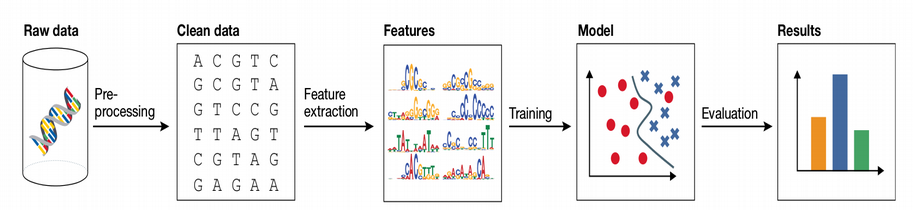
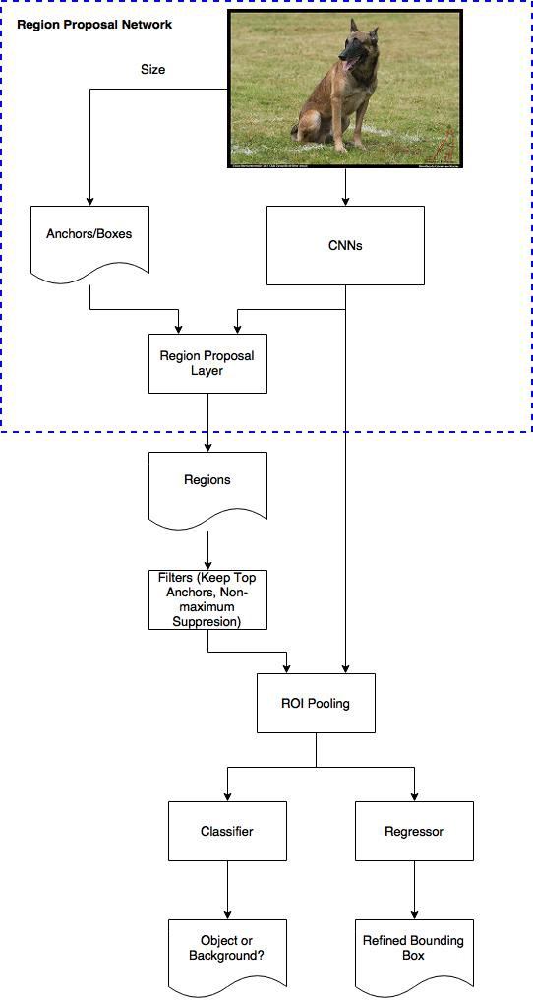
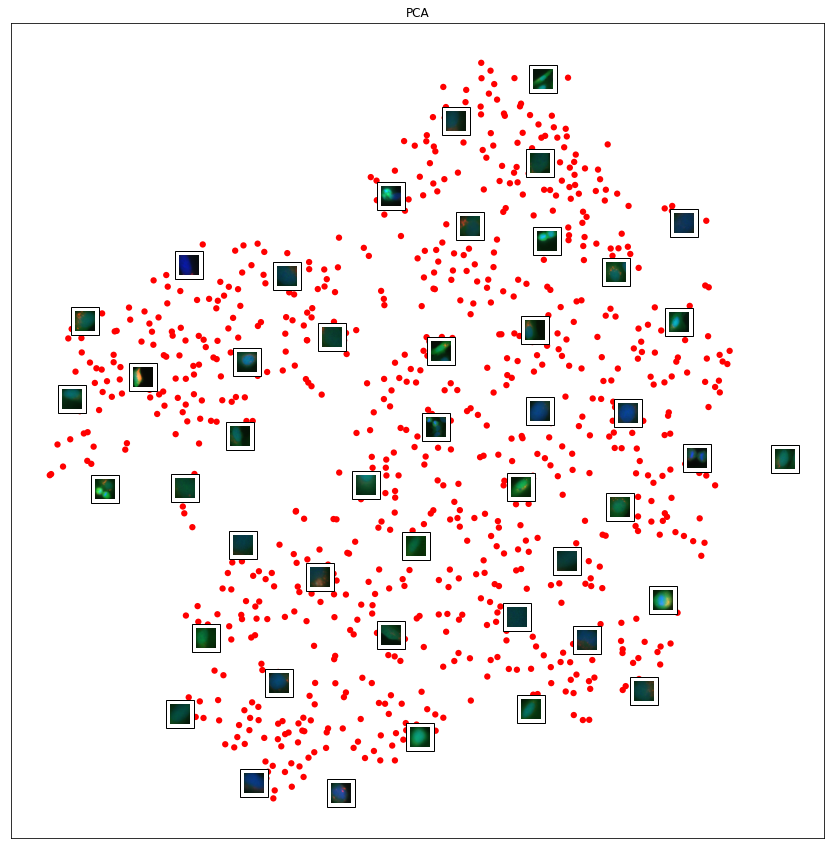
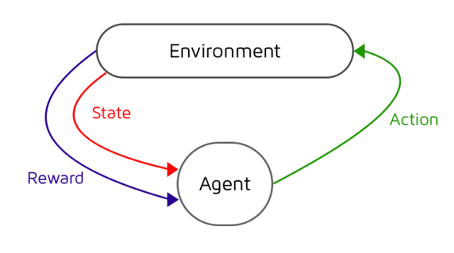

exclude: true
count: false

```{r,echo=FALSE,child="assets/header-presentation.Rmd"}
```

<!-- ----------------- Only edit title & author above this ----------------- -->

```{r,echo=FALSE,message=FALSE,warning=FALSE}
# load the packages you need

#library(tidyverse)
#library(ggplot2)
```

---
name: Machine Learning for Everyone

## Machine Learning for Everyone

.center[
]


---
name: Stereotypes about Machine Learning

## Stereotypes about Machine Learning

.center[
]


---
name: Data Science and Artificial Intelligence

## Data Science and Artificial Intelligence

* The world’s most valuable resource is no longer oil, but Data
* Big Data is arriving, Bioinformatics learns from Data Science
* Data Science speaks Python, Julia, Java Script, Scala and R
* Apache Spark, Probabilistic Programming and AI become common

.center[
]


---
name: What is Machine Learning?

## What is Machine Learning?

* Machine Learning maps input X to output Y as
$$Y = f ( X )$$
without necessarily knowing the functional form of f

* Machine Learning provides two major things:

  * **Prediction**
  * **Feature Selection**

* Machine Learning can be categorized into:

  * **Parametric**: assumtion on f(X), often linear, easy to learn, fast, little data needed, poor prediction (example: Linear and Logistic Regression)
  * **Non-Parametric**: assumtion free, difficult to train, slow, needs a lot of data, higher prediction power (example: Random Forest, LASSO, Neural Networks)


---
name: Diversity of Machine Learning

## Diversity of Machine Learning


---
name: Supervised vs. Unsupervised

## Supervised vs. Unsupervised


.center[
]


---
name: Main Steps of Machine Learning

## Main Steps of Machine Learning

* To start Machine Learning one needs first to clean the data: impute, correct for batch-effects, normalize, standardize etc.

* Next step is to figure out features in the data. Note: Deep Learning skips this step and works directly on raw data

* Machine Learning model is fitted on the training and evaluated on an independent subset





---
name: How does Machine Learning work?

## How does Machine Learning work?

Machine Learning by default involves five basic steps:

1. Split data set into **train**, **validation** and **test** subsets.
2. Fit the model in the train subset.
3. Validate your model on the validation subset.
4. Repeat steps 1-3 a number of times and tune **hyperparameters**.
5. Test the accuracy of the optimized model on the test subset.

.center[
]


---
name: Toy Example of Machine Learning

## Toy Example of Machine Learning

```{r,fig.width=6,fig.height=4.5,fig.align='center'}
set.seed(12345)
N<-100
x<-rnorm(N)
y<-2*x+rnorm(N)
df<-data.frame(x,y)
plot(y~x,data=df, col="blue")
```


---
name: Train and Test Subsets

## Train and Test Subsets

We randomly assign 70% of the data to training and 30% to test subsets: 

```{r}
set.seed(123)
train<-df[sample(1:dim(df)[1],0.7*dim(df)[1]),]
test<-df[!rownames(df)%in%rownames(train),]
```

```{r,echo=FALSE,fig.width=6,fig.height=4.5,fig.align='center'}
df$color[rownames(df)%in%rownames(train)]<-"blue"
df$color[rownames(df)%in%rownames(test)]<-"red"
plot(y~x,data=df,col=df$color)
legend("topleft",c("Train","Test"),fill=c("blue","red"),inset=0.02)
abline(lm(y~x,data=train),col="blue")
```


---
name: Validation of Model

## Validation of Model

```{r,fig.width=6,fig.height=4.5,fig.align='center'}
test_predicted<-as.numeric(predict(lm(y~x,data=train),newdata=test))
plot(test$y~test_predicted,ylab="True y",xlab="Pred y",col="darkgreen")
abline(lm(test$y~test_predicted),col="darkgreen")
```


---
name: Validation of Model (Cont.)

## Validation of Model (Cont.)

```{r}
summary(lm(test$y~test_predicted))
```

Thus the model explains 79% of variation on the test subset.


---
name: What is a Hyperparameter?

## What is a Hyperparameter?

* Hyperparameters are Machine Learning design parameters which are set before the learning process starts
* For the toy model a hyperparameter can be e.g. the number of covariates to adjust the main variable x of interest for

```{r}
set.seed(1)
for(i in 1:10)
{
  df[,paste0("PC",i)]<-1*(1-i/10)*y+rnorm(N)
}
head(df)
```


---
name: How does Cross-Validation work?

## How does Cross-Validation work?

* We should not include all PCs - overfitting
* Cross-Validation is a way to combat overfitting

```{r}
train<-df[sample(1:dim(df)[1],0.6*dim(df)[1]),]
val_test<-df[!rownames(df)%in%rownames(train),]
validate<-val_test[sample(1:dim(val_test)[1],0.25*dim(val_test)[1]),]
test<-val_test[!rownames(val_test)%in%rownames(validate),]
```
```{r,echo=FALSE,fig.width=6,fig.height=4.5,fig.align='center'}
df$color[rownames(df)%in%rownames(train)]<-"blue"
df$color[rownames(df)%in%rownames(validate)]<-"red"
df$color[rownames(df)%in%rownames(test)]<-"green"
plot(y~x,data=df,col=df$color)
legend("topleft",c("Train","Validate","Test"),fill=c("blue","red","green"),inset=0.02)
abline(lm(y~x,data=train),col="blue")
```


---
name: How does Cross-Validation work? (Cont.)

## How does Cross-Validation work? (Cont.)

* Let us fit the linear regression model in the training set and validate the error in the validation data set
* Error: root mean squared difference between y predicted by the trained model for validation set and the real y in the validation set
* Looks like no drammatic decrease of RMSE after PC2

```{r,echo=FALSE,fig.width=6,fig.height=4.5,fig.align='center'}
set.seed(1)

train_and_validate<-df[sample(1:dim(df)[1],0.7*dim(df)[1]),]
test<-df[!rownames(df)%in%rownames(train_and_validate),]

N_cv<-100
error<-vector()

error_null<-vector()
for(j in 1:N_cv)
{
  train<-train_and_validate[sample(1:dim(train_and_validate)[1],(6/7)*dim(train_and_validate)[1]),]
  validate<-train_and_validate[!rownames(train_and_validate)%in%rownames(train),]
  error_null<-append(error_null,sqrt(sum((predict(lm(y~x,data=train),newdata=validate)-validate$y)^2)/dim(validate)[1]))
}
error<-append(error,mean(error_null))

for(j in 1:10)
{
  error_at_pc<-vector()
  formula<-as.formula(paste0("y~x+",paste0("PC",seq(1:j),collapse="+")))
  for(i in 1:N_cv)
  {
    train<-train_and_validate[sample(1:dim(train_and_validate)[1],(6/7)*dim(train_and_validate)[1]),]
    validate<-train_and_validate[!rownames(train_and_validate)%in%rownames(train),]
    error_at_pc<-append(error_at_pc,sqrt(sum((predict(lm(formula,data=train),newdata=validate)-validate$y)^2)/dim(validate)[1]))
  }
  error<-append(error,mean(error_at_pc))
}
plot(error~seq(from=0,to=10,by=1),type='o',xlab="PRINCIPAL COMPONENTS",ylab="RMSE")
```


---
name: Ultimate Model Evaluation

## Ultimate Model Evaluation

* Thus optimal model is y~x+PC1+PC2
* Perform final evaluation of the optimized/trained model on the test data set and report the final accuracy (adjusted R squared)
* The model explains over 90% of variation on the unseen test data set

```{r}
summary(lm(predict(lm(y~x+PC1+PC2,data=train),newdata=test)~test$y))
```


---
name: Underfitting vs. Overfitting

## Underfitting vs. Overfitting


* Akaike Information Criterion (AIC):

$$\rm AIC = 2k - 2ln(L)$$
* Random Forest: each tree overfitted, but ensemble of trees performs very well 


---
name: Bias-Variance

## Bias-Variance Tradeoff

.pull-left-50[

]

.pull-right-50[

]

$$Y = f(X) \Longrightarrow\rm{Reality} \\
Y = \hat{f}(X) + \rm{Error}\Longrightarrow\rm{Model} \\
Error^2 = (Y - \hat{f}(X))^2 = Bias^2 + Variance$$

* It is mathematically proven that ensemble learning keeps the Bias the same but leads to a large decrease of Variance


---
name: KNN and SVM

## KNN and SVM

.pull-left-50[


* How many out of K neighbors belong to each class

* Majority voting

* Non-linear

]
.pull-right-50[


* Draw hyperplane that separates classes

* Maximize margins

* Can be linear and non-linear
]


---
name: Random Forest

## What is Random Forest?


---
name: Classification: Pima Indians Diabetes

## Classification: Pima Indians Diabetes

```{r}
library("mlbench")
data(PimaIndiansDiabetes2)
head(PimaIndiansDiabetes2,4)
```
```{r,echo=FALSE,cache=FALSE}
phen<-colnames(PimaIndiansDiabetes2)[2:6]
for(i in phen)
{
  PimaIndiansDiabetes2[,i][is.na(PimaIndiansDiabetes2[,i])==TRUE]<-mean(PimaIndiansDiabetes2[,i],na.rm=TRUE)
}
Y<-factor(PimaIndiansDiabetes2$diabetes)
X<-scale(PimaIndiansDiabetes2[,1:8],center=TRUE,scale=TRUE)
scaled_PimaIndiansDiabetes2<-data.frame(X,diabetes=Y)
scaled_PimaIndiansDiabetes2$random<-rnorm(dim(scaled_PimaIndiansDiabetes2)[1])
set.seed(12345)
train<-scaled_PimaIndiansDiabetes2[sample(1:dim(scaled_PimaIndiansDiabetes2)[1],0.7*dim(scaled_PimaIndiansDiabetes2)[1]),]
test<-scaled_PimaIndiansDiabetes2[!rownames(scaled_PimaIndiansDiabetes2)%in%rownames(train),]

library("caret")
library("kernlab")
library("randomForest")
set.seed(1234)
control<-trainControl(method="repeatedcv", number=10, savePredictions=T, repeats=5, classProbs=T, summaryFunction=twoClassSummary)

metric <- "ROC"

fit.lda <- train(diabetes~., data=train, method="lda", metric=metric, trControl=control, na.action=na.omit)
fit.cart <- train(diabetes~., data=train, method="rpart", metric=metric, trControl=control, na.action=na.omit)
fit.knn <- train(diabetes~., data=train, method="knn", metric=metric, trControl=control,na.action=na.omit)
fit.svm <- train(diabetes~., data=train, method="svmRadial", metric=metric, trControl=control,na.action=na.omit)
fit.rf <- train(diabetes~., data=train, method="rf", metric=metric, trControl=control, na.action=na.omit)
#fit.nn <- train(diabetes~., data=train, method="mlp", metric=metric, trControl=control, na.action=na.omit)
#results <- resamples(list(lda=fit.lda, cart=fit.cart, knn=fit.knn, svm=fit.svm, rf=fit.rf, nn=fit.nn))
results <- resamples(list(lda=fit.lda, cart=fit.cart, knn=fit.knn, svm=fit.svm, rf=fit.rf))
```
```{r}
summary(results)
```


---
name: Compare Machine Learning Methods

## Compare Machine Learning Methods

```{r,fig.width=8,fig.height=5}
dotplot(results)
```


---
name: Feature Selection

## Feature Selection

```{r,echo=FALSE}
best_model<-get(paste0("fit.",names(summary(results)$statistics$ROC[,4])[as.numeric(summary(results)$statistics$ROC[,4])==max(summary(results)$statistics$ROC[,4])]))
```
```{r,fig.width=9,fig.height=6}
feat<-varImp(best_model)$importance$pos
names(feat)<-rownames(varImp(best_model)$importance)
barplot(sort(feat,decreasing=T),ylab="FEATURE IMPORTANCE",col="darkred")
```


---
name: Make Predictions 

## Make Predictions: Confusion Matrix

```{r}
library("e1071")
predictions <- predict(best_model, test)
confusionMatrix(predictions, test$diabetes)
```


---
name: ROC Curves

## ROC Curves on Test Data Set

```{r,echo=FALSE,fig.width=7,fig.height=6,fig.align='center'}
library("pROC")
predictions <- predict(best_model, test, type="prob")
my_ROC<-roc(test$diabetes, predictions[,"pos"])
tpr<-my_ROC$sensitivities
fpr<-1-my_ROC$specificities
plot(tpr~fpr,type='l', ylab="TRUE POSITIVE RATE", xlab="FALSE POSITIVE RATE",col="red")
lines(c(0,1),c(0,1))

colors_vector<-c("blue","green","magenta","orange")
names_vector<-names(summary(results)$statistics$ROC[,4])
names_vector<-names_vector[-which(names_vector==names(summary(results)$statistics$ROC[,4])[as.numeric(summary(results)$statistics$ROC[,4])==max(summary(results)$statistics$ROC[,4])])]
for(i in 1:length(names_vector))
{
  current_model<-get(paste0("fit.",names_vector[i]))
  current_predictions <- predict(current_model, test, type="prob")
  current_ROC<-roc(test$diabetes, current_predictions[,"pos"])
  current_tpr<-current_ROC$sensitivities
  current_fpr<-1-current_ROC$specificities
  lines(current_tpr~current_fpr,type='l',col=colors_vector[i])
}
legend("bottomright", c("LDA","CART","KNN","SVM","RF"), fill=c("red",colors_vector), inset=0.02)
```


---
name: Why such a hype about Deep Learning?

## Why such a hype about Deep Learning?

.center[
]

.center[
<span style="color:red">**Because Deep Learning delivers state-of-the-art results**</span>]


---
name: Promises of  Deep Learning for Society

## Promises of  Deep Learning for Society

.center[
]


---
name: Promises of  Deep Learning for Life Sciences

## Promises of  Deep Learning for Life Sciences

.center[
]


---
name: What is Deep Learning?

## What is Deep Learning?

* Artificial Neural Networks (ANN) with multiple layers

* Main advantages of Deep Learning over Machine Learning:
  * Feature extraction
  * Scalability

* Universal Approximation Theorem

```{r,echo=FALSE,fig.width=6,fig.height=3.7,fig.align='center'}
library("png")
library("grid")
img <- readPNG("/home/nikolay/Documents/Teaching/RaukR/Presentations/MachineLearning/WhyDeepLearning.png")
grid.raster(img)
```


---
name: Artificial Neural Networks (ANN)

## Artificial Neural Networks (ANN)

* Mathematical algorithm/function with special architecture

* Highly non-linear dues to activation functions

* Backward propagation for minimizing error 

.center[
]


---
name: Convolutional Neural Networks (CNN)

## Convolutional Neural Networks (CNN)

.center[
]


---
name: Computer Vision

## Computer Vision

.center[
]


---
name: Object Detection

## Object Detection

.pull-left-50[
]

.pull-right-50[


]

---
name: Human Protein Atlas

## Human Protein Atlas

.center[
]

.center[
]


---
name: Image Annotation

## Image Annotation

.center[
]

.center[
]


---
name: Beauty of Neural Networks

## Beauty of Neural Networks

* Maximum Likelihood
* Cross-Validation
* Bootstrapping
* Regularization
* Bayesian Inference
* Multivariate Feature Selection
* Monte Carlo Approximation
* Bagging and Boosting


---
name: Single Cells make Big Data

## Single Cells make Big Data

.center[
]


---
name: Autoencoders

## Autoencoders

.center[
]


---
name: Autoencoders for scRNAseq

## Autoencoders for scRNAseq

.center[
]


---
name: Autoencoders for Large-Scale scRNAseq

## Autoencoders for Large-Scale scRNAseq

.center[
]


---
name: Frequentist Image Recognition

## Frequentist Image Recognition

.center[
]


---
name: Bayesian Image Recognition

## Bayesian Image Recognition

.center[
]


---
name: Bayesian Deep Learning for Single Cell

## Bayesian Deep Learning for Single Cell

.center[
]


---
name: Reinforcement Learning

## Reinforcement Learning

.center[
]


---
name: Towards Self-Trainable Machines

## Towards Self-Trainable Machines

.pull-left-50[
.center[

]
]

.pull-right-50[
.center[


]]


---
name: Bioinformatics Learns from Google

## Bioinformatics Learns from Google

.center[
]


---
name: Total Science: Pan-Science

## Total Science: Pan-Science

.pull-left-50[
.center[
Total Football
]]

.pull-right-50[
.center[
Total Hockey
]]


.center[
]


<!-- --------------------- Do not edit this and below --------------------- -->

---
name: end-slide
class: end-slide, middle
count: false

# Thank you. Questions?

```{r,echo=FALSE,child="assets/footer-presentation.Rmd"}
```

```{r,include=FALSE,eval=FALSE}
# manually run this to render this document to HTML
rmarkdown::render("presentation.Rmd")
# manually run this to convert HTML to PDF
#pagedown::chrome_print("presentation.html",output="presentation.pdf")
```

