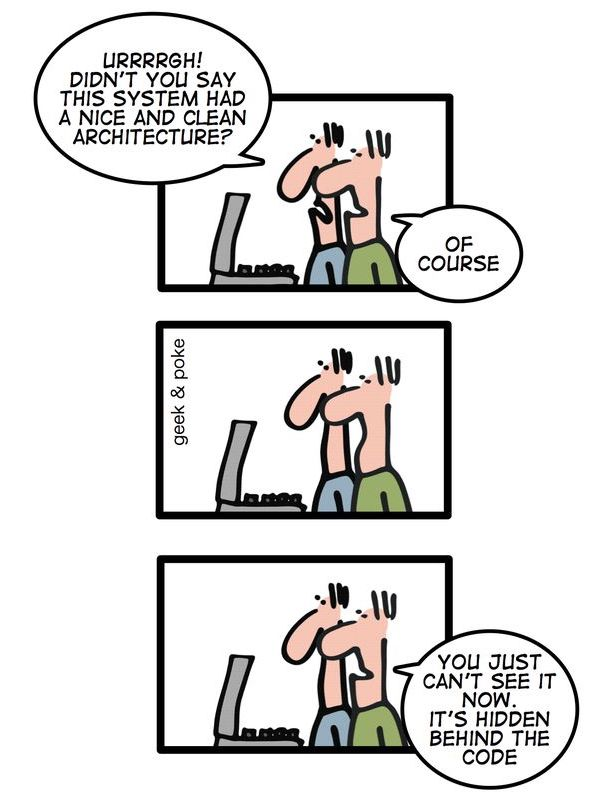

exclude: true
count: false

```{r,echo=FALSE,child="assets/header-presentation.Rmd"}
```

<!-- ----------------- Only edit title & author above this ----------------- -->

```{r setup,include=FALSE}
knitr::opts_chunk$set(dev="CairoPNG",results="hold",fig.show="hold",fig.align="left",echo=TRUE,warning=FALSE,message=FALSE)

# report related
library(knitr)
library(markdown)
library(rmarkdown)
```

```{r,echo=FALSE,message=FALSE,warning=FALSE}
# only load the packages you need

# data handling
library(dplyr)
library(tidyr)
library(stringr)

# tables
library(kableExtra) # complete table
library(formattable) # table with conditional formatting
library(DT) # interactive table

# graphics
library(ggplot2) # static graphics

# interactive graphics
library(highcharter)
library(plotly)
library(ggiraph) # convert ggplot to interactive
library(dygraphs) # time series
library(networkD3) # network graph
library(leaflet) # interactive maps
library(crosstalk) # linking plots
```

name: overview
## Topics of This Presentation
<br><br>
Code:
<br>

* **Style** -- __howTo_style.yourCode?

* **Structure** -- manufacture your own building blocks.

* **Debugging** -- my code does not run.

* **Profiling** -- now it does run but... out of memory!

* **Optimization** -- making things better.

---

name: coding-style
## Coding Style
* Naming conventions -- assigning names to variables.

* Code formatting -- placement of braces, use of whitespace characters etc.
.center[
<br>
.vsmall[From: [Behind The Lines](http://geekandpoke.typepad.com/geekandpoke/2010/09/behind-the-lines.html) 2010-09-23. By Oliver Widder, Webcomics Geek And Poke.]
]
---

name: naming-conventions
## Naming Conventions

A syntactically valid name:

* Consists of:
  + letters: ``r paste0(paste0(letters, collapse=''), paste0(LETTERS, collapse=''))``
  + digits: ``r paste(0:9, collapse='')``
  + period: `.`
  + underscore: `_`

* begins with a letter or the period (`.`) **not** followed by a number

* cannot be one of the *reserved words*: `if`, `else`, `repeat`, `while`, `function`, `for`, `in`, `next`, `break`, `TRUE`, `FALSE`, `NULL`, `Inf`, `NaN`, `NA`, `NA_integer_`, `NA_real_`, `NA_complex_`, `NA_character_`

* also cannot be: `c`, `q`, `t`, `C`, `D`, `I`
---

name: naming-styles
## Naming Style
Variable names that are legal are not necessarily a good style and they may be dangerous:

```{r the_TF_trap, echo=TRUE}
F + T  
F <- T  
F + T  
```

```{r reset_false, include=FALSE}
T <- TRUE
F <- FALSE
```
do not do this! 
--
unless you are a politician...
<br><br><br>
.center[.large[Avoid `T` and `F` as variable names.]]
---

## Customary Variable Names
Also, there is a number of variable names that are traditionally used to name particular variables:

* `usr` -- user, 
* `pwd` -- password,
* `x`, `y`, `z` -- vectors,
* `w` -- weights,
* `f`, `g` -- functions,
* `n` -- number of rows,
* `p` -- number of columns,
* `i`, `j`, `k` -- indexes,
* `df` -- data frame,
* `cnt` -- counter,
* `M`, `N`, `W` -- matrices, 
* `tmp` -- temporary variables

Sometimes these are domain-specific:

* `p`, `q` -- allele frequencies in genetics,
* `N`, `k` -- number of trials and number of successes in stats
<br><br>
.center[.large[Try to avoid use these in this way to avoid possible confusion.]]
---

## Different Notations
People use different notation styles throughout their code:
* `snake_notation_looks_like_this`,
* `camelNotationLooksLikeThis`,
* `period.notation.looks.like.this`,
* `LousyNotation_looks.likeThis`

Try to be consistent and stick to one of them. Bear in mind `period.notation` is used by S3 classes to create generic functions, e.g. `plot.my.object`. A reason to avoid it?

.center[***]

It is also important to maintain code readability by having your variable names:
* informative, e.g. `genotypes` vs. `fsjht45jkhsdf4`,

* consistent across your code - the same naming convention,

* not too long, e.g. - `weight` vs. `phenotype.weight.measured`,

* in the period notation and the snake notation avoid `my.var.2` or `my_var_2`, use `my.var2` and `my_var2` instead
---

## Special Variable Names
Few more things to consider:

* there are built-in variable names: 

  + LETTERS: the 26 upper-case letters of the Roman alphabet

  + letters: the 26 lower-case letters of the Roman alphabet

  + month.abb: the three-letter abbreviations for the English month names

  + month.name: the English names for the months of the year

  + pi: the ratio of the circumference of a circle to its diameter
  
* variable names beginning with period are **hidden**: `.my_secret_variable` will not be shown but can be accessed.

---
name: structuring_your_code
## Structure Your Code

Decompose the problem!

.center[


<br>
.vsmall[source: Wikimedia Commons]
]

--

* *Divide et impera* / top-down approach -- split your BIG problem into small subproblems recursively and, **at some level**, encapsulate your code in functional blocks (functions).

* A function should be performing a small task. Should be a logical program unit.

**When should I write a function?**

* one screen rule (resolution...),
* re-use twice rule.

Consider creating an S4 class -- data-type safety!

---
name: how_to_write_functions
## How to write functions

* Avoid accessing (and modifying) globals!

* Use data as the very first argument (pipes).

* Set parameters to defaults -- better more params than too few.

* Remember that global defaults can be changed by `options`.

* If you are re-using someone else's function -- write a wrapper.

* Showing progress and messages is good, but let the others turn this off.

* If you are calling other functions, consider using `...`

.center[
<br>
.vsmall[source: http://www.xkcd/com/292]
]

---
name: debugging

## Debugging Your Code 

* Sooner or later ALL of us, even the most experienced programmers, introduce errors to their code.

* *20 percent of the code has 80 percent of the errors. Find them, fix them!* 
.right[*-- Lowell Arthur*]

* *Beware of bugs in the above code; I have only proved it correct, not tried it.* 
.right[*-- Donald Knuth*]

* The process of debugging is about confirming, one-by-one, that our beliefs about the code are actually true (loosely inspired by Pete Salzman). 

* Debug in a *top-down* and *modular* manner! provided you have coded in a modular way...


---
name: types_of_bugs
## Types of bugs

### There are different types of bugs we can introduce:
* Syntax -- `prin(var1), mean(sum(seq((x + 2) * (y - 9 * b)))`

* Arithmetic -- `x/0` (not in R, though!) `Inf/Inf`

* Type -- `mean('a')`

* Logic -- everything works and produces seemingly valid output that is WRONG!

### To avoid bugs:
* Encapsulate your code in smaller units (functions), you can test.

* Use classes and type checking.

* Test at the boundaries, e.g. loops at min and max value.

* Feed your functions with test data that should result with a known output.

* Use *antibugging*: `stopifnot(y <= 75)`

---
name: arithmetic_bugs
## Arithmetic bugs

```{r arithmetic_bugs} 
(vec <- seq(0.1, 0.9, by=0.1))
vec == 0.7
vec == 0.5
(0.5 + 0.1) - 0.6
(0.7 + 0.1) - 0.8
```
Beware of floating point arithmetics!
.small[
```{r double_epsilon}
head(unlist(.Machine))
head(unlist(.Platform))
```
]

---
name: error_handling
## Handling Errors
```{r error_log, error=TRUE}
input <- c(1, 10, -7, -2/5, 0, 'char', 100, pi)
for (val in input) {
  (paste0('Log of ', val, 'is ', log10(val)))
}
```

One option is to use the `try` block:
```{r error_log_try}
for (val in input) {
  val <- as.numeric(val)
  try(print(paste0('Log of ', val, ' is ', log10(val))))
}
```

---
name: error_handling_cted
## Handling Errors with `tryCatch`
```{r error_log_tryCatch}
for (val in input) {
  val <- as.numeric(val)
  result <- tryCatch(log10(val), 
              warning = function(w) { print('Negative argument supplied. Negating.'); log10(-val) }, 
              error = function(e) { print('Not a number!'); NaN })
  print(paste0('Log of ', val, ' is ', result))
}
```

---
## Debugging -- Errors and Warnings
* An error in your code will result in a call to the `stop()` function that:

  + breaks the execution of the program (loop, if-statemetnt, etc.),
 
  + performs the action defined by the global parameter `error`.
  
* A warning just prints out the warning message (or reports it in another way).

* Global parameter `error` defines what R should do when an error occurs.

```{r debug_options, eval=FALSE, include=TRUE}
options(error = )
```

* You can use `simpleError()` and `simpleWarning()` to generate errors and warnings in your code:
```{r simpleErr_simmpleWarn}
f <- function(x) {
  if (x < 0) {
    x <- abs(x)
    w <- simpleWarning("Value less than 0. Taking abs(x)")
    w
  }
}
```


---
## Debugging -- What are my Options?

* Old-school debugging: a lot of `print` statements
  + print values of your variables at some checkpoints,
  + sometimes fine but often laborious,
  + need to remove/comment out manually after debugging.
  
* Dumping frames
  + on error, R state will be saved to a file,
  + file can be read into debugger,
  + values of all variables can be checked,
  + can debug on another machine, e.g. send dump to your colleague!

* Traceback
  + a list of the recent function calls with values of their params,

* Step-by-step debugging
  + execute code line by line within the debugger
  
---
name: debugging_dump_frames
## Option 1: Dumping Frames

```{r dump_frames, eval=T, echo=T, include=TRUE, error=TRUE}
options(error = quote(dump.frames("testdump", TRUE)))

f <- function(x) {
    sin(x)
}
f('test')
options(error = NULL)
load("testdump.rda")
# debugger(testdump)
```

.smaller[<tt>Message:  Error in sin(x) : non-numeric argument to mathematical function <br>
Available environments had calls: <br>
1: f("test") <br>
 <br>
Enter an environment number, or 0 to exit   <br>
Selection: 1 <br>
Browsing in the environment with call: <br>
   f("test") <br>
Called from: debugger.look(ind) <br>
Browse[1]> x <br>
[1] "test" <br>
Browse[1]>  <br>
[1] "test" <br>
Browse[1]> 
</tt>
]
Last empty line brings you back to the environments menu.

---
name: debugging_traceback
## Option 2: Traceback

```{r traceback, eval=T, echo=T, include=TRUE, error=TRUE}
f <- function(x) {
  log10(x)  
}

g <- function(x) {
  f(x)
}
g('test')
```
<tt>
> traceback()<br>
2: f(x) at #2<br>
1: g("test")<br>
</tt>

`traceback()` shows what were the function calls and what parameters were passed to them when the error occured.

---

## Option 3: Debug step-by-step

Let us define a new function `h(x, y)`:
```{r debug}
h <- function(x, y) { 
  f(x) 
  f(y) 
  }
```
Now, we can use `debug()` to debug the function in a step-by-step manner:
```{r debug2, echo=TRUE, eval=FALSE}
debug(h)
h('text', 7)
undebug(h)
```

---
## Option 3: Debug step-by-step cted.

`n` -- execute next line, `c` -- execute whole function, `q` -- quit debugger mode.

<tt>
> debug(h)<br>
> h('text', 7)<br>
debugging in: h("text", 7)<br>
debug at #1: {<br>
    f(x)<br>
    f(y)<br>
}<br>
</tt>
--
<tt>Browse[2]> x<br>
[1] "text"<br></tt>
--
<tt>Browse[2]> y<br>
[1] 7<br></tt>
--
<tt>Browse[2]> n<br>
debug at #2: f(x)<br></tt>
--
<tt>Browse[2]> x<br>
[1] "text"<br></tt>
--
<tt>Browse[2]> n<br>
Error in log10(x) : non-numeric argument to mathematical function<br>
</tt>

---

name: profiling_proc_time
## Profiling -- `proc.time()`
Profiling is the process of identifying memory and time bottlenecks in your code.

```{r proc_time, echo = TRUE}
proc.time()
```
* `user time` -- CPU time charged for the execution of user instructions of the calling process, 
* `system time` -- CPU time charged for execution by the system on behalf of the calling process,
* `elapsed time` -- total CPU time elapsed for the currently running R process.

```{r proc_time_ex, echo = TRUE}
pt1 <- proc.time()
tmp <- runif(n =  10e5)
pt2 <- proc.time()
pt2 - pt1
```
---
name: profiling_system_time

## Profiling -- `system.time()`
```{r profiling_system_time, echo = TRUE}
system.time(runif(n = 10e6))
system.time(rnorm(n = 10e6))
```

---
name: profiling_system_time

## Profiling in Action

Let's see profiling in action! We will define four functions that fill a large vector in two different ways:
--
```{r profiling_fundef1, echo = TRUE}
fun_fill_loop1 <- function(n = 10e6, f) {
  result <- NULL
  for (i in 1:n) {
    result <- c(result, eval(call(f, 1)))
  }
  return(result)
}
```
--
```{r profiling_fundef2, echo = TRUE}
fun_fill_loop2 <- function(n = 10e6, f) {
  result <- vector(length = n)
  for (i in 1:n) {
    result[i] <- eval(call(f, 1))
  }
  return(result)
}
```
 
---

## Profiling in Action cted.

It is maybe better to use...
--
vectorization!
--
```{r profiling_fundef3, echo = TRUE}
fun_fill_vec1 <- function(n = 10e6, f) {
  result <- NULL
  result <- eval(call(f, n))
  return(result)
}
```
--
```{r profiling_fundef4, echo = TRUE}
fun_fill_vec2 <- function(n = 10e6, f) {
  result <- vector(length = n)
  result <- eval(call(f, n))
  return(result)
}
```

---
name: compare_loop_vec_sys_time

## Profiling our functions

```{r profile_loop, echo = TRUE, cache=TRUE}
system.time(fun_fill_loop1(n = 10e4, "runif")) # Loop 1
system.time(fun_fill_loop2(n = 10e4, "runif")) # Loop 2
system.time(fun_fill_vec1(n = 10e4, "runif"))  # Vectorized 1
system.time(fun_fill_vec2(n = 10e4, "runif"))  # Vectorized 2
```

The `system.time()` function is not the most accurate though. During the lab, we will experiment with package `microbenchmark`.

---
name: Rprof
## More advanced profiling
We can also do a bit more advanced profiling, including the memory profiling, using, e.g. `Rprof()` function.

```{r Rprof, include=FALSE, cache=TRUE}
Rprof('profiler_test.out', interval = 0.01, memory.profiling = T)
for (i in 1:5) {
  result <- fun_fill_loop2(n = 10e4, "runif")
  print(result)
}
Rprof(NULL)
```
And let us summarise:
.small[
```{r summaryRprof}
summary <- summaryRprof('profiler_test.out', memory='both')
datatable(summary$by.self, options=list(pageLength = 10, searching = F, info = F))
#knitr::kable(summary$by.self)
```
]

---
name: profr_package
## Profiling -- `profr` package
There are also packages available that enable even more advanced profiling:

```{r profr_package, eval=F}
library(profr)
Rprof("profiler_test2.out", interval = 0.01)
tmp <- table(sort(rnorm(1e5)))
Rprof(NULL)
profile_df <- parse_rprof('profiler_test2.out')
```
This returns a table that can be visualised:
```{r include=FALSE}
#save(profile_df, file = 'assets/profiler_test2.Rdat')
load('assets/profiler_test2.Rdat')
```

```{r show_profr_result, echo=FALSE}
datatable(profile_df, options=list(pageLength = 5, searching = F, info = F))
```

---
name: profr_package_cted
## Profiling -- `profr` package cted.

We can also use the overloaded `ggplot` function:

```{r show_profr_result_plot, echo=T, fig.align = 'center', fig.height=5, fig.width=7}
profr::ggplot.profr(profile_df)
```

---
name: profviz_package
## Profiling with `profvis`

Yet another nice way to profile your code is by using Hadley Wickham's `profvis` package:
```{r profviz_demo, eval=F}
library(profvis)
profvis({fun_fill_loop2(1e4, 'runif')
  fun_fill_vec2(1e4, 'runif')
  })
```

---
name: profvis_run
## Profiling with `profvis` cted.
```{r profviz_run, echo=FALSE}
library(profvis)
profvis({fun_fill_loop2(1e4, 'runif')
  c()
  })
```

---
name: optimizing_code1
## Optimizing your code

*We should forget about small efficiencies, say about 97% of the time: premature optimization is the root of all evil. Yet we should not pass up our opportunities in that critical 3%. A good programmer will not be delulled into complacency by such reasoning, he will be wise to look carefully at the critical code; but only after that code has been identified.*
<br><br>
*-- Donald Knuth*  

<div class="pull-left">

<br>
.vsmall[source: http://www.xkcd/com/1319]
</div>

<div class="pull-right">

<br>
.vsmall[source: http://www.xkcd/com/1205]
</div>

---
name: optimization_types
## Ways to optimize the code

* write it in a more efficient way, e.g. use vectorization or `*apply` family instead of loops etc.,
* allocating memory to avoid copy-on-modify,
* use package `BLAS` for linear algebra,
* use `bigmemory` package,
* GPU computations,
* multicore support, e.g. `multicore`, `snow`
* use `data.table` or `tibble` instead of `data.frame`

---
name: copy-on-modify
## Copy-on-modify

```{r copy_on_modify}
library(pryr)
order <- 1024
matrix_A <- matrix(rnorm(order^2), nrow = order)
matrix_B <- matrix_A
```
--
Check where the objects are in the memory:
--
```{r}
address(matrix_A)
address(matrix_B)
```
--
What happens if we modify a value in one of the matrices?
--
```{r}
matrix_B[1,1] <- 1
address(matrix_A)
address(matrix_B)
```

---
## Avoid copying by allocating memory

### No memory allocation
```{r noalloc_ex}
f1 <- function(to = 3, silent=F) {
  tmp <- c()
  for (i in 1:to) {
    a1 <- address(tmp)
    tmp <- c(tmp, i)
    a2 <- address(tmp)
    if(!silent) { print(paste0(a1, " --> ", a2)) } 
  }
}
f1()
```

---
## Avoid copying by allocating memory cted.

### With allocation
```{r alloc_ex}
f2 <- function(to = 3, silent = FALSE) {
  tmp <- vector(length = to, mode='numeric')
  for (i in 1:to) {
    a1 <- address(tmp)
    tmp[i] <- i
    a2 <- address(tmp)
    if(!silent) { print(paste0(a1, " --> ", a2)) }
  }
}
f2()
```

---
## Allocating memory -- benchmark.
```{r, cache=T}
library(microbenchmark)
benchmrk <- microbenchmark(f1(to = 1e3, silent = T), 
                           f2(to = 1e3, silent = T), 
                           times = 100L)
autoplot(benchmrk)
```

---
## GPU
```{r gpu_R, echo=TRUE, cache=T}
library(gpuR)
library(microbenchmark)
A = matrix(rnorm(1000^2), nrow=1000) # stored: RAM, computed: CPU
B = matrix(rnorm(1000^2), nrow=1000) 
gpuA = gpuMatrix(A, type = "double") # stored: RAM, computed: GPU
gpuB = gpuMatrix(B, type = "double")
vclA = vclMatrix(A, type = "double") # stored: GPU, computed: GPU
vclB = vclMatrix(B, type = "double")
bch <- microbenchmark(
  cpuC = A %*% B,
  gpuC = gpuA %*% gpuB,
  vclC = vclA %*% vclB, 
  times = 10L) 
```
.small[
More on [Charles Determan's Blog](https://www.r-bloggers.com/r-gpu-programming-for-all-with-gpur/).
]

---
## GPU cted.
```{r, fig.align='center', cache=T}
autoplot(bch)
```

---
## Parallelization using package `parallel`
Easiest to paralllelize is `lapply`:
```{r parallel_lapply}
result <- lapply(1:2, function(x) { c(x, x^2, x^3) } )
result
```

```{r paralellized}
library(parallel)
num_cores <- detectCores() - 1
cl <- makeCluster(num_cores) # Init cluster
parLapply(cl, 1:2, function(x) { c(x, x^2, x^3)} )
stopCluster(cl)
```

---
name: end-slide
class: end-slide

<h2 style="color:#fff"> Thank you</h2>
