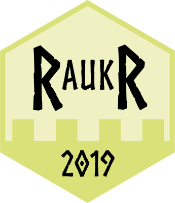

```{r,echo=FALSE,child="assets/header-lab.Rmd"}
```

```{r,echo=FALSE,results='hide'}
## LIBRARIES AND VARIABLES
# load the packages you need for this document

#library(ggplot2)
#library(tidyverse)
```



---

<p class="abstract">
The main goal of the group project is to use several tools that you have aquired during RaukR.
</p>

---

# Datasets

The three datasets supplied by RaukR can be installed using:

`devtools::install_github("Sebastian-D/ExploreData")`

Visit the github page, https://github.com/Sebastian-D/ExploreData, for more information on the datasets.

# Task

Work in groups on a dataset, either one of your own or one supplied by RaukR.
During the project you should:

* Use **Rstudio**.
* Create a `R package` and/or a `shiny app` with functions applicable to your dataset.
* Collaborate using **github**. For example one person with main repo that the others fork.
* Visualize the data with `ggplot2` or similar extended functionality plotting packages.
* When appropriate, use `tidyverse`functions to tidy or massage the data.
* Use **Best Coding Practices** generally on your code.
* **Benchmark** some function. If possible; improve and benchmark again.
* Perform some **statistical test** and/or **machine learning** on the data.

While these are suggestions, and not mandatory, do attempt to use many of the things you have learned. You are of course free to use any and all of the concepts taught during the course.

# Presentation

Each group will have 10 minutes to present on **Thursday morning** followed by 5 minutes for questions. Generate the presentation using **Rmarkdown** and any other presentation specific R packages that you wish (for example `xaringan`).

<p class="larger">
Good luck!
</p>


```{r,echo=FALSE,child="assets/footer-lab.Rmd"}
```
