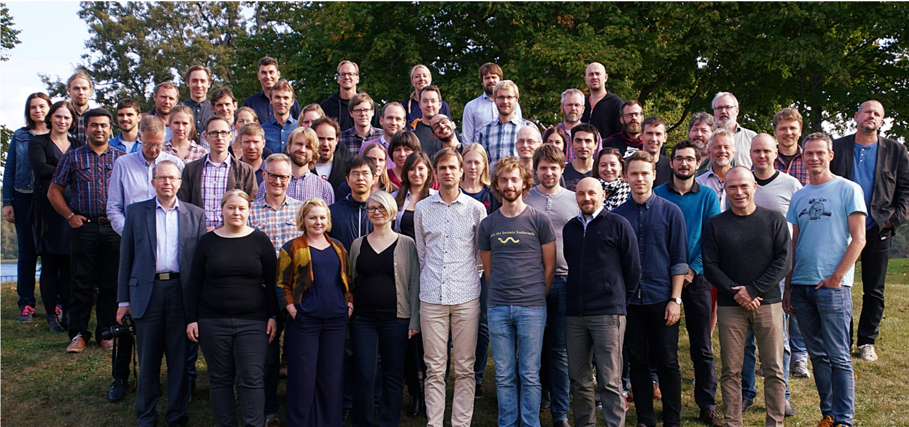
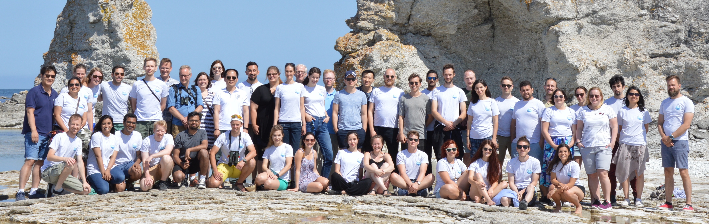

exclude: true
count: false

```{r,echo=FALSE,child="assets/header-presentation.Rmd"}
```

---

name: NBIS
## National Bioinformatics Infrastructure Sweden

* SciLifeLab -- one of the three biggest national research infrastructures in Sweden (Mark-IV and ESS),
* NBIS -- a SciLifeLab Bioinformatics Platforms,
* a national distributed network of around 100 bioinformaticians,
* support + training + development  
  
```{r, echo=FALSE}

```

---

name: raukr
## RaukR

* idea born about two years ago,
* first RaukR in 2018,
* in 2018 -- 45 participants (30 from Sweden and 15 international)
* subsidized by SciLifeLab,
* the first advanced topic course at NBIS,
* hosted at Campus Gotland, a part of Uppsala University,

```{r, echo = FALSE}

```

---

name: raukr-2019
## RaukR 2019

* 42 participants,

--

* 10 teachers,

--

* guest lecturers:
    + Jenny Bryan -- RStudio
    + Yihui Xie -- software engineer at RStudio,
    + Surprise Guest

--

* Saturday -- consultations in the morning,

--

* Sunday -- trip to Ljugarn

--

* Twitter: #RaukR

--

* Slack

--

* accommodation: Mullbärsgården and Visby Vandrarhem.

---

name: project
## Project

* either own data or supplie dataset,
* package,
* R markdown,
* collaborative effort using Git,
* short presentation on the last day.

---

name: session
## Session  

* This presentation was created in RStudio using [`remarkjs`](https://github.com/gnab/remark) framework through R package [`xaringan`](https://github.com/yihui/xaringan).
* For R Markdown, see <http://rmarkdown.rstudio.com>
* For R Markdown presentations, see <https://rmarkdown.rstudio.com/lesson-11.html>

```{r,echo=TRUE}
R.version
```

---

name: end-slide
class: end-slide

# Thank you
