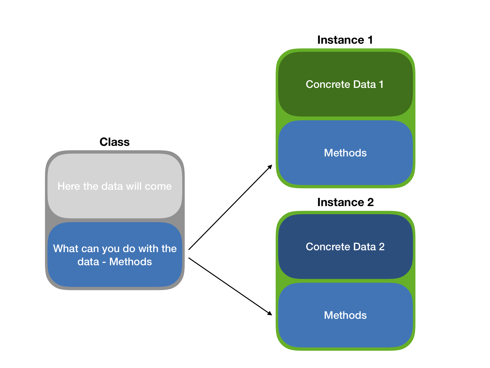

exclude: true
count: false

```{r,echo=FALSE,child="assets/header-presentation.Rmd"}
```

<!-- ----------------- Only edit title & author above this ----------------- -->

```{r setup,include=FALSE}
knitr::opts_chunk$set(dev="CairoPNG",results="hold",fig.show="hold",fig.align="left",echo=TRUE,warning=FALSE,message=FALSE)

# report related
library(knitr)
library(markdown)
library(rmarkdown)
```

```{r,echo=FALSE,message=FALSE,warning=FALSE}
# only load the packages you need

library(tidyverse)
library(purrr)
library(ggplot2) # static graphics
```

---
name: oop

## Object Oriented Programming

* A programming paradigm.
* We work with objects.
* Reflects many real-life systems -- easy to model things.
* Plato's cave (?): ideal objects -- classes, reflections -- instances.

--

```{r, echo=F, out.height=400, out.width=450, fig.align='center'} 

```

---
name: oop_in_r

## OOP Systems in R

* **S3** -- basic R OOP system,

* **S4** -- a bit more advanced OOP, common in, e.g. Bioconductor,

* RC -- Reference Classes, the most advanced and close to, e.g. Java OOP, extension of S4,

* **R6** -- simplified RC, extension of S3, `require(R6)`

---
name: S4_classes

## S4 classes
S4 classes are more advanced as you actually define the structure of the data within the object of your particular class:
```{r S4, echo=T}
setClass('gene', 
         representation(name='character', 
                        coords='numeric')
         )

.intragenic_region <- setClass(Class = 'intragenic_region', 
                               slots = c(
                                 name='character', 
                                 coords='numeric'
                               )
                              )

my.gene <- new('gene', name = 'ANK3', 
               coords = c(1.4e6, 1.412e6))

# but since SetClass returns a low-level constructor
my.intra1 <- .intragenic_region(name = 'int1', 
                  coords = c(1.7e6, 1.717e6))
```

---
name: S4_inheritance
## Inheritance in S4
```{r}
.ext_gene <- setClass(Class = 'ext_gene',
                      contains = "gene",
                      slots = c(
                        gene = 'gene',
                        feature_name = 'character',
                        feature_value = 'character'
                      ))

ANK3 <- .ext_gene(name = 'ANK3', 
                  coords = c(1.4e6, 1.412e6),
                  feature_name = 'num_introns',
                  feature_value = '5')
str(ANK3)
```

---
name: S4_sealed
## Sealed Class

Preventing double class definition:
```{r, error=T}
setClass('Not_Sealed')
setClass('Not_Sealed')
```

But to prevent this:
```{r, error=T}
setClass('Sealed', sealed = T)
setClass('Sealed')
```
---
name: S4_slots
## S4 class -- slots
The variables within an S4 class are stored in the so-called **slots**. In the above example, we have 2 such slots: *name* and *coords*. Here is how to access them:
```{r S4.slots, echo=T}
my.gene@name # access using @ operator
my.gene@coords[2] # access the 2nd element in slot coords
```

---
name: S4_methods
## S4 class -- methods
The power of classes lies in the fact that they define both the data types in particular slots and operations (functions) we can perform on them. Let us define a *generic print function* for an S4 class:
```{r S4.methods, echo=T}
setMethod('print', 'gene', 
          function(x) {
              cat('GENE: ', x@name, ' --> ')
              cat('[', x@coords, ']')
          })
print(my.gene) # and we use the newly defined print
```

---
name: S3_intro
## S3 Classes
An S3 class object is one of R base types (e.g. integer) with `class` attribute set:
--
.pull-left-50[
```{r}
obj <- factor(c("a", "b", "c"))
typeof(obj)
```
```{r}
class(obj)
```
]

.pull-right-50[
```{r}
attributes(obj)
```
```{r}
str(obj)
```
]

--

```{r}
print(obj)
```
--
```{r}
print(unclass(obj))
```
---
name: S3_custom_str
## Custom `str` Methods

Some S3 classes provide a custom `str`, e.g.: 
```{r}
time <- strptime("2018-06-07", "%Y-%m-%d")
```

.pull-left-50[
```{r}
str(time)
```
]
.pull-right-50[
```{r}
str(unclass(time))
```
]

---
name: S3_generic_dispatch
## Generic Methods and Method Dispatch
Have you ever wondered why `print()` or `summary()` work on many types (classes) of data? 

--

They are so-called *generics*, i.e. functions and methods that operate on classes. They know which method to apply to which class thanks to the process of *method dispatch*. 

The naming scheme for generics is: `generic.class()` i.e. a generic that applies to the `class` class. 

Examples:
* `print.factor()`, 
* `print.default()`, 
* `print.data.frame()`.

To see the code of a method: 
```{r}
require(GenABEL)
getS3method('summary', 'check.marker') %>% 
  head(n = 5)
```

---
name: S3_constructing
## Creating S3 Classes
To create an S3 class, simply give a name to a data structure:
```{r}
gf <- structure(list(), class = 'genomic_features')
class(gf)
```
OR
```{r}
gf <- list()
class(gf) <- 'genomic_features'
class(gf)
```

You can use some inheritance too:
```{r}
egf <- list()
class(egf) <- c('genomic_features', 'extended_genomic_features')
class(egf)
```

---
name: S3_correctness_checks
## Checking for Corectness
```{r}
linmod <- with(mtcars, lm(log(mpg) ~ log(disp)))
linmod
```
--
```{r}
class(linmod) <- "data.frame"
linmod
```
--
.center[
# S C A R Y !
]
---
name: S3_helper_validator_constructor
## Constructor, Validator

* Constructor
```{r}
new_Animal <- function(species, age) {
  stopifnot(is.character(species))
  stopifnot(is.numeric(age))
  
  structure(
    species,
    age = age,
    class = "Animal"
  )
}
```
* Validator 
```{r} 
validate_Animal <- function(x) {
  species <- unclass(x)
  age <- attr(x, 'age')
  
  if (is.na(species) || species == "") {
    stop('Species name is missing!', call. = FALSE)
  }
  if (!is.numeric(age) || age < 1 || age >= 100) {
    stop("Invalid age!", call. = FALSE)
  }
  return(x)
}
```

---
name: S3_helper
## Helper
* Helper
```{r}
Animal <- function(x) {
  species <- x[[1]] 
  age <- x[[2]]
  validate_Animal(new_Animal(species, age))
}
```

--

```{r, error=T}
# Testing
dog <- Animal(list('Canis familiaris', 7))
class(dog)
```

--
  
```{r, error=T}
cat <- Animal(list('Felis felis', '9'))
cat <- Animal(list('Felis felis', 9))
class(cat)
```

---
name: S3_object_styles
## Building S3 Classes -- Styles
One can build an S3 class on top of any existing base type, e.g. a named list:
```{r}
point_in_space_class <- function(x, y, z) {
  structure(
    list(
      x = x, 
      y = y, 
      z = z
    ),
    class = "point_in_space_class"
  )
}
```

---
name: R6_intro

## Introduction to R6 classes

* `require(R6)`,
* do not rely on S4 like RC, but on S3,
* are faster than RC,
* do not do *copy-on-modify*,
* thus provide OO model similar to C++ or Java.
* methods belong to objects, not to generics.

---
name: R6

## R6 Class Example

```{r}
library(R6)

Person <- R6Class("Person",
  public = list(
    name = NULL,
    hair = NULL,
    initialize = function(name = NA, hair = NA) {
      stopifnot(is.character(name), is.character(hair))
      self$name <- name
      self$hair <- hair
      self$greet()
    },
    set_hair = function(val) {
      self$hair <- val
    },
    greet = function() {
      cat(paste0("Hello, my name is ", self$name, ".\n"))
    }
  )
)
```

---
name: R6_Kate

## R6 in Action
```{r}
kate <- Person$new(name = 'Kate', hair = 'blond')
str(kate)
```
--
```{r}
kate$greet()
kate$set_hair('red')
kate
```

---
## R6 copy-on-modify
```{r}
kate$hair
```
--
```{r}
ann <- kate
ann$set_hair('blue')
ann$hair
```
--
```{r}
kate$hair
```
---
name: report

## Session  

* This presentation was created in RStudio using [`remarkjs`](https://github.com/gnab/remark) framework through R package [`xaringan`](https://github.com/yihui/xaringan).
* For R Markdown, see <http://rmarkdown.rstudio.com>
* For R Markdown presentations, see <https://rmarkdown.rstudio.com/lesson-11.html>

```{r,echo=TRUE}
R.version
```

---
name: end-slide
class: end-slide

# Thank you
