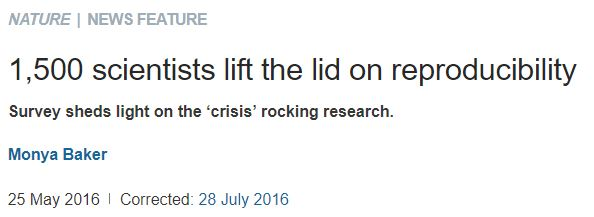
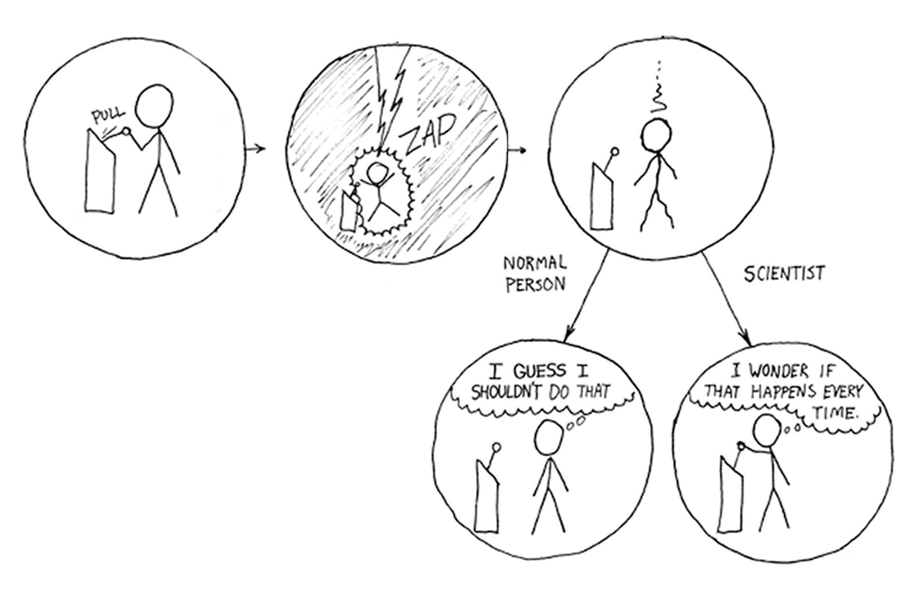

exclude: true
count: false

```{r,echo=FALSE,child="assets/header-presentation.Rmd"}
```

<!-- ----------------- Only edit title & author above this ----------------- -->

```{r,echo=FALSE,message=FALSE,warning=FALSE}
# load packages
library(dplyr)
library(ggplot2)
library(kableExtra) # for table
library(gridExtra) # multiple plot alignment

# not loaded but, but used
#library(ggpubr)
#library(cowplot)

#colors
rv_col_dark <- "#125687"
rv_col_light <- "#e7eef3"
```

---
name: topics

## Topics

* Reproducibility
* RStudio
* Markdown/Rmarkdown
* Reports and presentations in R

---
name: fuss

## What's all the fuss about?

  
.small[<https://www.nature.com/collections/prbfkwmwvz/>]  

  
.small[<https://www.nature.com/news/1-500-scientists-lift-the-lid-on-reproducibility-1.19970>]  

???

A large percentage of research is not reproducible by other researchers or by the original researchers themselves. This concern has been lately addressed by several high profile journals.

---

  
  

---

  

> "The difference between a scientist and a crazy person is that a scientist takes notes."

---
class: spaced

## Typical workflow

.pull-left-50[
1. Get data
2. Clean, transform data in spreadsheet
3. Copy-paste, copy-paste, copy-paste
4. Run analysis & export figures using A
5. Write up report using B
6. Import figures from A to B
7. Realises a sample was mislabelled
8. Go back to step 2, Repeat
]

--

.pull-right-50[

]

.small[[Problems with using Excel for data analyses.](http://biostat.mc.vanderbilt.edu/wiki/pub/Main/TheresaScott/StatsInExcel.TAScott.slides.pdf)]

???

Manually handling workflow is hard to reproduce because it is hard to know the exact step carried out. A programmatic workflow allows full transparency to the exact steps followed.

---
class: spaced

## Benefits of reproducibility


- Rerunning workflow
- Additional data/New data
- Returning to a project
- Transferring projects
- Collaborative work
- Easy to make changes
- Eliminate copy-paste errors

???

A reproducible workflow allows a lot of convenience. 

- It's easy to automate re-running of analysis when earlier steps have changed such as new input data, code or assumptions. 
- Useful for an investigator returning to an analyses after a period of time.
- Useful when a project is transferred to a new investigator.
- Useful when working collaboratively.
- When you are asked to modify or change a parameter.

---
class: spaced

## Solutions


* Containerised computing environment. Eg: *Docker*
* Workflow manager Eg: *Snakemake, Nextflow*
* Package and environment manager. Eg: *Packrat, Conda*
* Track edits and collaborate coding. Eg: *Git*
* Share and track code. Eg: *GitHub*
* Notebooks to document ongoing analyses. Eg: *Jupyter*
* Analyse and generate reports. Eg: *R Markdown*

???

Reproducible projects can be performed at different levels. Reproducibility is the ability for a work to be reproduced by an independently working third-party.

---
class: spaced

## Steps to reproducibility

* Single document containing analysis, code and results
* Self-contained portable project
* Avoid manual steps
* Results are directly linked to code used to generate them
* Contexual narrative to why a certain step was performed
* Version control of documents

???

Reproducible programming is not an R specific issue. R offers a set of tools and an environment that is conducive to reproducible research.

---

## Automate workflow

* Install packages from repositories

```
install.packages(), devtools::install_github()
```  
* Read data and scripts

```
read.delim(), source(), readr::read_tsv()
```
* Reorganise data

```
dplyr, tidyr
```

* Create figures

```
ggplot2
```

* Run statistics

```
lm(), wilcox.test()
```

* Run external programs

```
system("./plink --file --flag1 --flag2 --out bla")
```

---
name: r

# R

* Multiple R versions can be installed
* Be explicit about R version
* Set up R with write permission in libraries
* Windows users install to `C:/R/` rather than `C:/R/Program Files/`
* Windows users install [rtools](https://cran.r-project.org/bin/windows/Rtools/) for compiling from source
* Linux users will need additional linux packages
* Bioconductor packages are better managed with `BiocManager` to avoid conflicts

---

## RStudio • IDE


* Code completion & Syntax highlighting (for many languages)
* R Notebook
* Debugging
* Useful GUI elements
* Multiple sessions can be opened in parallel

---

## RStudio • Project

.small[**Create a new project**]


* Portable project (.Rproj)
* Dynamic reports
* Version control (git)
* Package control (packrat)

---

## Project Structure

```
project_name/
+-- raw/
|   +-- gene_counts.txt
|   +-- metadata.txt
+-- results/
|   +-- gene_filtered_counts.txt
|   +-- gene_vst_counts.txt
+-- images/
|   +-- exp-setup.jpg
+-- scripts/
|   +-- bash/
|   |   +-- fastqc.sh
|   |   +-- trim_adapters.sh
|   |   +-- mapping.sh
|   +-- r/
|       +-- qc.R
|       +-- functions.R
|       +-- dge.R
+-- report/
    +-- report.Rmd
```

* Organise data, scripts and results sensibly
* Keep projects self contained
* Use relative links

???

Try to organise all material related to a project in a common directory. Organise the directory in a sensible manner. Use relative links to refer to files. Consider raw as read-only content.

---

## Document converter


- Rmd > md > docx|HTML|PDF
- PDF needs Latex
- Handouts
- Scientific Articles
- Presentations
  - beamer
  - ioslides
  - slidy
  - xaringan

---

## Document formats

- [Summary](https://rmarkdown.rstudio.com/formats.html)
- Reports in [HTML](https://bookdown.org/yihui/rmarkdown/html-document.html), [PDF](https://bookdown.org/yihui/rmarkdown/pdf-document.html), [MS Word](https://bookdown.org/yihui/rmarkdown/word-document.html) etc
- Simple web pages and websites using [Rmarkdown](https://rmarkdown.rstudio.com/lesson-13.html)
- Complex websites using [blogdown](https://bookdown.org/yihui/blogdown/)
- Books using [bookdown](https://bookdown.org/yihui/bookdown/)
- Package documentation using [pkgdown](http://pkgdown.r-lib.org/)
- Web applications and interactive documents using [Shiny](https://www.rstudio.com/products/shiny/)
- Dashboards using [flexdashboard](https://rmarkdown.rstudio.com/flexdashboard/) or [shinydashboard](https://rstudio.github.io/shinydashboard/)

---

## RMarkdown • Intro

### Markdown

- Plain text format for readability
- Support pure HTML for complex formatting
- Many variations
  - [John Gruber's original](https://daringfireball.net/projects/markdown/syntax)
  - [GitHub Flavored Markdown (GFM)](https://github.github.com/gfm/)
  - [Pandoc](https://pandoc.org/MANUAL.html#pandocs-markdown)
  - [MultiMarkdown](https://fletcherpenney.net/multimarkdown/)
  - [](https://commonmark.org/)
- Pandoc supports conversion to multiple output formats
- To compare MD variants [](https://babelmark.github.io)

--

### RMarkdown

- Markdown + embedded R chunks
- Combine text and code in one file
- RMarkdown mostly uses [Pandoc markdown](https://rmarkdown.rstudio.com/authoring_pandoc_markdown.html%23raw-tex#pandoc_markdown)

---

## RStudio • Notebook

.small[**Create a new .Rmd document**]


* Text and code can be written together
* Inline R output (text and figures)

???

R Notebook demonstration.

---

## RMarkdown • Guide

* Create a file that ends in `.Rmd`
* Add YAML matter to top

```
---
title: "This is a title"
output: 
  rmarkdown::html_document
---
```
* In RStudio `File > New File > R Markdown` opens up an Rmd template
* Render interactively using the **Knit** button .fancyimage[]
* Render using command `rmarkdown::render("report.Rmd")`

---

## RMarkdown • Guide

.pull-left-50[
```
### Heading 3
#### Heading 4

_italic text_  
__bold text__  
`code text`  
~~strikethrough~~  
2^10^  
2~10~  

- bullet point

Link to [this](somewhere.com)


```
]

.pull-right-50[

### Heading 3
#### Heading 4

*italic text*  
**bold text**  
`code text`  
~~strikethrough~~  
2<sup>10</sup>  
2<sub>10</sub>   

* bullet point

Link to [this](somewhere.com)

.size-60[]
]

---

## RMarkdown • Guide

* R code can be executed inline

Today's date is `` `r "\u0060r date()\u0060"` ``    
Today's date is `r date()`  


* R code can be executed in code chunks

```{r,echo=FALSE,class.output="r",comment=""}
cat("```{r}\ndate()\n```")
```

* By default shows input code and output result.

```{r}
date()
```

* Many arguments to [customise chunks](https://yihui.name/knitr/options/)
  * Set `eval=FALSE` to not evaluate a code chunk
  * Set `echo=FALSE` to hide input code
  * Set `results="hide"` to hide output

* [R Markdown reference](https://rmarkdown.rstudio.com/lesson-1.html)

---
name: help
class: spaced

## Acknowledgements

* [**Reproducible Research in R and RStudio**](https://www.slideshare.net/SusanJohnston3/reproducible-research-in-r-and-r-studio) - Susan Johnston  
* [**New Tools for Reproducible Research with R**](https://slides.yihui.name/2012-knitr-RStudio.html) - JJ Allaire and Yihui Xie  
* [**Reproducible research with R**](http://www.hafro.is/~einarhj/education/tcrenv2016/pre/r-markdown.pdf) - Bjarki Thor Elvarsson and Einar Hjorleifsson  
* [**Reproducible Research Workshop**](http://www.geo.uzh.ch/microsite/reproducible_research/post/rr-r-publication/) - University of Zurich  
* RStudio [learning](https://www.rstudio.com/online-learning/)

<!-- --------------------- Do not edit this and below --------------------- -->

---
name: end-slide
class: end-slide, middle
count: false

# Thank you. Questions?

```{r,echo=FALSE,child="assets/footer-presentation.Rmd"}
```

```{r,include=FALSE,eval=FALSE}
rmarkdown::render("rr_presentation.Rmd")
#pagedown::chrome_print("rr_presentation.html",output="rr_presentation.pdf")
```
