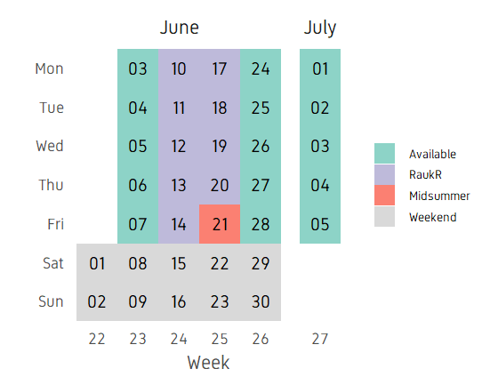
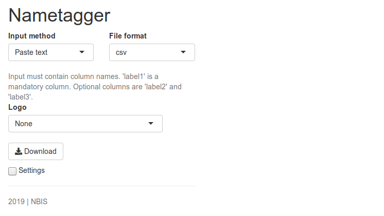

```{r,echo=FALSE,child="assets/header-lab.Rmd"}
```

<!-- ------------ Only edit title, subtitle & author above this ------------ -->

```{r,echo=FALSE,results='hide',warning=FALSE,message=FALSE}
library(shiny)
library(ggplot2)

```

<br>
<div class="abstract spaced">
This is an introduction to shiny web applications with R. Please follow the exercise to familiarise yourself with the fundamentals. And then you can follow instructions to build one of the two complete apps. Code chunks starting with `shinyApps()` can be copy-pasted completely and executed in an R console. 
</div>
<br>

# UI • Layout

This is an example to show the layout of widgets on a webpage using shiny functions. `fluidPage()` is used to define a responsive webpage. `titlePanel()` is used to define the top bar. `sidebarLayout()` is used to create a layout that includes a region on the left called side bar panel and a main panel on the right. The contents of these panels are further defined under `sidebarPanel()` and `mainPanel()`.

In the main panel, the use of tab panels are demonstrated. The function `tabsetPanel()` is used to define a tab panel set and individual tabs are defined using `tabPanel()`. `fluidRow()` and `column()` are used to structure elements within each tab. The width of each column is specified. Total width of columns must add up to 12.

```{r}
ui <- fluidPage(
  titlePanel("Title Panel"),
  sidebarLayout(
    sidebarPanel(
      helpText("Sidebar Panel")
    ),
    mainPanel(tabsetPanel(
      tabPanel("tab1",
               fluidRow(
                 column(6,helpText("Col1")),
                 column(6,
                        helpText("Col2"),
                        fluidRow(
                          column(4,style="background-color:#b0c6fb",
                                 helpText("Col1")
                          ),
                          column(4,style="background-color:#ffa153",
                                 helpText("Col2")
                          ),
                          column(4,style="background-color:#b1f6c6",
                                 helpText("Col3")
                          )
                        )
                 )
               )
      ),
      tabPanel("tab2",
               inputPanel(helpText("Input Panel"))
      ),
      tabPanel("tab3",
               wellPanel(helpText("Well Panel"))
      )
    )
    )
  )
)

server <- function(input,output){}
shinyApp(ui=ui,server=server)
```

# UI • Widgets • Input

Input widgets are used to accept content interactively from the user. These widgets usually end in `Input` like `selectInput()`. Below are usage examples of several of shiny's built-in widgets. Every widget has a variable name which is accessible through `input$` in the server function. For example, the value of a variable named `text-input` would be accessed through `input$text-input`.

```{r}
shinyApp(
ui=fluidPage(
  fluidRow(
    column(6,
           fileInput("file-input","fileInput:"),
           selectInput("select-input",label="selectInput",choices=c("A","B","C")),
           numericInput("numeric-input",label="numericInput",value=5,min=1,max=10),
           sliderInput("slider-input",label="sliderInput",value=5,min=1,max=10),
           textInput("text-input",label="textInput"),
           textAreaInput("text-area-input",label="textAreaInput"),
           dateInput("date-input",label="dateInput"),
           dateRangeInput("date-range-input",label="dateRangeInput"),
           radioButtons("radio-button",label="radioButtons",choices=c("A","B","C"),inline=T),
           checkboxInput("checkbox","checkboxInput",value=FALSE),
           actionButton("action-button","Action"),
           hr(),
           submitButton()
    )
  )
),
server=function(input,output){},
options=list(height=900))
```

# UI • Widgets • Outputs

Similar to input widgets, output widgets are used to display information to the user on the webpage. These widgets usually end in `Output` like `textOutput()`. Every widget has a variable name accessible under `output$` to which content is written in the server function. Render functions are used to write content to output widgets. For example `renderText()` is used to write text data to `textOutput()` widget.

```{r}
shinyApp(
  ui=fluidPage(fluidRow(column(6,
             textInput("text_input",label="textInput",value="<h3 style='color:red'>Red text</h3>"),
             hr(),
             htmlOutput("html_output"),
             textOutput("text_output"),
             verbatimTextOutput("verbatim_text_output"),
             tableOutput("table_output"),
             plotOutput("plot_output",width="300px",height="300px")
      ))),
  server=function(input, output) {
    output$html_output <- renderText({input$text_input})
    output$text_output <- renderText({input$text_input})
    output$verbatim_text_output <- renderText({input$text_input})
    output$table_output <- renderTable({iris[1:3,1:3]})
    output$plot_output <- renderPlot({
      plot(iris[,1],iris[,2])
    })
},
options=list(height=700))
```

In this example, we have a text input box which takes user text and outputs it in three different variations. The first output is html output `htmlOutput()`. Since the default text is html content, the output is red coloured text. A normal non-html text would just look like normal text. The second output is normal text output `textOutput()`. The third variation is `verbatimTextOutput()` which displays text in monospaced code style. This example further shows table output and plot output.

# Dynamic UI

Sometimes we want to add, remove or change currently loaded UI widgets conditionally based on dynamic changes in code execution or user input. Conditional UI can be defined using `conditionalPanel()`, `uiOutput()`/`renderUI()`, `insertUI()` or `removeUI`. In this example, we will use `uiOutput()`/`renderUI()`.

In the example below, the output plot is only displayed if selected dataset is iris.

```{r}
shinyApp(
ui=fluidPage(
  selectInput("data_input",label="Select data",
              choices=c("mtcars","faithful","iris")),
  tableOutput("table_output"),
  uiOutput("ui")
),

server=function(input,output) {
  getdata <- reactive({ get(input$data_input, 'package:datasets') })
  
  output$ui <- renderUI({
    if(input$data_input=="iris") plotOutput("plot_output",width="400px")
  })
  
  output$plot_output <- renderPlot({hist(getdata()[, 1])})
  output$table_output <- renderTable({head(getdata())})
})
```

Here, conditional UI is used to selectively display an output widget (plot). Similarily, this idea can be used to selectively display any input or output widget.

# Updating widgets

Widgets can be updated with new values dynamically. `observe()` and `observeEvent()` functions can monitor the values of interest and update relevant widgets.

```{r}
shinyApp(
ui=fluidPage(
  selectInput("data_input",label="Select data",choices=c("mtcars","faithful","iris")),
  selectInput("header_input",label="Select column name",choices=NULL),
  plotOutput("plot_output",width="400px")
),

server=function(input,output,session) {
  getdata <- reactive({ get(input$data_input, 'package:datasets') })
  
  observe({
    updateSelectInput(session,"header_input",label="Select column name",choices=colnames(getdata()))
  })
  
  output$plot_output <- renderPlot({
    #shiny::req(input$header_input)
    #validate(need(input$header_input %in% colnames(getdata()),message="Incorrect column name."))
    hist(getdata()[, input$header_input],xlab=input$header_input,main=input$data_input)
  })
},
options=list(height=600))
```

In this example, the user selects a dataset and a column from the selected dataset to be plotted as a histogram. The column name selection widget must automatically update it's choices depending on the selected dataset. This achieved using `observe()` where the `updateSelectInput()` function updates the selection choices. Notice that a third option `session` is in use in the server function. ie: `server=function(input,output,session)`. And `session` is also the first argument in `updateSelectInput()`. Session keeps track of values in the current session.

When changing the datasets, we can see that there is a short red error message. This is because, after we have selected a new dataset, the old column name from the previous dataset is searched for in the new dataset. This occurs for a short time and causes the error. This can be fixed using careful error handling. We will discuss this in the next section.

# Isolate

You might've noticed that shiny tends to update changes immediately as the input widgets change. This may not be desirable in all circumstances. For example, if the apps runs a heavy calculation, it is more efficient to grab all the changes and execute in one step rather than executing the heavy calculation after every input change. To illustrate this, we have an example below where we plot an image which has 3 input variables.

```{r}
shinyApp(
  ui=fluidPage(
    textInput("in_title",label="Title",value="Title"),
    textInput("in_xlab",label="X axis label",value="X axis"),
    textInput("in_ylab",label="X axis label",value="Y axis"),
    plotOutput("out_plot")),
  
  server=function(input,output) {
    output$out_plot <- renderPlot({
      plot(iris[,1],iris[,2],xlab=input$in_xlab,ylab=input$in_ylab,main=input$in_title)
    })
  }
)
```

The plot changes as soon as the input text field is changed. We can add an action button such that the plot is changed only when the button is clicked.

```{r}
shinyApp(
  ui=fluidPage(
    textInput("in_title",label="Title",value="Title"),
    textInput("in_xlab",label="X axis label",value="X axis"),
    textInput("in_ylab",label="X axis label",value="Y axis"),
    actionButton("btn_go","Go!"),
    plotOutput("out_plot")),
  
  server=function(input,output) {
    output$out_plot <- renderPlot({
      input$btn_go
      plot(iris[,1],iris[,2],xlab=isolate(input$in_xlab),
           ylab=isolate(input$in_ylab),main=isolate(input$in_title))
    })
  }
)
```

Now, changes to any of the input fields do not initiate the plot function. The plot is redrawn only when the action button is clicked. When the action button is click, the current values in the input fields are collected and used in the plotting function.

# Error validation

Shiny returns an error when a variable is NULL, NA or empty. This is similar to normal R operation. The errors show up as bright red text. By using careful error handling, we can print more informative and less distracting error messages. We also have the option of hiding error messages.

```{r}
shinyApp(
ui=fluidPage(
  selectInput("data_input",label="Select data",
              choices=c("","mtcars","faithful","iris")),
  tableOutput("table_output")
),

server=function(input, output) {
  getdata <- reactive({ get(input$data_input,'package:datasets') })
  output$table_output <- renderTable({head(getdata())})
},
options=list(height="350px"))
```

In this example, we have a list of datasets to select which is then printed as a table. The first and default option is an empty string which cannot be printed as a table and therefore returns an error.

We can add an extra line to the above app so that the selected string is validated before running downstream commands in the `getdata({})` reactive function. The function `validate()` is used to validate inputs. `validate()` can be used with `need()` function or a custom function.

Below we use the `need()` function to check the input. It checks if the input is NULL, NA or an empty string and returns a specified message if TRUE. `try()` is optional and is used to catch any other unexpected errors.

```{r}
shinyApp(
ui=fluidPage(
  selectInput("data_input",label="Select data",
              choices=c("","mtcars","faithful","iris")),
  tableOutput("table_output")
),

server=function(input, output) {
  
  getdata <- reactive({
    validate(need(try(input$data_input),"Please select a data set"))
    get(input$data_input,'package:datasets')
  })
  
  output$table_output <- renderTable({head(getdata())})
},
options=list(height="350px"))
```

Now we see an informative grey message asking the user to select a dataset.

We can use a custom function instead of using `need()`. Below, we have created a function called `valfun()` that checks if the input is NULL, NA or an empty string. This is then used in `validate()`.

```{r}
valfn <- function(x) if(is.null(x) | is.na(x) | x=="") return("Input data is incorrect.")

shinyApp(
ui=fluidPage(
  selectInput("data_input",label="Select data",
              choices=c("","mtcars","faithful","iris")),
  tableOutput("table_output")
),

server=function(input, output) {
  
  getdata <- reactive({
    validate(valfn(try(input$data_input)))
    get(input$data_input,'package:datasets')
  })
  
  output$table_output <- renderTable({head(getdata())})
},
options=list(height="350px"))
```

The last option is to simple hide the error. This may be used in situations where there is no input needed from the user. We use `req()` to check if the input is valid, else stop execution there till the condition becomes true.

```{r}
shinyApp(
ui=fluidPage(
  selectInput("data_input",label="Select data",
              choices=c("","mtcars","faithful","iris")),
  tableOutput("table_output")
),

server=function(input, output) {
  
  getdata <- reactive({
    shiny::req(try(input$data_input))
    get(input$data_input,'package:datasets')
  })
  
  output$table_output <- renderTable({head(getdata())})
},
options=list(height="350px"))
```

As expected there is no errors or any message at all. This is perhaps not the best situation to use this option as we need the user to do something.

Finally we can try to resolve the errors from the previous section. `shiny::req(input$header_input)` is added to ensure that a valid column name string is available before running any of the `renderPlot()` commands. Second, we add `validate(need(input$header_input %in% colnames(getdata()),message="Incorrect column name."))` to ensure that the column name is actually a column in the currently selected dataset.

```{r}
shinyApp(
ui=fluidPage(
  selectInput("data_input",label="Select data",choices=c("mtcars","faithful","iris")),
  selectInput("header_input",label="Select column name",choices=NULL),
  plotOutput("plot_output",width="400px")
),

server=function(input,output,session) {
  getdata <- reactive({ get(input$data_input, 'package:datasets') })
  
  observe({
    updateSelectInput(session,"header_input",label="Select column name",choices=colnames(getdata()))
  })
  
  output$plot_output <- renderPlot({
    shiny::req(input$header_input)
    validate(need(input$header_input %in% colnames(getdata()),message="Incorrect column name."))
    hist(getdata()[, input$header_input],xlab=input$header_input,main=input$data_input)
  })
},
options=list(height=600))
```

Now, we do not see any error messages. Note that shiny apps on shinyapps.io do not display the complete regular R error message for security reasons. It returns a generic error message in the app. One needs to inspect the error logs to view the actual error message.

# Download • Data

It is often desirable to let the user down data tables and plots as images. This is done using `downloadHandler()`.

In the example below, we are downloading a table as a csv text file. We define a button that accepts the action input from the user. The `downloadHandler()` function has the file name argument, and the content argument where we specify the `write.csv()` command. Note that this example will only work in a browser and not in the RStudio preview.

```{r}
shinyApp(
  ui=fluidPage(
    selectInput("data_input",label="Select data",
                choices=c("mtcars","faithful","iris")),
    textOutput("text_output"),
    downloadButton("button_download","Download")
  ),

  server=function(input, output) {
    
    getdata <- reactive({ get(input$data_input, 'package:datasets') })
    output$text_output <- renderText(paste0("Selected dataset: ",input$data_input))
    
    output$button_download <- downloadHandler(
      filename = function() {
        paste0(input$data_input,".csv")
      },
      content = function(file) {
        write.csv(getdata(),file,row.names=FALSE,quote=F)
      })
  },
  options=list(height="200px")
)
```

# Download • Plot

In this next example, we are downloading a plot. In the content part of `downloadHandler()`, we specify commands to export a png image. Note that this example will only work in a browser and not in the RStudio preview.


```{r}
shinyApp(
  ui=fluidPage(
    selectInput("data_input",label="Select data",
                choices=c("mtcars","faithful","iris")),
    textOutput("text_output"),
    plotOutput("plot_output",height="300px",width="300px"),
    downloadButton("button_download","Download")
  ),

  server=function(input, output) {
    
    getdata <- reactive({ get(input$data_input, 'package:datasets') })
    output$text_output <- renderText(paste0("Selected dataset: ",input$data_input))
    
    output$plot_output <- renderPlot({hist(getdata()[,1])})
  
  output$button_download <- downloadHandler(
    filename = function() {
      paste0(input$data_input,".png")
    },
    content = function(file) {
      png(file)
      hist(getdata()[, 1])
      dev.off()
    })
  },
  options=list(height="500px")
)
```

# Shiny in Rmd

Shiny interactive widgets can be embedded into Rmarkdown documents. These documents need to be live and can handle interactivity. The important addition is the line `runtime: shiny` to the YAML matter. Here is an example:

```{r,echo=FALSE,out.class="r",comment=""}
cat("---\nruntime: shiny\noutput: html_document\n---\n\n")
cat("```{r}\nlibrary(shiny)\n```\n\n")
cat("This is a standard RMarkdown document. Here is some code:\n\n")
cat("```{r}\nhead(iris)\n```\n\n")
cat("```{r}\nplot(iris$Sepal.Length,iris$Petal.Width)\n```\n\n")
cat("But, here are two shiny widgets.\n\n")
cat('```{r,echo=FALSE}\nselectInput("n_breaks",label="Number of bins:",choices=c(10,20,35,50), selected=20)\nsliderInput("bw_adjust",label="Bandwidth adjustment:",min=0.2,max=2,value=1,step=0.2)\n```')
```

This code can be copied to a new file in RStudio and saved as an .Rmd file. Then click 'Knit'.

# Calendar app

__Topics covered__

- UI layout using pre-defined function (pageWithSidebar)
- Input and output widgets and reactivity
- Use of date-time
- Customised ggplot
- Download image files
- Update inputs using observe
- Validating inputs with custom error messages

The following R packages will be required for this app: `ggplot2, shiny, colourpicker`.

A shiny app to create a calendar planner plot. Below is a preview of the finished app.


The idea of this app is to create and display a calendar styled planner. Below is a preview of the expected output.



The image is a plot created in ggplot. X axis showing week numbers, y axis showing weekdays, facet titles showing months and dates are coloured by categories. We can split this into two parts. The first part is preparing the code for the core task at hand (ie; generating the plot) and the second part is creating a graphical user interface around it using shiny apps to enable the user to input values and adjust dates, categories, plot parameters etc.

## Creating the plot

The first step is to figure out how to create this plot in ggplot. The data will be contained in a data.frame. The data.frame is created based on start and end dates.

```{r}
start_date <- as.Date("2019-06-01")
end_date <- as.Date("2019-07-05")
dfr <- data.frame(date=seq(start_date,end_date,by=1))
head(dfr)
```

We can add some code to get specific information from these dates such as the day, week, month and numeric date. Finally we

```{r}
dfr$day <- factor(strftime(dfr$date,format="%a"),levels=rev(c("Mon","Tue","Wed","Thu","Fri","Sat","Sun")))
dfr$week <- factor(strftime(dfr$date,format="%V"))
dfr$month <- strftime(dfr$date,format="%B")
dfr$month <- factor(dfr$month,levels=unique(dfr$month))
dfr$ddate <- factor(strftime(dfr$date,format="%d"))
head(dfr)
```

Finally, we add a column called track which will hold the categorical information for colouring dates by activity.

```{r}
dfr$track <- "Available"
dfr$track[dfr$day=="Sat"|dfr$day=="Sun"] <- "Weekend"
head(dfr)
```

This is enough information to plot.

```{r,fig.height=4.5,fig.width=7}
ggplot(dfr,aes(x=week,y=day))+
      geom_tile(aes(fill=track))+
      geom_text(aes(label=ddate))+
      facet_grid(~month,scales="free",space="free")+
      theme_bw()
```

We can add more activities to the track column. Or in other words, I refer to it as adding more tracks.

```{r,fig.height=4.5,fig.width=7}
dfr$track[dfr$date>=as.Date("2019-06-10") & dfr$date<=as.Date("2019-06-20")] <- "RaukR"
dfr$track[dfr$date==as.Date("2019-06-21")] <- "Midsummer"

ggplot(dfr,aes(x=week,y=day))+
      geom_tile(aes(fill=track))+
      geom_text(aes(label=ddate))+
      facet_grid(~month,scales="free",space="free")+
      theme_bw()
```

Now, we can customise the plot as you prefer. I am modifying the axes labels, changing colours and removing most of the plot elements.

```{r,fig.height=4.5,fig.width=7}
all_cols <- c("#bebada","#fb8072","#80b1d3","#fdb462")
  
ggplot(dfr,aes(x=week,y=day))+
      geom_tile(aes(fill=track))+
      geom_text(aes(label=ddate))+
      scale_fill_manual(values=all_cols)+
      facet_grid(~month,scales="free",space="free")+
      labs(x="Week",y="")+
      theme_bw(base_size=14)+
      theme(legend.title=element_blank(),
            panel.grid=element_blank(),
            panel.border=element_blank(),
            axis.ticks=element_blank(),
            axis.title=element_text(colour="grey30"),
            strip.background=element_blank(),
            legend.key.size=unit(0.3,"cm"),
            legend.spacing.x=unit(0.2,"cm"))
```

Our plot is now ready and we have the code to create this plot. The next step is to build a shiny app around it.

## Building the app
### Layout
We need to first have a plan for the app page, which UI elements to include and how they will be laid out and structured. My plan is as shown in the preview image.


There is a horizontal top bar for the title and two columns below. The left column will contain the input widgets and control. The right column will contain the plot output. Since, this is a commonly used layout, it is available as a predefined function in shiny called `pageWithSidebar()`. It takes three arguments `headerPanel`, `sidebarPanel` and `mainPanel` which is self explanatory.

```{r,eval=FALSE}
shinyApp(
ui=fluidPage(
  pageWithSidebar(
    headerPanel(),
    sidebarPanel(),
    mainPanel())
  ),
server=function(input,output){}
)
```

### UI

Then we fill in the panels with widgets and contents.

```{r,eval=FALSE}
shinyApp(
ui=fluidPage(
  pageWithSidebar(
    headerPanel(title="Calendar Planner",windowTitle="Calendar Planner"),
    sidebarPanel(
      h3("Duration"),
      fluidRow(
          column(6,style=list("padding-right: 5px;"),
              dateInput("in_duration_date_start","From",value=format(Sys.time(),"%Y-%m-%d"))
          ),
          column(6,style=list("padding-left: 5px;"),
              dateInput("in_duration_date_end","To",value=format(as.Date(Sys.time())+30,"%Y-%m-%d"))
          )
      )
    ),
    mainPanel())
  ),
server=function(input,output){}
)
```

The app as it is now, when previewed, should look like below:


We have defined a part of the side bar panel with a title **Duration**. `fluidRow()` is an html tag used to create rows. Above, in the side bar panel, a row is defined and two columns are defined inside. Each column is filled with date input widgets for start and end dates. We use the columns here to place date input widgets side by side. To place widgets one below the other, the columns can simply be removed. The default value for the start date is set to current date and the end date is set to current date + 30 days.

Now we add more sections to the side bar panel, namely track input variables and plot settings variables. We also added custom colours. Custom colours can be selected using the input widget `colourpicker::colourInput()`.

```{r,eval=FALSE}
cols <- toupper(c(
  "#bebada","#fb8072","#80b1d3","#fdb462","#b3de69","#fccde5","#FDBF6F","#A6CEE3",
  "#56B4E9","#B2DF8A","#FB9A99","#CAB2D6","#A9C4E2","#79C360","#FDB762","#9471B4",
  "#A4A4A4","#fbb4ae","#b3cde3","#ccebc5","#decbe4","#fed9a6","#ffffcc","#e5d8bd",
  "#fddaec","#f2f2f2","#8dd3c7","#d9d9d9"))
  
shinyApp(
ui=fluidPage(
  pageWithSidebar(
    headerPanel(title="Calendar Planner",windowTitle="Calendar Planner"),
    sidebarPanel(
      h3("Duration"),
      fluidRow(
          column(6,style=list("padding-right: 5px;"),
              dateInput("in_duration_date_start","From",value=format(Sys.time(),"%Y-%m-%d"))
          ),
          column(6,style=list("padding-left: 5px;"),
              dateInput("in_duration_date_end","To",value=format(as.Date(Sys.time())+30,"%Y-%m-%d"))
          )
      ),
      h3("Tracks"),
      fluidRow(
          column(3,style=list("padding-right: 3px;"),
              textInput("in_track_name_1",label="Name",value="Vacation",placeholder="Vacation")
          ),
          column(3,style=list("padding-right: 3px; padding-left: 3px;"),
              dateInput("in_track_date_start_1",label="From",value=format(Sys.time(),"%Y-%m-%d"))
          ),
          column(3,style=list("padding-right: 3px; padding-left: 3px;"),
              dateInput("in_track_date_end_1",label="To",value=format(as.Date(Sys.time())+30,"%Y-%m-%d"))
          ),
          column(3,style=list("padding-left: 3px;"),
              colourpicker::colourInput("in_track_colour_1",label="Colour",
                                        palette="limited",allowedCols=cols,value=cols[1])
          )
      ),
      fluidRow(
          column(3,style=list("padding-right: 3px;"),
              textInput("in_track_name_2",label="Name",value="Offline",placeholder="Offline")
          ),
          column(3,style=list("padding-right: 3px; padding-left: 3px;"),
              dateInput("in_track_date_start_2",label="From",value=format(Sys.time(),"%Y-%m-%d"))
          ),
          column(3,style=list("padding-right: 3px; padding-left: 3px;"),
              dateInput("in_track_date_end_2",label="To",value=format(as.Date(Sys.time())+30,"%Y-%m-%d"))
          ),
          column(3,style=list("padding-left: 3px;"),
              colourpicker::colourInput("in_track_colour_2",label="Colour",
                                        palette="limited",allowedCols=cols,value=cols[2])
          )
      ),
      fluidRow(
          column(6,style=list("padding-right: 5px;"),
              colourpicker::colourInput("in_track_colour_available",label="Track colour (Available)",
                                        palette="limited",allowedCols=cols,value=cols[length(cols)-1])
          ),
          column(6,style=list("padding-left: 5px;"),
              colourpicker::colourInput("in_track_colour_weekend",label="Track colour (Weekend)",
                                        palette="limited",allowedCols=cols,value=cols[length(cols)])
          )
      ),
      tags$br(),
      h3("Settings"),
      selectInput("in_legend_position",label="Legend position",
                  choices=c("top","right","left","bottom"),selected="right",multiple=F),
      fluidRow(
          column(6,style=list("padding-right: 5px;"),
              selectInput("in_legend_justification",label="Legend justification",
                          choices=c("left","right"),selected="right",multiple=F)
          ),
          column(6,style=list("padding-left: 5px;"),
              selectInput("in_legend_direction",label="Legend direction",
                          choices=c("vertical","horizontal"),selected="vertical",multiple=F)
          )
      ),
      fluidRow(
          column(6,style=list("padding-right: 5px;"),
              numericInput("in_themefontsize",label="Theme font size",value=8,step=0.5)
          ),
          column(6,style=list("padding-left: 5px;"),
              numericInput("in_datefontsize",label="Date font size",value=2.5,step=0.1)
          )
      ),
      fluidRow(
          column(6,style=list("padding-right: 5px;"),
              numericInput("in_monthfontsize",label="Month font size",value=8,step=0.5)
          ),
          column(6,style=list("padding-left: 5px;"),
              numericInput("in_legendfontsize",label="Legend font size",value=5,step=0.5)
          )
      )
    ),
    mainPanel(
      plotOutput("out_plot")
    ))
  ),
server=function(input,output){}
)
```


The track start and end dates are by default set to the same as that of duration start and end dates. We will adjust this later. Under the settings section, we have added a few useful plot variables to adjust sizes and spacing of plot elements. They are set to reasonable defaults. These variables will be passed on to the ggplot plotting function. 

We can end with column with the download options. Input fields are height, width, resolution and file format. Last we add a button for download.

```{r,eval=FALSE}
h3("Download"),
helpText("Width is automatically calculated based on the number of weeks. File type is only applicable to download and does not change preview."),
fluidRow(
    column(6,style=list("padding-right: 5px;"),
        numericInput("in_height","Height (cm)",step=0.5,value=5.5)
    ),
    column(6,style=list("padding-left: 5px;"),
        numericInput("in_width","Width (cm)",step=0.5,value=NA)
    )
),
fluidRow(
    column(6,style=list("padding-right: 5px;"),
        selectInput("in_res","Res/DPI",choices=c("200","300","400","500"),selected="200")
    ),
    column(6,style=list("padding-left: 5px;"),
        selectInput("in_format","File type",choices=c("png","tiff","jpeg","pdf"),selected="png",multiple=FALSE,selectize=TRUE)
    )
),
downloadButton("btn_downloadplot","Download Plot"),
tags$hr(),
helpText("2019 | RaukR")
```

In the main panel, we add the plot output function that will hold the output plot. We also add a slider for image preview scaling and the output image. The idea behind the preview scaling is to allow the user to increase or decrease the size of the plot in the browser without affecting the download size. The part of the UI code to add the preview slider is below:

```{r,eval=FALSE}
mainPanel(
  sliderInput("in_scale","Image preview scale",min=0.1,max=3,step=0.10,value=1),
  helpText("Scale only controls preview here and does not affect download."),
  tags$br(),
  imageOutput("out_plot")
)
```

This should now look like this.

```{r,eval=FALSE}
## load colours
cols <- toupper(c(
  "#bebada","#fb8072","#80b1d3","#fdb462","#b3de69","#fccde5","#FDBF6F","#A6CEE3",
  "#56B4E9","#B2DF8A","#FB9A99","#CAB2D6","#A9C4E2","#79C360","#FDB762","#9471B4",
  "#A4A4A4","#fbb4ae","#b3cde3","#ccebc5","#decbe4","#fed9a6","#ffffcc","#e5d8bd",
  "#fddaec","#f2f2f2","#8dd3c7","#d9d9d9"))

shinyApp(
  ui=fluidPage(
    pageWithSidebar(
      headerPanel(title="Calendar Planner",windowTitle="Calendar Planner"),
      sidebarPanel(
        h3("Duration"),
        fluidRow(
          column(6,style=list("padding-right: 5px;"),
                 dateInput("in_duration_date_start","From",value=format(Sys.time(),"%Y-%m-%d"))
          ),
          column(6,style=list("padding-left: 5px;"),
                 dateInput("in_duration_date_end","To",value=format(as.Date(Sys.time())+30,"%Y-%m-%d"))
          )
        ),
        h3("Tracks"),
        fluidRow(
          column(3,style=list("padding-right: 3px;"),
                 textInput("in_track_name_1",label="Name",value="Vacation",placeholder="Vacation")
          ),
          column(3,style=list("padding-right: 3px; padding-left: 3px;"),
                 dateInput("in_track_date_start_1",label="From",value=format(Sys.time(),"%Y-%m-%d"))
          ),
          column(3,style=list("padding-right: 3px; padding-left: 3px;"),
                 dateInput("in_track_date_end_1",label="To",value=format(as.Date(Sys.time())+30,"%Y-%m-%d"))
          ),
          column(3,style=list("padding-left: 3px;"),
                 colourpicker::colourInput("in_track_colour_1",label="Colour",
                                           palette="limited",allowedCols=cols,value=cols[1])
          )
        ),
        fluidRow(
          column(3,style=list("padding-right: 3px;"),
                 textInput("in_track_name_2",label="Name",value="Offline",placeholder="Offline")
          ),
          column(3,style=list("padding-right: 3px; padding-left: 3px;"),
                 dateInput("in_track_date_start_2",label="From",value=format(Sys.time(),"%Y-%m-%d"))
          ),
          column(3,style=list("padding-right: 3px; padding-left: 3px;"),
                 dateInput("in_track_date_end_2",label="To",value=format(as.Date(Sys.time())+30,"%Y-%m-%d"))
          ),
          column(3,style=list("padding-left: 3px;"),
                 colourpicker::colourInput("in_track_colour_2",label="Colour",
                                           palette="limited",allowedCols=cols,value=cols[2])
          )
        ),
        fluidRow(
          column(6,style=list("padding-right: 5px;"),
                 colourpicker::colourInput("in_track_colour_available",label="Track colour (Available)",
                                           palette="limited",allowedCols=cols,value=cols[length(cols)-1])
          ),
          column(6,style=list("padding-left: 5px;"),
                 colourpicker::colourInput("in_track_colour_weekend",label="Track colour (Weekend)",
                                           palette="limited",allowedCols=cols,value=cols[length(cols)])
          )
        ),
        tags$br(),
        h3("Settings"),
        selectInput("in_legend_position",label="Legend position",
                    choices=c("top","right","left","bottom"),selected="right",multiple=F),
        fluidRow(
          column(6,style=list("padding-right: 5px;"),
                 selectInput("in_legend_justification",label="Legend justification",
                             choices=c("left","right"),selected="right",multiple=F)
          ),
          column(6,style=list("padding-left: 5px;"),
                 selectInput("in_legend_direction",label="Legend direction",
                             choices=c("vertical","horizontal"),selected="vertical",multiple=F)
          )
        ),
        fluidRow(
          column(6,style=list("padding-right: 5px;"),
                 numericInput("in_themefontsize",label="Theme font size",value=8,step=0.5)
          ),
          column(6,style=list("padding-left: 5px;"),
                 numericInput("in_datefontsize",label="Date font size",value=2.5,step=0.1)
          )
        ),
        fluidRow(
          column(6,style=list("padding-right: 5px;"),
                 numericInput("in_monthfontsize",label="Month font size",value=8,step=0.5)
          ),
          column(6,style=list("padding-left: 5px;"),
                 numericInput("in_legendfontsize",label="Legend font size",value=5,step=0.5)
          )
        ),
        tags$br(),
        h3("Download"),
        helpText("Width is automatically calculated based on the number of weeks. File type is only applicable to download and does not change preview."),
        fluidRow(
          column(6,style=list("padding-right: 5px;"),
                 numericInput("in_height","Height (cm)",step=0.5,value=5.5)
          ),
          column(6,style=list("padding-left: 5px;"),
                 numericInput("in_width","Width (cm)",step=0.5,value=NA)
          )
        ),
        fluidRow(
          column(6,style=list("padding-right: 5px;"),
                 selectInput("in_res","Res/DPI",choices=c("200","300","400","500"),selected="200")
          ),
          column(6,style=list("padding-left: 5px;"),
                 selectInput("in_format","File type",choices=c("png","tiff","jpeg","pdf"),selected="png",multiple=FALSE,selectize=TRUE)
          )
        ),
        downloadButton("btn_downloadplot","Download Plot"),
        tags$hr(),
        helpText("2019 | RaukR")
      ),
      mainPanel(
        sliderInput("in_scale","Image preview scale",min=0.1,max=3,step=0.10,value=1),
        helpText("Scale only controls preview here and does not affect download."),
        tags$br(),
        imageOutput("out_plot")
      )
    )
  ),
  server=function(input,output){}
)
```


### Server

We can start adding content into the server function to actually enable functionality.

The server code can be organised into 5 blocks.

1. `fn_plot()`: Reactive function that generates ggplot object 
2. out_plot: Plots the ggplot object
3. `fn_downloadplotname()`: Function to create download image name
4. `fn_downloadplot()`: Function to create and download the image
5. btn_downloadplot: Download handler that runs fn_downloadplot on button trigger
6. observe: Observer that updates input values

Here is a flow diagram of how these blocks work.

```
     1 > [2]
     v
3 > [4] < 5

    {6}
```

The core block 1 creates the preview plot in block 2. The download handler block 5 calls block 1 to generate the plot which is downloaded using block 4. Block 6 is standalone observer.

Reactive values used across multiple functions can be stored using `reactiveValues()`. These can be written to or accessed from within a reactive environment.

```
store <- reactiveValues(week=NULL)
```

We have our core function `fn_plot()` (block 1). Inputs are validated and gathered from input widgets. We are using `shiny::req()` to silently check that necessary input variables are available before running through the function. We use `validate()` with `need()` to run some basic sanity checks namely that track names are not duplicated and to ensure that start-dates preceed end-dates. Necessary date-time calculations are performed. The calendar plot is created and returned. 

```{r,eval=FALSE}
## RFN: fn_plot -----------------------------------------------------------
## core plotting function, returns a ggplot object

fn_plot <- reactive({

  shiny::req(input$in_duration_date_start)
  shiny::req(input$in_duration_date_end)

  shiny::req(input$in_track_date_start_1)
  shiny::req(input$in_track_date_end_1)
  shiny::req(input$in_track_name_1)
  shiny::req(input$in_track_colour_1)

  shiny::req(input$in_track_date_start_2)
  shiny::req(input$in_track_date_end_2)
  shiny::req(input$in_track_name_2)
  shiny::req(input$in_track_colour_2)

  shiny::req(input$in_legend_position)
  shiny::req(input$in_legend_justification)
  shiny::req(input$in_legend_direction)
  shiny::req(input$in_themefontsize)
  shiny::req(input$in_datefontsize)
  shiny::req(input$in_monthfontsize)
  shiny::req(input$in_legendfontsize)

  validate(need(input$in_track_name_1!=input$in_track_name_2,"Duplicate track names are not allowed."))
  validate(need(as.Date(input$in_duration_date_start) < as.Date(input$in_duration_date_end),"End duration date must be later than start duration date."))

  # prepare dates
  dfr <- data.frame(date=seq(as.Date(input$in_duration_date_start),as.Date(input$in_duration_date_end),by=1))
  dfr$day <- factor(strftime(dfr$date,format="%a"),levels=rev(c("Mon","Tue","Wed","Thu","Fri","Sat","Sun")))
  dfr$week <- factor(strftime(dfr$date,format="%V"))
  dfr$month <- strftime(dfr$date,format="%B")
  dfr$month <- factor(dfr$month,levels=unique(dfr$month))
  dfr$ddate <- factor(strftime(dfr$date,format="%d"))

  #add tracks
  dfr$track <- "Available"
  dfr$track[dfr$day=="Sat" | dfr$day=="Sun"] <- "Weekend"

  temp_start_date_1 <- as.Date(input$in_track_date_start_1)
  temp_end_date_1 <- as.Date(input$in_track_date_end_1)
  temp_track_name_1 <- input$in_track_name_1
  temp_track_col_1 <- input$in_track_colour_1
  validate(need(temp_start_date_1 < temp_end_date_1,"End track duration date must be later than start track duration date."))
  dfr$track[dfr$date>=temp_start_date_1 & dfr$date<=temp_end_date_1] <- temp_track_name_1

  temp_start_date_2 <- as.Date(input$in_track_date_start_2)
  temp_end_date_2 <- as.Date(input$in_track_date_end_2)
  temp_track_name_2 <- input$in_track_name_2
  temp_track_col_2 <- input$in_track_colour_2
  validate(need(temp_start_date_2 < temp_end_date_2,"End track duration date must be later than start track duration date."))
  dfr$track[dfr$date>=temp_start_date_2 & dfr$date<=temp_end_date_2] <- temp_track_name_2

  # create order factor
  fc <- vector(mode="character")
  if("Available" %in% unique(dfr$track)) fc <- c(fc,"Available")
  fc <- c(fc,temp_track_name_1,temp_track_name_2)
  if("Weekend" %in% unique(dfr$track)) fc <- c(fc,"Weekend")
  dfr$track <- factor(dfr$track,levels=fc)

  # prepare colours
  all_cols <- c(input$in_track_colour_available,temp_track_col_1,temp_track_col_2,input$in_track_colour_weekend)

  # plot
  p <- ggplot(dfr,aes(x=week,y=day))+
    geom_tile(aes(fill=track))+
    geom_text(aes(label=ddate),size=input$in_datefontsize)+
    scale_fill_manual(values=all_cols)+
    facet_grid(~month,scales="free",space="free")+
    labs(x="Week",y="")+
    theme_bw(base_size=input$in_themefontsize)+
    theme(legend.title=element_blank(),
          panel.grid=element_blank(),
          panel.border=element_blank(),
          axis.ticks=element_blank(),
          axis.title=element_text(colour="grey30"),
          strip.background=element_blank(),
          strip.text=element_text(size=input$in_monthfontsize),
          legend.position=input$in_legend_position,
          legend.justification=input$in_legend_justification,
          legend.direction=input$in_legend_direction,
          legend.text=element_text(size=input$in_legendfontsize),
          legend.key.size=unit(0.3,"cm"),
          legend.spacing.x=unit(0.2,"cm"))

  # add number of weeks to reactive value
  store$week <- length(levels(dfr$week))

  return(p)
})
```

Here is the block that generates the output image. Image dimensions and resolution is obtained from input widgets. Default width is computed based on number of weeks. This is why the number of weeks was stored as a reactive value. The plot is exported to the working directly and then displayed in the browser. The scale slider allows the plot preview to be scaled in the browser.

```{r,eval=FALSE}
## OUT: out_plot ------------------------------------------------------------
## plots figure

output$out_plot <- renderImage({

  shiny::req(fn_plot())
  shiny::req(input$in_height)
  shiny::req(input$in_res)
  shiny::req(input$in_scale)

  height <- as.numeric(input$in_height)
  width <- as.numeric(input$in_width)
  res <- as.numeric(input$in_res)

  if(is.na(width)) {
    width <- (store$week*1.2)
    if(width < 4.5) width <- 4.5
  }

  p <- fn_plot()
  ggsave("calendar_plot.png",p,height=height,width=width,units="cm",dpi=res)

  return(list(src="calendar_plot.png",
              contentType="image/png",
              width=round(((width*res)/2.54)*input$in_scale,0),
              height=round(((height*res)/2.54)*input$in_scale,0),
              alt="calendar_plot"))
})
```

The downloadplotname function simple generates the output filename depending on the filetype extension.

```{r,eval=FALSE}
# FN: fn_downloadplotname ----------------------------------------------------
# creates filename for download plot

fn_downloadplotname <- function()
{
  return(paste0("calendar_plot.",input$in_format))
}
```

The downloadplot function uses `fn_plot()` to create the image and then export the image.

```{r,eval=FALSE}
## FN: fn_downloadplot -------------------------------------------------
## function to download plot

fn_downloadplot <- function(){
  shiny::req(fn_plot())
  shiny::req(input$in_height)
  shiny::req(input$in_res)
  shiny::req(input$in_scale)

  height <- as.numeric(input$in_height)
  width <- as.numeric(input$in_width)
  res <- as.numeric(input$in_res)
  format <- input$in_format

  if(is.na(width)) width <- (store$week*1)+1

  p <- fn_plot()
  if(format=="pdf" | format=="svg"){
    ggsave(fn_downloadplotname(),p,height=height,width=width,units="cm",dpi=res)
    #embed_fonts(fn_downloadplotname())
  }else{
    ggsave(fn_downloadplotname(),p,height=height,width=width,units="cm",dpi=res)
  }
}
```

The download handler then downloads the file.

```{r,eval=FALSE}
## DHL: btn_downloadplot ----------------------------------------------------
## download handler for downloading plot

output$btn_downloadplot <- downloadHandler(
  filename=fn_downloadplotname,
  content=function(file) {
    fn_downloadplot()
    file.copy(fn_downloadplotname(),file,overwrite=T)
  }
)
```

Finally, we have the observer function. The observer continuously monitors change in input widgets of interest (here start and end duration) and updates other widget values.

```{r}
## OBS: tracks dates ---------------------------------------------------------

observe({
  
  shiny::req(input$in_duration_date_start)
  shiny::req(input$in_duration_date_end)
  
  validate(need(as.Date(input$in_duration_date_start) < as.Date(input$in_duration_date_end),"End duration date must be later than start duration date."))
  
  # create date intervals
  dseq <- seq(as.Date(input$in_duration_date_start),as.Date(input$in_duration_date_end),by=1)
  r1 <- unique(as.character(cut(dseq,breaks=3)))
  
  updateDateInput(session,"in_track_date_start_1",label="From",value=as.Date(r1[1],"%Y-%m-%d"))
  updateDateInput(session,"in_track_date_end_1",label="To",value=as.Date(r1[1+1],"%Y-%m-%d")-1)
  updateDateInput(session,"in_track_date_start_2",label="From",value=as.Date(r1[2],"%Y-%m-%d"))
  updateDateInput(session,"in_track_date_end_2",label="To",value=as.Date(r1[2+1],"%Y-%m-%d")-1)
  
})
```

The complete code for the app is as below.

```{r,eval=FALSE}
## load libraries
library(ggplot2)
library(shiny)
library(colourpicker)

## load colours
cols <- toupper(c(
  "#bebada","#fb8072","#80b1d3","#fdb462","#b3de69","#fccde5","#FDBF6F","#A6CEE3",
  "#56B4E9","#B2DF8A","#FB9A99","#CAB2D6","#A9C4E2","#79C360","#FDB762","#9471B4",
  "#A4A4A4","#fbb4ae","#b3cde3","#ccebc5","#decbe4","#fed9a6","#ffffcc","#e5d8bd",
  "#fddaec","#f2f2f2","#8dd3c7","#d9d9d9"))

shinyApp(

# UI ---------------------------------------------------------------------------

ui=fluidPage(
  pageWithSidebar(
    headerPanel(title="Calendar Planner",windowTitle="Calendar Planner"),
    sidebarPanel(
      h3("Duration"),
      fluidRow(
          column(6,style=list("padding-right: 5px;"),
              dateInput("in_duration_date_start","From",value=format(Sys.time(),"%Y-%m-%d"))
          ),
          column(6,style=list("padding-left: 5px;"),
              dateInput("in_duration_date_end","To",value=format(as.Date(Sys.time())+30,"%Y-%m-%d"))
          )
      ),
      h3("Tracks"),
      fluidRow(
          column(3,style=list("padding-right: 3px;"),
              textInput("in_track_name_1",label="Name",value="Vacation",placeholder="Vacation")
          ),
          column(3,style=list("padding-right: 3px; padding-left: 3px;"),
              dateInput("in_track_date_start_1",label="From",value=format(Sys.time(),"%Y-%m-%d"))
          ),
          column(3,style=list("padding-right: 3px; padding-left: 3px;"),
              dateInput("in_track_date_end_1",label="To",value=format(as.Date(Sys.time())+30,"%Y-%m-%d"))
          ),
          column(3,style=list("padding-left: 3px;"),
              colourpicker::colourInput("in_track_colour_1",label="Colour",
                                        palette="limited",allowedCols=cols,value=cols[1])
          )
      ),
      fluidRow(
          column(3,style=list("padding-right: 3px;"),
              textInput("in_track_name_2",label="Name",value="Offline",placeholder="Offline")
          ),
          column(3,style=list("padding-right: 3px; padding-left: 3px;"),
              dateInput("in_track_date_start_2",label="From",value=format(Sys.time(),"%Y-%m-%d"))
          ),
          column(3,style=list("padding-right: 3px; padding-left: 3px;"),
              dateInput("in_track_date_end_2",label="To",value=format(as.Date(Sys.time())+30,"%Y-%m-%d"))
          ),
          column(3,style=list("padding-left: 3px;"),
              colourpicker::colourInput("in_track_colour_2",label="Colour",
                                        palette="limited",allowedCols=cols,value=cols[2])
          )
      ),
      fluidRow(
          column(6,style=list("padding-right: 5px;"),
              colourpicker::colourInput("in_track_colour_available",label="Track colour (Available)",
                                        palette="limited",allowedCols=cols,value=cols[length(cols)-1])
          ),
          column(6,style=list("padding-left: 5px;"),
              colourpicker::colourInput("in_track_colour_weekend",label="Track colour (Weekend)",
                                        palette="limited",allowedCols=cols,value=cols[length(cols)])
          )
      ),
      tags$br(),
      h3("Settings"),
      selectInput("in_legend_position",label="Legend position",
                  choices=c("top","right","left","bottom"),selected="right",multiple=F),
      fluidRow(
          column(6,style=list("padding-right: 5px;"),
              selectInput("in_legend_justification",label="Legend justification",
                          choices=c("left","right"),selected="right",multiple=F)
          ),
          column(6,style=list("padding-left: 5px;"),
              selectInput("in_legend_direction",label="Legend direction",
                          choices=c("vertical","horizontal"),selected="vertical",multiple=F)
          )
      ),
      fluidRow(
          column(6,style=list("padding-right: 5px;"),
              numericInput("in_themefontsize",label="Theme font size",value=8,step=0.5)
          ),
          column(6,style=list("padding-left: 5px;"),
              numericInput("in_datefontsize",label="Date font size",value=2.5,step=0.1)
          )
      ),
      fluidRow(
          column(6,style=list("padding-right: 5px;"),
              numericInput("in_monthfontsize",label="Month font size",value=8,step=0.5)
          ),
          column(6,style=list("padding-left: 5px;"),
              numericInput("in_legendfontsize",label="Legend font size",value=5,step=0.5)
          )
      ),
      tags$br(),
      h3("Download"),
      helpText("Width is automatically calculated based on the number of weeks. File type is only applicable to download and does not change preview."),
      fluidRow(
          column(6,style=list("padding-right: 5px;"),
              numericInput("in_height","Height (cm)",step=0.5,value=5.5)
          ),
          column(6,style=list("padding-left: 5px;"),
              numericInput("in_width","Width (cm)",step=0.5,value=NA)
          )
      ),
      fluidRow(
          column(6,style=list("padding-right: 5px;"),
              selectInput("in_res","Res/DPI",choices=c("200","300","400","500"),selected="200")
          ),
          column(6,style=list("padding-left: 5px;"),
              selectInput("in_format","File type",choices=c("png","tiff","jpeg","pdf"),selected="png",multiple=FALSE,selectize=TRUE)
          )
      ),
      downloadButton("btn_downloadplot","Download Plot"),
      tags$hr(),
      helpText("2019 | RaukR")
    ),
    mainPanel(
      sliderInput("in_scale","Image preview scale",min=0.1,max=3,step=0.10,value=1),
      helpText("Scale only controls preview here and does not affect download."),
      tags$br(),
      imageOutput("out_plot")
    )
  )
),

# SERVER -----------------------------------------------------------------------

server=function(input, output, session) {

  store <- reactiveValues(week=NULL)

  ## RFN: fn_plot -----------------------------------------------------------
  ## core plotting function, returns a ggplot object

  fn_plot <- reactive({

    shiny::req(input$in_duration_date_start)
    shiny::req(input$in_duration_date_end)

    shiny::req(input$in_track_date_start_1)
    shiny::req(input$in_track_date_end_1)
    shiny::req(input$in_track_name_1)
    shiny::req(input$in_track_colour_1)

    shiny::req(input$in_track_date_start_2)
    shiny::req(input$in_track_date_end_2)
    shiny::req(input$in_track_name_2)
    shiny::req(input$in_track_colour_2)

    shiny::req(input$in_legend_position)
    shiny::req(input$in_legend_justification)
    shiny::req(input$in_legend_direction)
    shiny::req(input$in_themefontsize)
    shiny::req(input$in_datefontsize)
    shiny::req(input$in_monthfontsize)
    shiny::req(input$in_legendfontsize)

    validate(need(input$in_track_name_1!=input$in_track_name_2,"Duplicate track names are not allowed."))
    validate(need(as.Date(input$in_duration_date_start) < as.Date(input$in_duration_date_end),"End duration date must be later than start duration date."))

    # prepare dates
    dfr <- data.frame(date=seq(as.Date(input$in_duration_date_start),as.Date(input$in_duration_date_end),by=1))
    dfr$day <- factor(strftime(dfr$date,format="%a"),levels=rev(c("Mon","Tue","Wed","Thu","Fri","Sat","Sun")))
    dfr$week <- factor(strftime(dfr$date,format="%V"))
    dfr$month <- strftime(dfr$date,format="%B")
    dfr$month <- factor(dfr$month,levels=unique(dfr$month))
    dfr$ddate <- factor(strftime(dfr$date,format="%d"))

    #add tracks
    dfr$track <- "Available"
    dfr$track[dfr$day=="Sat" | dfr$day=="Sun"] <- "Weekend"

    temp_start_date_1 <- as.Date(input$in_track_date_start_1)
    temp_end_date_1 <- as.Date(input$in_track_date_end_1)
    temp_track_name_1 <- input$in_track_name_1
    temp_track_col_1 <- input$in_track_colour_1
    validate(need(temp_start_date_1 < temp_end_date_1,"End track duration date must be later than start track duration date."))
    dfr$track[dfr$date>=temp_start_date_1 & dfr$date<=temp_end_date_1] <- temp_track_name_1

    temp_start_date_2 <- as.Date(input$in_track_date_start_2)
    temp_end_date_2 <- as.Date(input$in_track_date_end_2)
    temp_track_name_2 <- input$in_track_name_2
    temp_track_col_2 <- input$in_track_colour_2
    validate(need(temp_start_date_2 < temp_end_date_2,"End track duration date must be later than start track duration date."))
    dfr$track[dfr$date>=temp_start_date_2 & dfr$date<=temp_end_date_2] <- temp_track_name_2

    # create order factor
    fc <- vector(mode="character")
    if("Available" %in% unique(dfr$track)) fc <- c(fc,"Available")
    fc <- c(fc,temp_track_name_1,temp_track_name_2)
    if("Weekend" %in% unique(dfr$track)) fc <- c(fc,"Weekend")
    dfr$track <- factor(dfr$track,levels=fc)

    # prepare colours
    all_cols <- c(input$in_track_colour_available,temp_track_col_1,temp_track_col_2,input$in_track_colour_weekend)

    # plot
    p <- ggplot(dfr,aes(x=week,y=day))+
      geom_tile(aes(fill=track))+
      geom_text(aes(label=ddate),size=input$in_datefontsize)+
      scale_fill_manual(values=all_cols)+
      facet_grid(~month,scales="free",space="free")+
      labs(x="Week",y="")+
      theme_bw(base_size=input$in_themefontsize)+
      theme(legend.title=element_blank(),
            panel.grid=element_blank(),
            panel.border=element_blank(),
            axis.ticks=element_blank(),
            axis.title=element_text(colour="grey30"),
            strip.background=element_blank(),
            strip.text=element_text(size=input$in_monthfontsize),
            legend.position=input$in_legend_position,
            legend.justification=input$in_legend_justification,
            legend.direction=input$in_legend_direction,
            legend.text=element_text(size=input$in_legendfontsize),
            legend.key.size=unit(0.3,"cm"),
            legend.spacing.x=unit(0.2,"cm"))

    # add number of weeks to reactive value
    store$week <- length(levels(dfr$week))

    return(p)
  })

  ## OUT: out_plot ------------------------------------------------------------
  ## plots figure

  output$out_plot <- renderImage({

    shiny::req(fn_plot())
    shiny::req(input$in_height)
    shiny::req(input$in_res)
    shiny::req(input$in_scale)

    height <- as.numeric(input$in_height)
    width <- as.numeric(input$in_width)
    res <- as.numeric(input$in_res)

    if(is.na(width)) {
      width <- (store$week*1.2)
      if(width < 4.5) width <- 4.5
    }

    p <- fn_plot()
    ggsave("calendar_plot.png",p,height=height,width=width,units="cm",dpi=res)

    return(list(src="calendar_plot.png",
                contentType="image/png",
                width=round(((width*res)/2.54)*input$in_scale,0),
                height=round(((height*res)/2.54)*input$in_scale,0),
                alt="calendar_plot"))
  })

  # FN: fn_downloadplotname ----------------------------------------------------
  # creates filename for download plot

  fn_downloadplotname <- function()
  {
    return(paste0("calendar_plot.",input$in_format))
  }

  ## FN: fn_downloadplot -------------------------------------------------
  ## function to download plot

  fn_downloadplot <- function(){
    shiny::req(fn_plot())
    shiny::req(input$in_height)
    shiny::req(input$in_res)
    shiny::req(input$in_scale)

    height <- as.numeric(input$in_height)
    width <- as.numeric(input$in_width)
    res <- as.numeric(input$in_res)
    format <- input$in_format

    if(is.na(width)) width <- (store$week*1)+1

    p <- fn_plot()
    if(format=="pdf" | format=="svg"){
      ggsave(fn_downloadplotname(),p,height=height,width=width,units="cm",dpi=res)
      #embed_fonts(fn_downloadplotname())
    }else{
      ggsave(fn_downloadplotname(),p,height=height,width=width,units="cm",dpi=res)

    }
  }

  ## DHL: btn_downloadplot ----------------------------------------------------
  ## download handler for downloading plot

  output$btn_downloadplot <- downloadHandler(
    filename=fn_downloadplotname,
    content=function(file) {
      fn_downloadplot()
      file.copy(fn_downloadplotname(),file,overwrite=T)
    }
  )

  ## OBS: tracks dates ---------------------------------------------------------
  
  observe({
    
    shiny::req(input$in_duration_date_start)
    shiny::req(input$in_duration_date_end)
    
    validate(need(as.Date(input$in_duration_date_start) < as.Date(input$in_duration_date_end),"End duration date must be later than start duration date."))
    
    # create date intervals
    dseq <- seq(as.Date(input$in_duration_date_start),as.Date(input$in_duration_date_end),by=1)
    r1 <- unique(as.character(cut(dseq,breaks=3)))
    
    updateDateInput(session,"in_track_date_start_1",label="From",value=as.Date(r1[1],"%Y-%m-%d"))
    updateDateInput(session,"in_track_date_end_1",label="To",value=as.Date(r1[1+1],"%Y-%m-%d")-1)
    updateDateInput(session,"in_track_date_start_2",label="From",value=as.Date(r1[2],"%Y-%m-%d"))
    updateDateInput(session,"in_track_date_end_2",label="To",value=as.Date(r1[2+1],"%Y-%m-%d")-1)
    
  })
})
```


For a variation of this app where number of tracks are user-defined, click [here](https://github.com/royfrancis/shinyapp_calendar_plot).

# Nametagger app

__Topics covered__

- UI layout using rows and columns
- Input and output widgets and reactivity
- Uploading and using the contents of a tabular text file
- Reading in tabular text using text field (shinyAce)
- Conditional settings panel
- Read in and plot a raster image (logo)
- Generate multiple output files
- Download zipped output files
- Validating inputs with custom error messages

The following R packages will be required for this app: 

```{r,eval=FALSE}
install.packages(c(ggplot2, shiny, shinythemes, shinyAce, showtext, curl))
```

This is another small app, created to generate labels for clip-on nametags. The final app will look something like below.


The idea is to create the labels suitable for A4 paper size and generate as many pages as needed. We wish to include one, two or three lines of text on each label. Also, we may choose to include a logo. We need input for label information, option to select logo, a preview plot and finally an option to download the images.

## Creating the figure

We need to first write the code needed to take some input labels and generate a figure.

We have measured the labels to be 9cm x 5.5cm which means that 8 of them will fit on an A4 paper suitable for print. We have the function for generating the plot below.

```{r,eval=FALSE}
# nametag_plot_page ------------------------------------------------------------

#' @title nametag_plot_page
#' @description Creates a page with 1-8 nametags.
#' @param dfr A data.frame. See details.
#' @param logo_right A raster logo to be placed on the right.
#' @param logo_right_scale A scale value. Typically 0.1-0.4.
#' @param logo_right_offset Logo offset from the edge. Around 0.01-0.1.
#' @param height Height of nametag in cm. Defaults to 5.5.
#' @param width Width of nametag in cm. Defaults to 9.
#' @details Argument 'dfr' is a data.frame that must have columns
#' label1, label1_x, label1_y, page, row and col.
#'
nametag_plot_page <- function(dfr,logo_right=NULL,logo_right_scale,logo_right_offset,height=5.5,width=9)
{
  if(missing(dfr)) stop("Input argument 'dfr' missing.")

  # check columns
  req_cols <- c("label1","label1_sz","label1_x","label1_y","page","row","col")
  chk_cols <- req_cols %in% colnames(dfr)
  if(any(!chk_cols)) stop(paste0("Input data is missing columns: ",paste0(req_cols[!chk_cols],collapse=","),"."))

  # add labels if any has length >0
  p <- ggplot(dfr)
  if(any(nchar(dfr$label1)!=0)) p <- p + geom_text(aes(x=label1_x,y=label1_y,label=label1),size=dfr$label1_sz[1],fontface="bold")

  if("label2" %in% colnames(dfr)) {
    req_cols <- c("label2_sz","label2_x","label2_y")
    chk_cols <- req_cols %in% colnames(dfr)
    if(any(!chk_cols)) stop(paste0("Input data contains column 'label2' but missing columns: ",paste0(req_cols[!chk_cols],collapse=","),"."))

    if(any(nchar(dfr$label2)!=0)) p <- p + geom_text(aes(x=label2_x,y=label2_y,label=label2),size=dfr$label2_sz[1])
  }

  if("label3" %in% colnames(dfr)) {
    req_cols <- c("label3_sz","label3_x","label3_y")
    chk_cols <- req_cols %in% colnames(dfr)
    if(any(!chk_cols)) stop(paste0("Input data contains column 'label2' but missing columns: ",paste0(req_cols[!chk_cols],collapse=","),"."))

    if(any(nchar(dfr$label3)!=0)) p <- p + geom_text(aes(x=label3_x,y=label3_y,label=label3),size=dfr$label3_sz[1])
  }

  p <- p + scale_x_continuous(limits=c(0,1),expand=c(0,0))+
    scale_y_continuous(limits=c(0,1),expand=c(0,0))+
    labs(x=NULL,y=NULL)

  w_scaler <- width/height

  # check and add right logo
  if(!is.null(logo_right)) {

    # height scaling multiplier 1.6
    logo_right_height <- ((logo_right_scale*nrow(logo_right))/ncol(logo_right))*w_scaler

    # create logo positions
    logo_right_x2 <- 1-logo_right_offset
    logo_right_x1 <- logo_right_x2-logo_right_scale
    logo_right_y2 <- 1-(logo_right_offset+(logo_right_offset*w_scaler))
    logo_right_y1 <- round(logo_right_y2-logo_right_height,3)

    # add right logo to plot
    p <- p + annotation_raster(logo_right,xmin=logo_right_x1,xmax=logo_right_x2,ymin=logo_right_y1,ymax=logo_right_y2)
  }
  
  p <- p+
    facet_grid(row~col)+
    theme(axis.text=element_blank(),
          axis.title=element_blank(),
          panel.grid=element_blank(),
          panel.spacing=unit(0,"lines"),
          strip.background=element_blank(),
          strip.text=element_blank(),
          axis.ticks=element_blank(),
          panel.background=element_rect(colour="grey75",fill="white",size=0.4,linetype="25"),
          plot.background=element_blank(),
          plot.margin=margin(0.1,0.1,0.1,0.1),
          axis.ticks.length=unit(0,"pt"))

  return(p)
}

# nametag ----------------------------------------------------------------------

#' @title nametag
#' @description Creates an A4 paper with 1-8 name tags.
#' @param dfr A data.frame with column 'label1'. Optionally 'label2' and 'label3'.
#' @param label1_sz Size of label on line 1.
#' @param label1_x X-axis coordinate for the label on line 1.
#' @param label1_y Y-axis coordinate for the label on line 1.
#' @param label2_sz Size of label on line 2.
#' @param label2_x X-axis coordinate for the label on line 2.
#' @param label2_y Y-axis coordinate for the label on line 2.
#' @param label3_sz Size of label on line 3.
#' @param label3_x X-axis coordinate for the label on line 3.
#' @param label3_y Y-axis coordinate for the label on line 3.
#' @param logo_right A raster logo for the right side.
#' @param logo_right_offset Logo offset from the edge. Around 0.01-0.1.
#' @param logo_right_scale A scale value. Typically 0.1-0.4.
#' @param filename A character denoting filename (prefix) of exported files.Defaults to 'nametag_' followed by page number and '.png'.
#' @param path A character path to the directory where file(s) are to be exported. Do not add / at the end of the path.
#' @param ftype Export file type. 'png' or 'pdf'. Defaults to 'png'.
#' @param height Height of nametag in cm. Defaults to 5.5.
#' @param width Width of nametag in cm. Defaults to 9.
#' @details A data.frame with one column 'label1' is the only mandatory input for this function.
#'
nametag <- function(dfr,label1_sz=8,label1_x=0.5,label1_y=0.54,
                    label2_sz=6.5,label2_x=0.5,label2_y=0.37,
                    label3_sz=6,label3_x=0.5,label3_y=0.22,
                    logo_right=NULL,logo_right_offset=0.04,logo_right_scale=0.2,
                    filename="nametag_",path=".",ftype="png",height=5.5,width=9)
{
  if(missing(dfr)) stop("Input argument 'dfr' is missing.")
  if(!is.data.frame(dfr)) stop("Input argument 'dfr' must be a data.frame.")
  if(nrow(dfr)<1) stop("Input data must have at least 1 row.")
  if(!("label1"  %in% colnames(dfr))) stop("Input data must contain a column named 'label1'.")
  if("label3"  %in% colnames(dfr)) {if(!("label2"  %in% colnames(dfr))) stop("Column 'label3' is present, but 'label2' is missing. If 'label3' is used, 'label2' must be present." )}
  if(is.null(filename)) filename <- "nametag_"

  # compute tags and pages
  n <- nrow(dfr)
  npages <- ceiling(n/8)
  ntags <- npages*8
  filler <- ntags-n
  l1 <- c(dfr$label1,rep("",filler))
  if("label2"  %in% colnames(dfr)) l2 <- c(dfr$label2,rep("",filler))
  if("label3"  %in% colnames(dfr)) l3 <- c(dfr$label3,rep("",filler))
  nn <- length(l1)

  # create working df
  dfw <- data.frame(label1=l1,label1_sz=label1_sz,
                    label1_x=rep(label1_x,nn),label1_y=rep(label1_y,nn),
                    stringsAsFactors=F)

  if("label2"  %in% colnames(dfr)) {
    dfw$label2 <- l2
    dfw$label2_sz <- label2_sz
    dfw$label2_x <- rep(label2_x,nn)
    dfw$label2_y <- rep(label2_y,nn)
  }

  if("label3"  %in% colnames(dfr)) {
    dfw$label3 <- l3
    dfw$label3_sz <- label3_sz
    dfw$label3_x <- rep(label3_x,nn)
    dfw$label3_y <- rep(label3_y,nn)
  }

  dfw$page <- rep(1:npages,each=8)
  dfw$row <- rep(rep(1:4,each=2),npages)
  dfw$col <- rep(rep(c(1,2),4),npages)

  dflist <- split(dfw,dfw$page)
  ids <- names(dflist)

  # creates plots and saves ggplot objects to a list
  plist <- lapply(dflist,nametag_plot_page,logo_right,logo_right_scale,logo_right_offset,height=height,width=width)

  # function to export images
  efun <- function(p,id,height,width,filename,ftype) {
    if(ftype=="png") {
      fname <- paste0(path,"/",filename,id,".png")
      ggsave(filename=fname,plot=p,height=height*4,width=width*2,units="cm",dpi=300,device="png")
    }
    if(ftype=="pdf") {
      fname <- paste0(path,"/",filename,id,".pdf")
      ggsave(filename=fname,plot=p,height=height*4*0.3937,width=width*2*0.3937,device="pdf")
    }
  }

  # exports images
  mapply(function(p,id,height,width,filename,ftype) efun(p,id,height,width,filename,ftype),plist,ids,height,width,filename,ftype)
}
```

We will skip the details of the function as it is not exactly shiny related. There is a function called `nametag()` which generates the figures given appropriate input. It needs an input data.frame with at least one column named `label1`. We can test this out.

```{r,eval=FALSE}
dfr <- data.frame(label1=c("Person A","Person B"),label2=c("Institution X","Institution Y"),stringsAsFactors = F)
nametag(dfr)
```

This should have exported a png image to the working directory. `nametag()` also has an argument called `logo_right` to pass in a raster image which will be plotted as a logo on the top right side. `nametag()` also has numerous other arguments to adjust label positions, logo position, size justification etc. But, these arguments have reasonable defaults.

## Building the app

Now that we have the function, we are ready to build the GUI around it. Let's remind ourselves of the app layout.


### UI

We want a three-column layout with a title panel on the top. The input widgets go on the left and the preview figure in the middle and the optional settings on the right. We can start by building up the structure using row and column functions.

```{r}
shinyApp(
ui=fluidPage(
  fixedRow(
      column(12,
    h1("Nametagger"),
    fixedRow(
    column(3
    ),
    column(6
    ),
    uiOutput("ui_settings")
    )
  )
)
),
server=function(input,output) {}
)
```

This code displays a blank page with the title. But, there is quite a bit going on here. We started with a responsive `fluidPage` container. We added a row and a column to hold everything. This column has the full width of 12. We added the h1 heading. Then we added a new row which contains 3 columns of widths 3,6 and 3 adding up to 12. The first column will hold the standard input widgets, second column will contain the preview plot and the last column is a hidden conditional UI which will hold the optional settings. Conditional UI defined using `uiOutput()` is hidden by default and is displayed only if a condition is true.

Next, we will populate the columns with widgets.

```{r,eval=FALSE}
shinyApp(
ui=fluidPage(
  fixedRow(
      column(12,style="margin:15px;",
    h1("Nametagger"),
    fixedRow(
    column(3,
      fluidRow(
        column(6,
               selectInput("in_input","Input method",choices=c("Upload file","Paste text"),
                           selected="Paste text",multiple=FALSE)),
        column(6,
               selectInput("in_data_format","File format",choices=c("tsv","csv","csv2"),selected="csv",multiple=FALSE))
        ),
      uiOutput("ui_input"),
      helpText("Input must contain column names. 'label1' is a mandatory column. Optional columns are 'label2' and 'label3'.",style="display:inline;"),
      selectInput("in_logo_right",label="Logo",c("None","NBIS Green","NBIS Blue","NBIS Orange","SciLifeLab Green","SciLifeLab Blue","SciLifeLab Orange","Elixir"),selected="None",multiple=FALSE),
      downloadButton("btn_download","Download"),
      checkboxInput("in_settings","Settings",value=FALSE),
      tags$hr(),
      helpText("2019 | NBIS")
    ),
    column(6,
      textOutput("out_pagecount"),
      tags$br(),
      imageOutput("out_plot")
    ),
    uiOutput("ui_settings")
    )
  )
)),
server=function(input,output) {}
)
```



We have added input for file upload and paste text so that users can input labels either way. The tabular column delimiter can be user-defined. The actual input widget is hidden since it's a conditional UI. This works only when further code is defined under server. A help text is added to explain the input format to the user. A download button to download the images. A settings checkbox to optionally display the advanced settings panel. The main column has text showing number of files generated and the preview plot.

Finally, we will add some custom styling to the columns. For example `style="max-width:300px;border-radius:4px;background:#ebedef;"` was added to the left input column to colour the background grey, rounded corners and limit responsive width to 300px.

```{r,eval=FALSE}
shinyApp(
ui=fluidPage(
  fixedRow(
      column(12,style="margin:15px;",
    h1("Nametagger"),
    fixedRow(
    column(3,style="max-width:300px;background:#ebedef;padding-top:15px;padding-bottom:15px;border-radius:4px;",
      fluidRow(
        column(6,style=list("padding-right:5px;"),
               selectInput("in_input","Input method",choices=c("Upload file","Paste text"),
                           selected="Paste text",multiple=FALSE)),
        column(6,style=list("padding-left: 5px;"),
               selectInput("in_data_format","File format",choices=c("tsv","csv","csv2"),selected="csv",multiple=FALSE))
        ),
      uiOutput("ui_input"),
      helpText("Input must contain column names. 'label1' is a mandatory column. Optional columns are 'label2' and 'label3'.",style="display:inline;"),
      selectInput("in_logo_right",label="Logo",c("None","NBIS Green","NBIS Blue","NBIS Orange","SciLifeLab Green","SciLifeLab Blue","SciLifeLab Orange","Elixir"),selected="None",multiple=FALSE),
      downloadButton("btn_download","Download"),
      checkboxInput("in_settings","Settings",value=FALSE),
      tags$hr(),
      helpText("2019 | NBIS")
    ),
    column(6,style="max-width:450px;min-width:400px;padding-top:15px;padding-bottom:15px;border-radius:4px;",
      textOutput("out_pagecount"),
      tags$br(),
      imageOutput("out_plot")
    ),
    uiOutput("ui_settings")
    )
  )
)
),
server=function(input,output) {}
)
```


### Server

Now let's plan a bit on how to organise the server code. We can break it up into 8 blocks.

1. Conditional UI for input
2. Conditional UI for settings
3. Reactive function for reading and processing input
4. Reactive function for computing plotting parameters
5. Plot output for plotting preview
6. Text output for displaying number of files generated
7. Function for downloading files
8. A download handler for the download button

Here is a flow diagram roughly showing the sequence of steps. `< > v` denotes direction, `()` denotes optional input and `[]` denotes endpoint outputs.

```
      1
      v
[6] < 3 < (2)
      v
      4 > [7] < 8
      v
     [5]
```


The plot preview block (5) and download block (7) depends on common reactive functions 3 and 4.

Let's look at block 1. This is a conditional UI which is active only if the **Input method** (`input$in_input`) is not NULL. If input method is **Upload file**, then the UI for file upload is displayed, otherwise the input method is paste text (aceEditor).

```{r,eval=FALSE}
## UI: ui_input --------------------------------------------------------------
## ui to select input type: upload or paste
output$ui_input <- renderUI({
validate(fn_validate(input$in_input))

if(input$in_input=="Upload file") {
  fileInput("in_data","Upload a text file.",multiple=FALSE)
}else{
  shinyAce::aceEditor("in_data","label1,label2\nJohn Doe,Uppsala University\nMary Jane,Stockholm University",mode="text",theme="textmate",readOnly=FALSE,height="150px",fontSize=12)
}
})
```

The settings panel is displayed only if the **Settings** checkbox is displayed. This panel contains input widgets for adjusting the position and alignment of text and logo.

Let's look at block 3 to process input data. It depends on input method and input data format. Depending on the input method (file upload/paste text), different processing steps are carried out eventually resulting in identical output data.frame structure. Upload file is read in using defined separator. For paste-text field, the input is split by separator and organised into a data.frame.

```{r,eval=FALSE}
## FN: fn_input --------------------------------------------------------
## function to get input data

fn_input <- reactive({
  validate(fn_validate(input$in_input))
  validate(fn_validate(try(input$in_data),message1="Upload a file or paste text."))
  validate(fn_validate(input$in_data_format))
  fr <- ifelse(input$in_data_format=="tsv","\t",ifelse(input$in_data_format=="csv",",",";"))

  if(input$in_input=="Upload file") {
    dfr <- read.delim(input$in_data$datapath,header=TRUE,sep=fr,stringsAsFactors=F)
  }
  if(input$in_input=="Paste text") {
    df1 <- as.data.frame(strsplit(as.character(unlist(strsplit(input$in_data,"\n"))),fr))
    cnames <- as.character(df1[,1])
    df1[,1] <- NULL
    dfr <- as.data.frame(t(df1),stringsAsFactors=F)
    colnames(dfr) <- cnames
    rownames(dfr) <- 1:nrow(dfr)
  }

  colnames(dfr) <- tolower(colnames(dfr))
  return(dfr)
})
```

Let's explore the block 4 that generates the plotting parameters. It depends on block 3 (`fn_input()`), settings checkbox (`input$in_settings`) and logo dropdown (`input$in_logo_right`).

It checks if columns `label1`,`label2` and `label3` are present in the input data.frame. Label size, x-position, y-position, logo scale and logo offset and set from input widgets or defaults are set. Depending on selected logo, the path is set and logo is read in. All these parameters are returned as a list.

The logos are placed under a directory labelled **www** in the app root.

```{r,eval=FALSE}
## FN: fn_params ------------------------------------------------------------
## function to get plot params

fn_params <- reactive({

  validate(fn_validate(fn_input()))
  validate(fn_validate(input$in_settings))
  validate(fn_validate(input$in_logo_right))

  if("label1" %in% colnames(fn_input())) {l1 <- TRUE}else{l1 <- FALSE}
  if("label2" %in% colnames(fn_input())) {l2 <- TRUE}else{l2 <- FALSE}
  if("label3" %in% colnames(fn_input())) {l3 <- TRUE}else{l3 <- FALSE}

  # if values are available, use them, else use defaults
  if(is.null(input$in_label1_size)){l1s <- 8}else{l1s <- input$in_label1_size}
  if(is.null(input$in_label1_x)){l1x <- 0.5}else{l1x <- input$in_label1_x}
  if(is.null(input$in_label1_y)){l1y <- 0.54}else{l1y <- input$in_label1_y}
  if(is.null(input$in_label2_size)){l2s <- 6.5}else{l2s <- input$in_label2_size}
  if(is.null(input$in_label2_x)){l2x <- 0.5}else{l2x <- input$in_label2_x}
  if(is.null(input$in_label2_y)){l2y <- 0.37}else{l2y <- input$in_label2_y}
  if(is.null(input$in_label3_size)){l3s <- 6}else{l3s <- input$in_label3_size}
  if(is.null(input$in_label3_x)){l3x <- 0.5}else{l3x <- input$in_label3_x}
  if(is.null(input$in_label3_y)){l3y <- 0.22}else{l3y <- input$in_label3_y}
  if(is.null(input$in_logo_right_offset)){lro <- 0.04}else{lro <- input$in_logo_right_offset}
  if(is.null(input$in_logo_right_scale)){lrs <- 0.2}else{lrs <- input$in_logo_right_scale}

  # logos
  lr = switch(
    input$in_logo_right,
    "None"=NULL,
    "NBIS Green"="./www/nbis_200_green.png",
    "NBIS Blue"="./www/nbis_200_blue.png",
    "NBIS Orange"="./www/nbis_200_orange.png",
    "SciLifeLab Green"="./www/scilifelab_200_green.png",
    "SciLifeLab Blue"="./www/scilifelab_200_blue.png",
    "SciLifeLab Orange"="./www/scilifelab_200_orange.png",
    "Elixir"="./www/elixir_200.png"
  )
  if(!is.null(lr)) {lri <- readPNG(lr)}else{lri <- NULL}

  return(list(l1s=l1s,l1x=l1x,l1y=l1y,l2s=l2s,l2x=l2x,l2y=l2y,l3s=l3s,l3x=l3x,l3y=l3y,
              lro=lro,lrs=lrs,lri=lri))
})
```

Now, we have block 5 which creates the preview plot. It takes input from block 3 (`fn_input()`) and parameters from block 4 (`fn_params()`) which are passed to our `nametag()` function. Lastly, a list is returned with image path and render dimensions.

```{r,eval=FALSE}
## OUT: out_plot ------------------------------------------------------------
## plots figure
output$out_plot <- renderImage({

  validate(fn_validate(fn_input()))
  validate(fn_validate(fn_params()))
  p <- fn_params()

  nametag(dfr=fn_input(),label1_sz=p$l1s,label1_x=p$l1x,label1_y=p$l1y,
          label2_sz=p$l2s,label2_x=p$l2x,label2_y=p$l2y,
          label3_sz=p$l3s,label3_x=p$l3x,label3_y=p$l3y,
          logo_right=p$lri,logo_right_offset=p$lro,logo_right_scale=p$lrs)

  return(list(src="nametag_1.png",contentType="image/png",
              width=round(9*2*37.7*0.6,0),
              height=round(5.5*4*37.7*0.6,0),
              alt="nametagger_image"))
})
```

Block 6 simply prints out the number of pages of images.

```{r,eval=FALSE}
## OUT: out_pagecount -------------------------------------------------------
## prints general variables for debugging

output$out_pagecount <- renderText({

  req(fn_input())

  npages <- ceiling(nrow(fn_input())/8)
  paste0("Showing 1 of ",npages," pages.")
})
```

Here is block 7 and 8. Block 7 is the download function. This is very similar to the plotting block. The only real addition here is creation of the zip file collating all output PNGs. Individual images are then deleted. Block 8 below when triggered using the download button calls the `fn_download()` function.

```{r,eval=FALSE}
## FN: fn_download -----------------------------------------------------------
## function to download a zipped file with images

fn_download <- function(){

  validate(fn_validate(fn_input()))
  validate(fn_validate(fn_params()))

  p <- fn_params()
  nametag(dfr=fn_input(),label1_sz=p$l1s,label1_x=p$l1x,label1_y=p$l1y,
          label2_sz=p$l2s,label2_x=p$l2x,label2_y=p$l2y,
          label3_sz=p$l3s,label3_x=p$l3x,label3_y=p$l3y,
          logo_right=p$lri,logo_right_offset=p$lro,logo_right_scale=p$lrs,
          path=".")

  unlink("nametagger.zip")
  zip("nametagger.zip",files=list.files()[grep("nametag_[0-9]+[.png$|.pdf$]",list.files())])
  unlink(list.files()[grep("nametag_[0-9]+[.png$|.pdf$]",list.files())])
}

## DHL: btn_download ---------------------------------------------------------
## download handler for downloading zipped file

output$btn_download <- downloadHandler(
  filename="nametagger.zip",
  content=function(file) {
    fn_download()
    file.copy("nametagger.zip",file,overwrite=T)
  }
)
```

Now, we can add all of this to the server section. The final code looks like below.

```{r,eval=FALSE}

library(ggplot2)
library(shinyAce)

shinyApp(
  
  # UI -------------------------------------------------------------------------
  ui=fluidPage(
    fixedRow(
      column(12,style="margin:15px;",
             h1("Nametagger"),
             fixedRow(
               column(3,style="max-width:300px;background:#ebedef;padding-top:15px;padding-bottom:15px;border-radius:4px;",
                      fluidRow(
                        column(6,style=list("padding-right:5px;"),
                               selectInput("in_input","Input method",choices=c("Upload file","Paste text"),
                                           selected="Paste text",multiple=FALSE)),
                        column(6,style=list("padding-left: 5px;"),
                               selectInput("in_data_format","File format",choices=c("tsv","csv","csv2"),selected="csv",multiple=FALSE))
                      ),
                      uiOutput("ui_input"),
                      helpText("Input must contain column names. 'label1' is a mandatory column. Optional columns are 'label2' and 'label3'.",style="display:inline;"),
                      selectInput("in_logo_right",label="Logo",c("None","NBIS Green","NBIS Blue","NBIS Orange","SciLifeLab Green","SciLifeLab Blue","SciLifeLab Orange","Elixir"),selected="None",multiple=FALSE),
                      downloadButton("btn_download","Download"),
                      checkboxInput("in_settings","Settings",value=FALSE),
                      tags$hr(),
                      helpText("2019 | NBIS")
               ),
               column(6,style="max-width:450px;min-width:400px;padding-top:15px;padding-bottom:15px;border-radius:4px;",
                      textOutput("out_pagecount"),
                      tags$br(),
                      imageOutput("out_plot")
               ),
               uiOutput("ui_settings")
             )
      )
    )
  ),
  
  # SERVER -----------------------------------------------------------------------
  
  server=function(input, output, session) {
    
    ## UI: ui_input --------------------------------------------------------------
    ## ui to select input type: upload or paste
    output$ui_input <- renderUI({
      validate(fn_validate(input$in_input))
      
      if(input$in_input=="Upload file") {
        fileInput("in_data","Upload a text file.",multiple=FALSE)
      }else{
        shinyAce::aceEditor("in_data","label1,label2\nJohn Doe,Uppsala University\nMary Jane,Stockholm University",mode="text",theme="textmate",readOnly=FALSE,height="150px",fontSize=12)
      }
    })
    
    ## UI: ui_settings -----------------------------------------------------------
    ## ui to display settings
    output$ui_settings <- renderUI({
      validate(fn_validate(input$in_settings))
      
      if(input$in_settings) {
        column(3,style="max-width:300px;border-radius:4px;background:#ebedef;",
               h4("Settings"),
               div(
                 tags$b("Label 1"),
                 fluidRow(
                   column(4,style=list("padding-right: 3px;"),
                          numericInput("in_label1_size",label="Size",value=8,min=4,max=12,step=0.5)
                   ),
                   column(4,style=list("padding-right: 3px; padding-left: 3px;"),
                          numericInput("in_label1_x",label="X pos",value=0.5,min=0,max=1,step=0.02)
                   ),
                   column(4,style=list("padding-left: 3px;"),
                          numericInput("in_label1_y",label="Y pos",value=0.54,min=0,max=1,step=0.02)
                   )
                 ),
                 tags$b("Label 2"),
                 fluidRow(
                   column(4,style=list("padding-right: 3px;"),
                          numericInput("in_label2_size",label="Size",value=6.5,min=4,max=12,step=0.5)
                   ),
                   column(4,style=list("padding-right: 3px; padding-left: 3px;"),
                          numericInput("in_label2_x",label="X pos",value=0.5,min=0,max=1,step=0.02)
                   ),
                   column(4,style=list("padding-left: 3px;"),
                          numericInput("in_label2_y",label="Y pos",value=0.37,min=0,max=1,step=0.02)
                   )
                 ),
                 tags$b("Label 3"),
                 fluidRow(
                   column(4,style=list("padding-right: 3px;"),
                          numericInput("in_label3_size",label="Size",value=6,min=4,max=12,step=0.5)
                   ),
                   column(4,style=list("padding-right: 3px; padding-left: 3px;"),
                          numericInput("in_label3_x",label="X pos",value=0.5,min=0,max=1,step=0.02)
                   ),
                   column(4,style=list("padding-left: 3px;"),
                          numericInput("in_label3_y",label="Y pos",value=0.22,min=0,max=1,step=0.02)
                   )
                 ),
                 tags$b("Logo"),
                 fluidRow(
                   column(6,style=list("padding-right: 3px;"),
                          numericInput("in_logo_right_offset",label="Offset",value=0.02,min=0,max=0.2,step=0.01)
                   ),
                   column(6,style=list("padding-left: 3px;"),
                          numericInput("in_logo_right_scale",label="Width",value=0.2,min=0.1,max=0.6,step=0.01)
                   )
                 )
               )
        )
      }
      
    })
    
    ## FN: fn_input --------------------------------------------------------
    ## function to get input data
    
    fn_input <- reactive({
      validate(fn_validate(input$in_input))
      validate(fn_validate(try(input$in_data),message1="Upload a file or paste text."))
      validate(fn_validate(input$in_data_format))
      fr <- ifelse(input$in_data_format=="tsv","\t",ifelse(input$in_data_format=="csv",",",";"))
      
      if(input$in_input=="Upload file") {
        dfr <- read.delim(input$in_data$datapath,header=TRUE,sep=fr,stringsAsFactors=F)
      }
      if(input$in_input=="Paste text") {
        df1 <- as.data.frame(strsplit(as.character(unlist(strsplit(input$in_data,"\n"))),fr))
        cnames <- as.character(df1[,1])
        df1[,1] <- NULL
        dfr <- as.data.frame(t(df1),stringsAsFactors=F)
        colnames(dfr) <- cnames
        rownames(dfr) <- 1:nrow(dfr)
      }
      
      colnames(dfr) <- tolower(colnames(dfr))
      return(dfr)
    })
    
    ## FN: fn_params ------------------------------------------------------------
    ## function to get plot params
    
    fn_params <- reactive({
      
      validate(fn_validate(fn_input()))
      validate(fn_validate(input$in_settings))
      validate(fn_validate(input$in_logo_right))
      
      if("label1" %in% colnames(fn_input())) {l1 <- TRUE}else{l1 <- FALSE}
      if("label2" %in% colnames(fn_input())) {l2 <- TRUE}else{l2 <- FALSE}
      if("label3" %in% colnames(fn_input())) {l3 <- TRUE}else{l3 <- FALSE}
      
      # if values are available, use them, else use defaults
      if(is.null(input$in_label1_size)){l1s <- 8}else{l1s <- input$in_label1_size}
      if(is.null(input$in_label1_x)){l1x <- 0.5}else{l1x <- input$in_label1_x}
      if(is.null(input$in_label1_y)){l1y <- 0.54}else{l1y <- input$in_label1_y}
      if(is.null(input$in_label2_size)){l2s <- 6.5}else{l2s <- input$in_label2_size}
      if(is.null(input$in_label2_x)){l2x <- 0.5}else{l2x <- input$in_label2_x}
      if(is.null(input$in_label2_y)){l2y <- 0.37}else{l2y <- input$in_label2_y}
      if(is.null(input$in_label3_size)){l3s <- 6}else{l3s <- input$in_label3_size}
      if(is.null(input$in_label3_x)){l3x <- 0.5}else{l3x <- input$in_label3_x}
      if(is.null(input$in_label3_y)){l3y <- 0.22}else{l3y <- input$in_label3_y}
      if(is.null(input$in_logo_right_offset)){lro <- 0.04}else{lro <- input$in_logo_right_offset}
      if(is.null(input$in_logo_right_scale)){lrs <- 0.2}else{lrs <- input$in_logo_right_scale}
      
      # logos
      lr = switch(
        input$in_logo_right,
        "None"=NULL,
        "NBIS Green"="./www/nbis_200_green.png",
        "NBIS Blue"="./www/nbis_200_blue.png",
        "NBIS Orange"="./www/nbis_200_orange.png",
        "SciLifeLab Green"="./www/scilifelab_200_green.png",
        "SciLifeLab Blue"="./www/scilifelab_200_blue.png",
        "SciLifeLab Orange"="./www/scilifelab_200_orange.png",
        "Elixir"="./www/elixir_200.png"
      )
      if(!is.null(lr)) {lri <- readPNG(lr)}else{lri <- NULL}
      
      return(list(l1s=l1s,l1x=l1x,l1y=l1y,l2s=l2s,l2x=l2x,l2y=l2y,l3s=l3s,l3x=l3x,l3y=l3y,
                  lro=lro,lrs=lrs,lri=lri))
    })
    
    ## OUT: out_plot ------------------------------------------------------------
    ## plots figure
    
    output$out_plot <- renderImage({
      
      validate(fn_validate(fn_input()))
      validate(fn_validate(fn_params()))
      p <- fn_params()
      
      nametag(dfr=fn_input(),label1_sz=p$l1s,label1_x=p$l1x,label1_y=p$l1y,
              label2_sz=p$l2s,label2_x=p$l2x,label2_y=p$l2y,
              label3_sz=p$l3s,label3_x=p$l3x,label3_y=p$l3y,
              logo_right=p$lri,logo_right_offset=p$lro,logo_right_scale=p$lrs)
      
      return(list(src="nametag_1.png",contentType="image/png",
                  width=round(9*2*37.7*0.6,0),
                  height=round(5.5*4*37.7*0.6,0),
                  alt="nametagger_image"))
    })
    
    ## OUT: out_pagecount -------------------------------------------------------
    ## prints general variables for debugging
    
    output$out_pagecount <- renderText({
      
      req(fn_input())
      
      npages <- ceiling(nrow(fn_input())/8)
      paste0("Showing 1 of ",npages," pages.")
    })
    
    ## FN: fn_download -----------------------------------------------------------
    ## function to download a zipped file with images
    
    fn_download <- function(){
      
      validate(fn_validate(fn_input()))
      validate(fn_validate(fn_params()))
      
      p <- fn_params()
      nametag(dfr=fn_input(),label1_sz=p$l1s,label1_x=p$l1x,label1_y=p$l1y,
              label2_sz=p$l2s,label2_x=p$l2x,label2_y=p$l2y,
              label3_sz=p$l3s,label3_x=p$l3x,label3_y=p$l3y,
              logo_right=p$lri,logo_right_offset=p$lro,logo_right_scale=p$lrs,
              path=".")
      
      unlink("nametagger.zip")
      zip("nametagger.zip",files=list.files()[grep("nametag_[0-9]+[.png$|.pdf$]",list.files())])
      unlink(list.files()[grep("nametag_[0-9]+[.png$|.pdf$]",list.files())])
    }
    
    ## DHL: btn_download ---------------------------------------------------------
    ## download handler for downloading zipped file
    
    output$btn_download <- downloadHandler(
      filename="nametagger.zip",
      content=function(file) {
        fn_download()
        file.copy("nametagger.zip",file,overwrite=T)
      }
    )
  }
)
```


For a variation of this app with left and right logos and custom fonts, click [here](https://github.com/royfrancis/nametagger).

Hopefully, this has not been too overwhelming. Shiny app code may look like a jungle on the first look, but it is easier to understand what is happening by breaking it apart into smaller chunks and creating a flow diagram of how functions are connected. It is crucial to plan out the structure of your app well in advanced as it is easy to get lost and confused. Remember to name functions and variables sensibly. Use text output widgets and/or print statements in the code to keep track of internal variable values during run-time. Go forth and build awesome apps!

<!-- --------------------- Do not edit this and below ---------------------- -->

```{r,echo=FALSE,child="assets/footer-lab.Rmd"}
```

```{r,eval=FALSE,echo=FALSE}
# manually run this to render this document to HTML
rmarkdown::render("shiny_lab.Rmd")
# manually run this to convert HTML to PDF
#pagedown::chrome_print("shiny_lab.html",output="shiny_lab.pdf")
```

