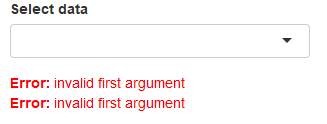

exclude: true
count: false

```{r,echo=FALSE,child="assets/header-presentation.Rmd"}
```

<!-- ----------------- Only edit title & author above this ----------------- -->

```{r,echo=FALSE,message=FALSE,warning=FALSE}
# load packages
library(dplyr)
library(ggplot2)
library(kableExtra) # for table
library(gridExtra) # multiple plot alignment
library(shiny)
# not loaded but, but used
#library(ggpubr)
#library(cowplot)

#colors
rv_col_dark <- "#125687"
rv_col_light <- "#e7eef3"
```

---
name: content
class: spaced

## Contents

* [Introduction](#intro)
* [Usage](#usage)
* [Structure](#structure)

---
name: intro

[.size-95[]](https://shiny.rstudio.com/gallery/)

---
name: intro-1
class: spaced 

## What is shiny?

* Interactive documents & web applications
* Completely created using R
* Needs a live environment

--

### Usage

* Interactive RMarkdown
* [Standalone web applications](http://shiny.rstudio.com/gallery/see-more.html)
* [Dashboard/Flexboard](http://rstudio.github.io/shinydashboard/examples.html)
* Gadgets/RStudio extensions

--

### App structure

* UI Layout
* UI Inputs (Widgets)
* UI Outputs
* Renderer
* [Function reference](https://shiny.rstudio.com/reference/shiny/1.2.0/)

---
name: code-structure
class: spaced

## Code structure

.pull-left-50[
__One file format__

_app.R_

```
ui <- fluidPage()
server <- function(input,output) {}
shinyApp(ui=ui,server=server)
```
]

.pull-right-50[

__Two file format__

_ui.R_

```
ui <- fluidPage()
```

_server.R_

```
server <- function(input,output) {}
```
]

---
name: running

## Running the app

* Change to app directory, then run `runApp()`
* Use `shinyApp()`

```{r,eval=FALSE}
shinyApp(
ui=fluidPage(),
server=function(input,output) {}
)
```

* From Rmd file using `rmarkdown::run()`
* Running as a separate process from terminal

```
R -e "shiny::runApp('~/shinyapp')"
```

---
name: ui-layout

## UI • Layout

.limity300[
```{r,eval=FALSE}
shinyApp(
ui=fluidPage(
  titlePanel("Title Panel"),
  sidebarLayout(
    sidebarPanel(
      helpText("Sidebar Panel")
    ),
    mainPanel(tabsetPanel(
                tabPanel("tab1",
                         fluidRow(
                           column(6,helpText("Col1")),
                           column(6,
                                  helpText("Col2"),
                                  fluidRow(
                                    column(4,style="background-color:#b0c6fb",
                                           helpText("Col1")
                                    ),
                                    column(4,style="background-color:#ffa153",
                                           helpText("Col2")
                                    ),
                                    column(4,style="background-color:#b1f6c6",
                                           helpText("Col3")
                                    )
                                  )
                           )
                         )
                ),
                tabPanel("tab2",
                         inputPanel(helpText("Input Panel"))
                ),
                tabPanel("tab3",
                  wellPanel(helpText("Well Panel"))
                )
              )
    )
  )
),
server=function(input,output) {})
```
]


---
name: ui-input

## UI • Widgets • Input

.pull-left-60[
```{r,eval=FALSE}
shinyApp(
ui=fluidPage(
  fluidRow(
    column(4,
           fileInput("file-input","fileInput:"),
           selectInput("select-input",label="selectInput",choices=c("A","B","C")),
           numericInput("numeric-input",label="numericInput",value=5,min=1,max=10),
           sliderInput("slider-input",label="sliderInput",value=5,min=1,max=10),
           textInput("text-input",label="textInput"),
           textAreaInput("text-area-input",label="textAreaInput"),
           dateInput("date-input",label="dateInput"),
           dateRangeInput("date-range-input",label="dateRangeInput"),
           radioButtons("radio-button",label="radioButtons",choices=c("A","B","C"),inline=T),
           checkboxInput("checkbox","checkboxInput",value=FALSE),
           actionButton("action-button","Action"),
           hr(),
           submitButton()
    )
  )
),
server=function(input,output) {
})
```
]

.pull-right-40[

]

.small[[Widgets gallery](http://shiny.rstudio.com/gallery/widget-gallery.html)]

???

Widgets are visual objects on a page to allow for data input. Input and output variables.

---
name: ui-output

## UI • Widgets • Outputs

.pull-left-60[
```{r,eval=FALSE}
shinyApp(
ui=fluidPage(fluidRow(column(5,
           textInput("text_input",label="textInput",value="<h3 style='color:red'>Red text</h3>"),
           hr(),
           htmlOutput("html_output"),
           textOutput("text_output"),
           verbatimTextOutput("verbatim_text_output"),
           tableOutput("table_output"),
           plotOutput("plot_output",width="300px",height="300px")
    ))),

server=function(input, output) {
  output$html_output <- renderText({input$text_input})
  output$text_output <- renderText({input$text_input})
  output$verbatim_text_output <- renderText({input$text_input})
  output$table_output <- renderTable({iris[1:3,1:3]})
  output$plot_output <- renderPlot({
    plot(iris[,1],iris[,2])
  })
})
```
]

.pull-right-40[

]

---
name: ui-dynamic

## Dynamic UI

- UI elements are created conditionally using `uiOutput()`/`renderUI()`

```{r,eval=FALSE}
shinyApp(
ui=fluidPage(
  selectInput("data",label="Select data",
              choices=c("mtcars","faithful","iris")),
  tableOutput("table"),
 {{uiOutput("ui")}}
),

server=function(input, output) {
  
  data <- reactive({ get(input$data, 'package:datasets') })
  
 {{output$ui <- renderUI({
  if(input$data=="iris") plotOutput("plot",width="400px")
  })}}
  
  output$plot <- renderPlot({hist(data()[, 1])})
  output$table <- renderTable({head(data())})
})
```

* Other options include `conditionalPanel()`, `ìnsertUI()` and `removeUI()`

---
name: runtime

## Code execution

__App launch__

```
*ui <- fluidPage(
*  textInput("text_input",label="textInput"),
*  textOutput("text_output"))
*server <- function(input,output) {
*  output$text_output <- renderText({input$text_input})
*}
```

--

__New user__

```
ui <- fluidPage(
  textInput("text_input",label="textInput"),
  textOutput("text_output"))
*server <- function(input,output) {
*  output$text_output <- renderText({input$text_input})
*}
```

--

__Widget update__

```
ui <- fluidPage(
  textInput("text_input",label="textInput"),
  textOutput("text_output"))
server <- function(input,output) {
*  output$text_output <- renderText({input$text_input})
}
```

---
name: reactive-1

## Reactivity

```{r,eval=FALSE}
shinyApp(
  
  ui=fluidPage(
    numericInput("num_input",label="Observations",value=50),
    plotOutput("plot_output")),
  
  server=function(input,output) {
  
    output$plot_output <- renderPlot({
      {{hist(rnorm(input$num_input))}}
    })
  
  }
)
```


---
name: reactive-2

## Reactivity

```{r,eval=FALSE}
shinyApp(
  
  ui=fluidPage(
    numericInput("num_input",label="Observations",value=50),
    plotOutput("plot_output"),
    textOutput("text_output")),
  
  server=function(input,output) {
    
    output$plot_output <- renderPlot({
      {{hist(rnorm(input$num_input))}}
    })
    
    output$text_output <- renderText({
      {{mean(rnorm(input$num_input))}}
    })
    
  }
)
```


---
name: reactive-3

## Reactivity

```{r,eval=FALSE}
shinyApp(
  
  ui=fluidPage(
    numericInput("num_input",label="Observations",value=50),
    plotOutput("plot_output"),
    textOutput("text_output")),
  
  server=function(input,output) {
  
    {{rand <- reactive({ rnorm(input$num_input) })}}
    
    output$plot_output <- renderPlot({
      hist(rand())
    })
    
    output$text_output <- renderText({
      mean(rand())
    })
  }
)
```


???

Reactive functions can be use to share output from a common source. They can be used to reduce computation for demanding functions. Reactive values cannot be accessed from outside the reactive environment.

Try changing the reactive function

`rand <- reactive({ rnorm(input$num_input) })`

to a regular function

`rand <- function(){ rnorm(input$num_input) }`

---
name: updating

## Updating widgets

* Widgets can be updated once initialised.
* Add third argument **session** to server function

```
server=function(input,output,session) {}
```

--

* Example of a typical UI

```
ui=fluidPage(
  selectInput("select-input",label="selectInput",choices=c("A","B","C")),
  numericInput("numeric-input",label="numericInput",value=5,min=1,max=10),
  sliderInput("slider-input",label="sliderInput",value=5,min=1,max=10),
)
```

--

* Update functions can be used to update input widgets
* Reactive observer `observe({})` monitors for a conditional change

```
server=function(input,output,session) {
  observe({
    if(something) {
      updateSelectInput(session,"select-input",label="selectInput",choices=c("D","E","F"))
      updateNumericInput(session,"numeric-input",label="numericInput",value=10,min=1,max=10)
      updateSliderInput(session,"slider-input",label="sliderInput",value=8,min=1,max=10)
    }
  })
}
```

---
name: isolate

## Isolate reactivity

* Reactivity can be controlled.

```{r,eval=FALSE}
shinyApp(
  ui=fluidPage(
    textInput("text_input",label="textInput"),
    actionButton("btn_go", "Go!"),
    textOutput("text_output")),
  
  server=function(input,output) {
    output$text_output <- renderText({
   {{input$btn_go}}
   {{isolate(input$text_input)}}
      })
  }
)
```

---
name: validation

## Error validation

* Shiny returns an error with missing or incorrect values

.pull-left-70[.limity100[
```{r,eval=FALSE}
shinyApp(
ui=fluidPage(
  selectInput("data_input",label="Select data",
              choices=c("","mtcars","faithful","iris")),
  tableOutput("table_output")
),

server=function(input, output) {
  getdata <- reactive({ get(input$data_input,'package:datasets') })
  output$table_output <- renderTable({head(getdata())})
})
```
]]

.pull-right-30[

]

--

* Errors can be handled in a controlled manner

--

* `validate()` can be used to check input
* `validate()` using `need()`

.pull-left-70[.limity100[
```{r,eval=FALSE}
shinyApp(
ui=fluidPage(
  selectInput("data_input",label="Select data",
              choices=c("","mtcars","faithful","iris")),
  tableOutput("table_output")
),

server=function(input, output) {
  getdata <- reactive({ 
  {{validate(need(try(input$data_input),"Please select a data set"))}}
    get(input$data_input,'package:datasets') 
    })
  output$table_output <- renderTable({head(getdata())})
})
```
]]

.pull-right-30[

]

--

* `validate()` using custom function

.pull-left-70[.limity100[
```{r,eval=FALSE}
{{valfn <- function(x) if(is.null(x) | is.na(x) | x=="") return("Input data is incorrect.")}}

shinyApp(
ui=fluidPage(
  selectInput("data_input",label="Select data",
              choices=c("","mtcars","faithful","iris")),
  tableOutput("table_output")
),

server=function(input,output) {
  getdata <- reactive({ 
  {{validate(valfn(try(input$data_input)))}}
    get(input$data_input,'package:datasets')
    })
  output$table_output <- renderTable({head(getdata())})
})
```
]]

.pull-right-30[

]

--

* `shiny::req()` checks input variable and silently stops execution

---
name: download-data

## Download • Data

* Add button and `downloadHandler()` function

```{r,eval=FALSE}
shinyApp(
ui=fluidPage(
  selectInput("data_input",label="Select data",
              choices=c("mtcars","faithful","iris")),
  textOutput("text_output"),
  {{downloadButton("button_download","Download")}}
),

server=function(input, output) {
  getdata <- reactive({ get(input$data_input, 'package:datasets') })
  output$text_output <- renderText(paste0("Selected dataset: ",input$data_input))
  
{{output$button_download <- downloadHandler(
  filename = function() {
     paste0(input$data_input,".csv")
   },
  content = function(file) {
     write.csv(getdata(),file,row.names=FALSE,quote=F)
   })}}
})
```

* Must be run in a browser to work
* See usage of download buttons

---
name: download-plot

## Download • Plots

```{r,eval=FALSE}
shinyApp(
ui=fluidPage(
  selectInput("data_input",label="Select data",
              choices=c("mtcars","faithful","iris")),
  textOutput("text_output"),
  plotOutput("plot_output",width="400px"),
  {{downloadButton("button_download", "Download")}}
),

server=function(input, output) {
  getdata <- reactive({ get(input$data_input, 'package:datasets') })
  output$text_output <- renderText(paste0("Selected dataset: ",input$data_input))
  output$plot_output <- renderPlot({hist(getdata()[, 1])})
  
{{output$button_download <- downloadHandler(
  filename = function() {
    paste0(input$data_input,".png")
  },
  content = function(file) {
    png(file)
    hist(getdata()[, 1])
    dev.off()
  })}}
})
```

* Must be run in a browser to work
* See usage of download buttons

---
name: deploy

## Deployment

* R scripts
  * R Package

* Webpage
  * Shinyapps.io
  * Shiny Server (Free)
  * Shiny Server Pro

--

* Automatically deploying to shinyapps.io

```
library(rsconnect)
rsconnect::setAccountInfo(name="user", token="HDFGT46YF7TDT6474G47", secret="hdgTDF5FStgdkpJ")
deployApp(appName="name")
```

--

* Shiny apps user guide https://docs.rstudio.com/shinyapps.io/index.html  
Shiny server guide https://docs.rstudio.com/shiny-server/

---
name: interactive-docs

## Interactive documents

* Shiny can run in RMarkdown documents. Set YAML `runtime: shiny`.  

```
---
title: Interactive document
output: html_document
runtime: shiny
---
```

* Shiny widgets can be included directly  

```{r,echo=FALSE,comment=""}
cat(paste0("```{r}\n","selectInput('n_breaks',label='Number of bins:',choices=c(10,20,35,50),selected=20)\n","```\n"))
```

* Whole shiny apps can be included directly  

```{r,echo=FALSE,comment=""}
cat(paste0("```{r}\n","shinyApp(\n","  ui=fluidPage(),\n","  server=function(input,output) {}\n",")\n","```\n"))
```

* Hosted shiny apps can be embedded using `<iframe>`  

```
<iframe src="https://user.shinyapps.io/app"></iframe>
```

.small[_Demo: shiny-rmarkdown.R_]

---
name: extensions

## Extensions

* [Naxstats](https://github.com/nanxstats/awesome-shiny-extensions): Repo collection all shiny extensions
* [shinythemes](https://github.com/rstudio/shinythemes): Bootswatch themes for shiny
* shinyurl: using URLs to recreate state of an app
* shinypod: Reusable modules
* [shinyjs](https://deanattali.com/shinyjs/): custom javascript functionality
* [shinyWidgets](https://github.com/dreamRs/shinyWidgets): Bootstrap 3 custom widgets
* [shinyBS](https://github.com/ebailey78/shinyBS): Bootstrap 3 widgets

---
name: help
class: spaced

## Help

* [**RStudio Shiny home**](https://shiny.rstudio.com/) 
* [**RStudio Shiny tutorial**](http://shiny.rstudio.com/tutorial/)
* [**RStudio Shiny articles**](https://shiny.rstudio.com/articles/)

### Other topics

* [Applications of action buttons](http://shiny.rstudio.com/articles/action-buttons.html)
* [Progress indicators](http://shiny.rstudio.com/articles/progress.html)
...

<!-- --------------------- Do not edit this and below --------------------- -->

---
name: end-slide
class: end-slide, middle
count: false

# Thank you. Questions?

```{r,echo=FALSE,child="assets/footer-presentation.Rmd"}
```

```{r,include=FALSE,eval=FALSE}
# manually run this to render this document to HTML
rmarkdown::render("shiny_presentation.Rmd")
# manually run this to convert HTML to PDF
#pagedown::chrome_print("shiny_presentation.html",output="shiny_presentation.pdf")
```

